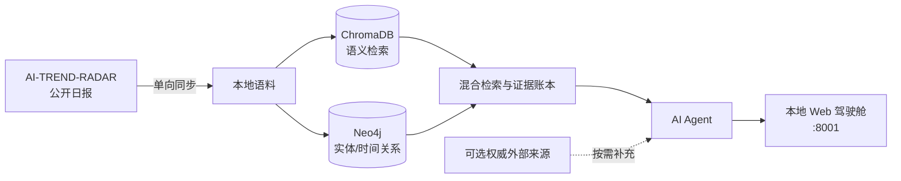

<div align="center">

# 📡 AI Trend Radar RAG

**把公开 AI 趋势日报变成可追问、可核验的本地研究驾驶舱。**

[](LICENSE)
[](https://docs.docker.com/compose/)
[](Dockerfile)

[3 分钟开始](#3-分钟开始) · [产品能力](#它解决什么问题) · [部署说明](docs/deployment.zh.md) · [配置说明](docs/configuration-rag.zh.md) · [排错](docs/troubleshooting-rag.zh.md) · [贡献](CONTRIBUTING.md)

</div>

---

## 它解决什么问题

AI Trend Radar 每天会产出公开的 AI 趋势报告，但“读很多日报”不等于“能快速形成有依据的判断”。本项目默认同步已发布的公开报告，也为高级维护者保留自维护数据源模式；随后建立向量与图谱索引，并让 Agent 在当前请求的**证据账本**范围内回答问题、展示可点击引用。

它适合需要持续追踪 AI 产品、模型、研究与行业变化的人：先浏览日报，再问“近三天哪些趋势值得深挖”“OpenAI 的产品动向有哪些证据”“哪些信号来自联网搜索”。

| 能力 | 用户得到什么 |
| --- | --- |
| 本地研究驾驶舱 | 按日浏览报告；长表格可横向滚动并调整阅读密度，摘要保持原始完整内容 |
| Graph + Vector RAG | 从文本相似度与实体/时间关系两条路径找证据 |
| 证据型 Agent | 回答绑定本次检索到的证据记录，而非把“相关链接”混作结论依据 |
| 可控联网搜索 | 默认内部语料优先；开启后只在时效性或证据不足时补充外部来源，并标记外部内容 |
| 增量同步 | 容器启动立即检查并在运行中按周期检查上游变化，只重新索引新增或变更的日报；失败时继续使用最后成功索引 |

### 两种语料模式

默认模式把 [`AI-TREND-RADAR`](https://github.com/Conradgui/AI-TREND-RADAR) 的公开 Pages 作为托管语料源，用户只部署本仓库，不需要再 Fork 或配置上游项目。高级模式允许维护者在本仓库手动运行内置生产流水线，控制自己的来源、模型和发布结果。

两种模式共用同一份可审计语料契约，但不应同时定时发布。日报进入检索库；周报和月报只供浏览，避免二次摘要干扰召回。完整配置见[GitHub 自动化与语料模式](docs/github-automation.zh.md)。

## 3 分钟开始

### 开始前只需要两样东西

1. [Docker Desktop](https://www.docker.com/products/docker-desktop/) 已安装并正在运行。
2. 一个模型 Provider 的 API Key（DeepSeek、Anthropic 或 OpenAI，推荐 DeepSeek）。

不需要预装 Python、Node.js、Neo4j 或 pnpm。

### 第一次使用

```bash
git clone https://github.com/Conradgui/AI-TREND-RADAR-RAG.git
cd AI-TREND-RADAR-RAG
```

然后双击配置向导：

| 系统 | 打开方式 |
| --- | --- |
| macOS / Linux | 双击 `setup.command`；若系统阻止执行，在终端运行一次 `chmod +x setup.command && ./setup.command` |
| Windows | 双击 `setup.bat` |

向导只会询问 Provider 和 API Key，自动生成本地 Neo4j 密码并写到 `.env`。`.env` 已被 Git 忽略，绝不应提交。若 Docker Desktop 尚未运行，启动器会尝试打开并等待它就绪；首次运行才会下载 Docker 镜像、安装容器内依赖并预热检索模型。

完成后打开 [http://127.0.0.1:8001](http://127.0.0.1:8001)。首次语料索引会在后台继续：**仓库已附带的最新日报优先可检索，历史报告随后补齐**；之后立即检查上游，并在运行中默认每 6 小时自动检查。即使上游暂时不可达，System 面板也会显示“上游同步失败（本地语料可用）”，Agent 仍只基于已建立的证据回答。

日常打开只需双击 `start.command` 或 `start.bat`：它会复用已有镜像与数据库，不会重建。仅在 `git pull`、修改代码、切换依赖或 Dockerfile 后，才双击 `update.command` 或 `update.bat` 进行显式更新构建；两种入口都不会删除 Neo4j 或 RAG 数据卷。

账号切换、电脑重启或页面连接异常后，可双击 `doctor.command`。它会检查本地配置、Docker、Compose、app、Neo4j、Chroma 与 Provider，并自动恢复已停止的现有容器或数据库连接；不会删除数据卷，也不会因为普通断连重建已有镜像。开发或 CI 只想检查时运行 `./doctor.command --check`。

> 一键启动的真实边界：Docker Desktop 和你自己的 Provider Key 无法被项目替你安装或提供；除此之外的 Python、依赖与数据库都在 Docker 容器中处理。

## 第一次体验建议

1. 从左侧打开最新日期，先浏览日报与原始摘要；当前搜索主要帮助聚焦报告日期，条目级模糊搜索与深链将在后续版本完善。
2. 拖动侧栏右边缘，或点页头的 `NAV` 收起导航，让报告表格获得更多空间。
3. 用“表格阅读密度”滑条切换紧凑、标准、舒展；摘要保留报告原始内容。
4. 点击醒目的 `AGENT`，先问“最近三天有哪些值得关注的 AI 产品趋势？”。
5. 在 Agent 输入框上方选择“自动 / 关闭 / 开启”联网搜索策略。外部内容会和内部语料分组标记，不会伪装成日报证据。

## 本地运维

```bash
# 查看服务与启动过程（含同步/索引日志）
docker compose logs -f app

# 暂停服务，数据仍会保留
docker compose stop

# 再次启动（不构建）
docker compose up -d --no-build

# 拉取新代码或修改项目后，显式更新构建
docker compose up -d --build

# 校验 Compose 配置语法（不输出密钥）
docker compose config --quiet
```

不要把 `docker compose down -v` 当作普通停止命令：它会删除本项目的 Neo4j 与 RAG 本地数据卷。需要彻底重建索引时，请先阅读[部署与数据迁移说明](docs/deployment.zh.md)。

## GitHub 自动化的发布边界

仓库默认启用 `RAG Corpus Sync`：它每天从公开 Pages 拉取新日报及可浏览的周/月报，并把通过校验的语料变化提交回本仓库；此模式不需要任何新闻源或模型密钥。高级维护者可先手动预览 `Corpus Producer (self-managed)`，验证后设置 `CORPUS_MODE=self_managed`，让自己的来源每日自动生成、校验并通过专用 PR 发布日报。

不熟悉 GitHub Actions 配置时，可在 Web UI 的 `SYSTEM → 自动语料 → 配置自动语料` 中选择模式、Provider 和来源。向导会生成 Variables、`config.yml` 片段和所需 Secret **名称**，并跳转到当前仓库的 GitHub 设置页；它不会要求在浏览器中填写密钥，也不会把“生成配置”伪装成“已经修改云端”。

新工作流尚未进入默认分支时，通常不会出现在 Actions 手动入口，也不会替代默认分支的长期自动化。推荐顺序是：功能分支完成测试与干净克隆验收 → 代码审查 → 合并到默认分支 → 每日同步与 Pages 发布生效。

具体的 Actions 操作、Secrets/Variables 清单、日报与周/月报边界见[GitHub 自动化与语料模式](docs/github-automation.zh.md)。

## 配置层级

首次向导只处理“能聊天”的最小配置。其他能力按需开启，不会打扰第一次使用：

| 层级 | 何时需要 | 入口 |
| --- | --- | --- |
| 必需 | 第一次启动 | Provider + API Key（`setup.command` / `setup.bat`） |
| 可选 | 希望 Agent 查找最新外部资料 | `.env` 中配置任意一个搜索 Provider key，然后在页面开启联网搜索 |
| 高级 | 需要把 API 暴露给其他客户端 | `RAG_API_KEY` 与反向代理；本地浏览器仪表盘默认不保存该密钥 |

完整变量含义、Provider 切换与安全边界见[配置说明](docs/configuration-rag.zh.md)。

## 架构概览



“证据账本”是一次提问实际取到、可以支撑当前答案的证据集合。Agent 不应拿账本外的内容伪装成引用；更完整的术语约定见 [`CONTEXT.md`](CONTEXT.md)。

## 文档地图

| 我想做什么 | 阅读 |
| --- | --- |
| 首次部署、迁移旧 Docker 数据、重建索引 | [部署说明](docs/deployment.zh.md) |
| 切换 Provider、开启联网搜索、保护密钥 | [配置说明](docs/configuration-rag.zh.md) |
| 配置每日同步或自维护新闻源 | [GitHub 自动化与语料模式](docs/github-automation.zh.md) |
| 解决启动、页面、Agent、数据库问题 | [故障排除](docs/troubleshooting-rag.zh.md) |
| 参与开发或跑测试 | [贡献指南](CONTRIBUTING.md) |
| 了解安全边界与漏洞报告 | [安全说明](SECURITY.md) |
| 准备发布版本 | [发布检查清单](docs/release-checklist.zh.md) |
| 理解托管语料与自维护模式 | [GitHub 自动化与语料模式](docs/github-automation.zh.md) |

## 开发与测试

Docker 是普通用户默认路径。只有参与开发时才需要本地 Python 环境：

```bash
python3 -m venv .venv
source .venv/bin/activate
pip install -r rag/requirements.txt
pytest rag/tests -q
```

对 UI 或发布包的改动，至少运行：

```bash
pytest rag/tests/test_release_package.py rag/tests/test_dashboard_readability.py rag/tests/test_dashboard_same_origin.py -q
docker compose config
```

## 贡献、安全与许可证

欢迎贡献。提交前请阅读[贡献指南](CONTRIBUTING.md)、[行为准则](CODE_OF_CONDUCT.md)与[安全说明](SECURITY.md)。

本项目使用 [MIT License](LICENSE)。
