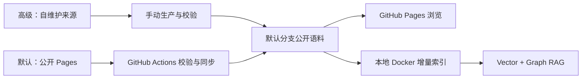

# GitHub 自动化与语料模式

这份文档回答三个问题：仓库每天从哪里拿数据、是否需要配置密钥，以及日报、周报、月报如何进入 RAG。

## 先选模式

仓库提供两条互斥的数据生产路径。普通用户保持默认即可；不要同时定时启用两条路径，否则会产生相互覆盖的提交。

| 模式 | 适合谁 | 数据从哪里来 | 必需 Secrets | 默认状态 |
| --- | --- | --- | --- | --- |
| 托管语料同步 | 想开箱即用的用户 | 已发布的 AI Trend Radar Pages | 无 | 每日自动运行 |
| 自维护数据源 | 希望控制来源、规则和模型的维护者 | 本仓库内置采集与日报生成代码 | 一个 LLM Provider Key | 仅手动运行 |

无论使用哪种模式，进入检索库的只有原始日报制品 `ai-topic-radar.md` 和 `topic-pool.json`。周报、月报属于二次归纳，只在页面供浏览，不参与向量化或图谱化，避免重复摘要挤占原始证据。

## 默认模式：托管语料同步

工作流：`RAG Corpus Sync`（`.github/workflows/rag-corpus-sync.yml`）。

它每天 00:17 UTC 执行以下动作：

1. 从公开 Pages 下载 `manifest.json` 和新增/修订的日报、周报、月报；
2. 先校验日期、路径、大小和工作流契约；
3. 验证通过后才把 `digests/`、`manifest.json`、`corpus-manifest.json` 提交回默认分支；
4. `Deploy GitHub Pages` 只发布允许公开的报告文件，不上传仓库源码、数据库或本地状态。

默认地址是 `https://conradgui.github.io/AI-TREND-RADAR`，不需要配置 LLM 或新闻源 API。若你维护兼容的镜像站，在 GitHub 仓库进入 `Settings → Secrets and variables → Actions → Variables`，新建：

| Variable | 是否必需 | 用途 |
| --- | --- | --- |
| `UPSTREAM_CORPUS_URL` | 否 | 覆盖默认 Pages 地址；不要带末尾 `/` |

首次启用建议：

1. 打开 `Actions → RAG Corpus Sync → Run workflow`；
2. 先勾选 `dry_run=true`，确认下载和校验通过，但不写仓库；
3. 再以 `dry_run=false` 手动运行一次，确认产生可审计提交；
4. 真实 publish 成功后会调用同一份可复用 Pages 工作流；dry-run 不会触发无意义部署；
5. 观察下一次定时运行。

> GitHub 只会为默认分支注册定时工作流。功能分支中的文件即使测试通过，也不代表每日任务已生效；合并到默认分支后才会激活。

## 高级模式：自维护数据源

工作流：`Corpus Producer (self-managed)`（`.github/workflows/corpus-producer-self-managed.yml`）。它当前是**手动工作流**，用于先验证用户自己的来源和模型配置，不会偷偷产生费用。

在 `Settings → Secrets and variables → Actions → Secrets` 中，按选用 Provider 配置一个必需密钥：

| Provider | 必需 Secret | 可选 Secret |
| --- | --- | --- |
| DeepSeek | `DEEPSEEK_API_KEY` | 无 |
| Anthropic | `ANTHROPIC_API_KEY` | `ANTHROPIC_BASE_URL` |
| OpenAI | `OPENAI_API_KEY` | 无 |
| OpenRouter | `OPENROUTER_API_KEY` | 无 |
| GitHub Models | 仓库自带 `GITHUB_TOKEN` | 无 |

新闻源增强项：

| Secret | 是否必需 | 缺失时行为 |
| --- | --- | --- |
| `AI_RADAR_GITHUB_TOKEN` | 否 | 降级使用仓库 `GITHUB_TOKEN`，公开仓库检索额度较低 |
| `PRODUCTHUNT_TOKEN` | 否 | 跳过 Product Hunt 来源 |
| `GITEE_TOKEN` | 否 | 跳过 Gitee 来源 |

操作路径：

1. 打开 `Actions → Corpus Producer (self-managed) → Run workflow`；
2. 选择 Provider，第一次保持 `publish=false`；
3. 下载运行产生的短期 Artifact，检查日报和 `corpus-manifest.json`；
4. 验证满意后，从默认分支运行并设置 `publish=true`。

当前不在本地 Web UI 中收集 GitHub Secrets。原因不是“做不到界面”，而是浏览器若要改仓库 Secrets，必须额外获得 GitHub 写权限和安全保存令牌，这会显著扩大权限边界。现阶段用 GitHub Actions 原生表单更安全，也更容易审计；未来若引入 GitHub App/OAuth，再评估统一 GUI。

## 本地 Docker 与云端自动化的关系

GitHub Actions 负责把经过校验的公开语料提交到仓库；本地 Docker 启动时负责同步这些文件并增量建立 ChromaDB 与 Neo4j 索引。云端不会接触用户本地的模型 Key、数据库或聊天记录。

## 常见失败定位

- `Missing required secret`：所选 Provider 的 Secret 没有配置或名称拼错。
- `Unsafe publish branch`：试图从非默认分支发布；先只生成 Artifact，审核后再合并。
- 上游下载 404：检查 `UPSTREAM_CORPUS_URL` 是否指向包含 `manifest.json` 的站点根路径。
- 工作流文件已存在但没有定时运行：确认它已经进入仓库默认分支，并在 Actions 页面处于启用状态。
- 推送被拒绝：检查仓库 `Settings → Actions → General → Workflow permissions` 是否允许工作流写入内容；本项目仅在发布 job 请求 `contents: write`。
