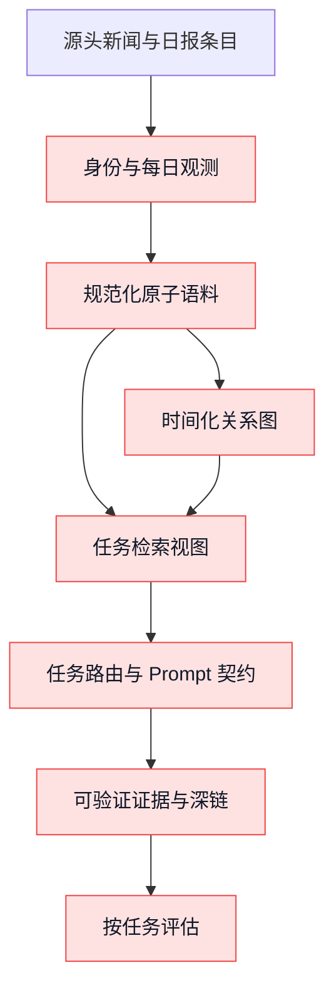
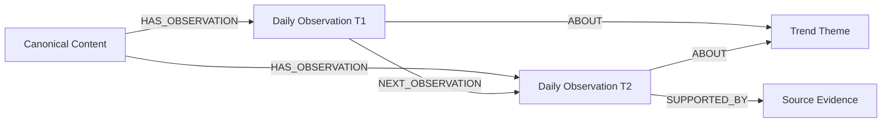

# RAG Evolution Playbook 独立适配复盘

- 日期：2026-08-11
- 对象：AI Trend Radar RAG 当前架构、既有评估结果、2026-08-11 统一改造计划
- 外部参考：[`Conradgui/RAG-Evolution-Playbook`](https://github.com/Conradgui/RAG-Evolution-Playbook/tree/348e22c1168ede5efab5743e05440331d14deb6f)
- 结论类型：架构评审；本文件不授权或执行生产索引重建

## 一、结论

当前项目的问题已经定位到**系统契约断裂**，不是一个参数问题，也不是“缺少某个成熟 GraphRAG 框架”这么简单：

1. 同一日报内容以“独立选题”和“Markdown 报告切块”重复进入索引，检索单位不稳定；
2. 条目身份、跨日内容身份、每日观测与热度变化没有统一模型；
3. 精确导航、趋势发现、证据研究、关系探索和主张核验仍未拥有各自完整的检索与回答契约；
4. 当前图谱更接近实体共现索引，尚不能可靠表达同一事件的纵向变化和同类事件的横向趋势；
5. 评估集仍有大量不可评分样本，有限 Canary 通过不能证明整体检索质量成熟。

`RAG-Evolution-Playbook` **不能作为现成运行时直接接入来解决这些问题**。它明确不包含宿主 RAG 运行时代码；可运行部分主要是文档检查器、测试和 CI。它适合提供失败分类、评估纪律、候选/发布分离、回滚与证据治理原则，不提供本项目所需的数据模型、图构建器、Router、Prompt Registry、Deep Link Resolver 或检索实现。[仓库产品边界](https://github.com/Conradgui/RAG-Evolution-Playbook/blob/348e22c1168ede5efab5743e05440331d14deb6f/README.md#L12-L22)

因此，现有统一计划的**方向正确，但不能宣称已经解决问题**。它解决的是正确的架构边界；只有通过单日影子语料和冻结小样的对照实验，才有资格进入全量迁移。

## 二、当前问题到底是什么

### 2.1 不是单一召回算法失效

现有评估显示：

- vector-only 宏平均 F1 约 9.54%；
- vector + lexical 宏平均 F1 约 23.02%；
- task-based directional 中，可评分样本宏平均 F1 约 22.65%；
- `trend_discovery` F1 约 8%，`evidence_research` F1 约 10.96%。

这些数值说明通用向量召回确实不足，但不能孤立解释为 embedding 或 Top-K 参数问题：task-based 数据集中只有 10 条可评分、22 条仍是诊断样本；旧数据还混入了错误的无引用期望和宽泛问题的召回上限。因此目前的分数既包含真实质量缺陷，也包含评估契约未完成造成的噪声。

### 2.2 根因是五层没有共用同一语义

这七个环节目前都有局部能力，但没有共享稳定身份、时间和证据契约。任何下游局部优化都会被上游不稳定输入削弱。

## 三、Playbook 能解决什么，不能解决什么

| 当前层面 | Playbook 提供 | 缺少的执行能力 | 对本项目的采用方式 |
|---|---|---|---|
| 身份与去重 | 稳定 source/artifact ID、hash、幂等原则 | 文档/修订/观测/近重复的领域模型与算法 | 借原则，不复制示例 JSON |
| 时间与观测 | effective time、compiled/recorded time | 双时态、晚到数据、跨日观测、图边有效期 | 用来检查字段完整性，模型仍由本项目定义 |
| GraphRAG | 实体、关系、社区、跨文档关联的能力说明 | 节点/边契约、趋势图、增量构图、查询实现 | 用 competence questions 约束图，而非接入代码 |
| 查询路由 | Structured Query 边界、intent 与约束 | 分类器、Router、retrieval view、Prompt Registry | 借契约治理思想，执行模块自建 |
| 引用与深链 | claim-provenance 完整性 | 页面锚点、解析器、渲染器、失效检测 | 借 provenance 链，保留当前条目深链设计 |
| 评估与发布 | 失败分类、多目标门禁、Candidate/Winner/Published 分离 | 真实 RAG eval runner 与宿主适配 | 这是最值得直接摘取的部分 |

Playbook 将 Scheme A 定义为离线“编译知识制品”，将 Scheme B 定义为受治理的改进闭环，但同时明确这些是目标责任和方案包，并非已部署组件。[Scheme A 边界](https://github.com/Conradgui/RAG-Evolution-Playbook/blob/348e22c1168ede5efab5743e05440331d14deb6f/schemes/compiled-knowledge-for-rag/architecture/reference-architecture.md#L54-L96) [Scheme B 边界](https://github.com/Conradgui/RAG-Evolution-Playbook/blob/348e22c1168ede5efab5743e05440331d14deb6f/schemes/governed-rag-improvement/architecture/reference-architecture.md#L82-L142)

## 四、现有统一计划是否针对根因

### 已经针对到的部分

1. `DailyObservation` 被设为主 RAG 原子单位，Markdown 仅作为浏览投影，直接对应重复索引与跨条目污染问题；
2. 新的公开 Daily Item ID 与内部 `content_id` 分离，能够同时支持精确定位和跨日关联；
3. `Retrieval Gateway` 被扩展为按任务选择 retrieval view，避免所有问题都走相同 `search(query, k)`；
4. `Prompt Registry` 按用户任务而非品牌关键词组织，适合长期维护；
5. 横向趋势、纵向趋势、确认关系和推断关系分层，避免把共现误说成因果；
6. 单日影子语料、小数据集 A/B 和阶段门禁符合 Playbook 的 Baseline/Treatment 与保护切片纪律。

### 尚需修正或补强的部分

1. **评估必须前置为 Stage 0 的正式产物。** 先冻结 20–30 个可评分问题，补齐 gold item ID、相关性等级、允许/禁止证据与拒答标签；否则后续 F1 不可解释。
2. **Graph 不应早于关系问题定义。** 先为“单条新闻纵向变化”“同类趋势横向比较”“实体关系解释”各写 competence question（能力问题）和预期证据，再决定节点与边；否则容易造出更多无法用于回答的关系。
3. **Prompt Registry 不能只保存文本。** 每个任务需绑定输入 schema、retrieval view、证据最低门槛、输出 schema、拒答条件和版本；Prompt 文案只是其中一个字段。
4. **来源特定变化策略应延后。** 第一轮只选择一个数据源和一个日期验证身份复用、摘要完整性、去重与引用，证明有效后再扩展 source policy，避免一开始建立复杂规则系统。
5. **必须做表示层消融实验。** 对同一冻结小样至少比较：旧混合索引、仅原子条目、原子条目+lexical、原子条目+任务视图；这样才能知道收益来自数据清洁、召回器还是路由。
6. **不能把 Gateway Canary 5/5 当发布门。** 它只证明少数通用趋势和精确标题路径没有明显回归，没有覆盖图、LLM、联网、claim verification 与真实用户相关性。

## 五、建议采用的最小验证顺序

### Gate 0：先证明评估尺子可信

- 20–30 条冻结问题；
- 每个任务至少 4–5 条可评分样本；
- 区分 answerable、unanswerable、claim support/refute/insufficient；
- 对宽泛趋势问题使用分级相关性和 NDCG，不强行用单一 exact gold 列表；
- 人工复核至少一轮。

### Gate 1：只验证一个日期的规范化语料

- 一条新闻只有一个 canonical observation；
- 不再索引同日报 Markdown chunk；
- 摘要缺失不伪造，进入 enrichment/diagnostic；
- ID 重跑稳定；
- 引用可回到具体条目。

### Gate 2：小样消融，不改正式索引

| Variant | 目的 |
|---|---|
| A 旧索引 | 基线 |
| B 原子条目 only | 验证语料原子性收益 |
| C B + lexical | 验证精确词/标题收益 |
| D C + task retrieval view | 验证任务路由收益 |

只有 D 在核心任务提升且保护任务不退化，才进入历史迁移。

### Gate 3：再做 Graph 垂直切片

只选择一个 `content_id` 的跨日观测和一个同类趋势簇，建立最小图：

必须先证明它能回答时间线或横向趋势问题，再扩充社区、推断关系和更多来源。

### Gate 4：最后接 Prompt Registry 与发布治理

先让 EvidenceBundle 稳定，再封装 task-specific Prompt；随后选择性吸收 Playbook 的 Candidate/Winner/Published、Maker/Checker、保护切片、回滚和停止条件。当前阶段不需要完整 Scheme B 控制面。

## 六、最终判断

### 我们有没有定位清楚问题？

**已经定位到正确架构层，但仍需用 Gate 0 和 Gate 1 把因果关系测实。** 目前最强证据支持“重复表示 + 不稳定检索单位 + 任务契约缺失”是主要根因；Graph 表达不足和 Prompt 单体化是后续质量上限问题，不应先于语料和评估修复。

### 当前计划能否切实解决？

**能覆盖主要根因，但前提是按门禁小样推进，而不是直接全量实现。** 它不能保证某个 F1 数字，能够保证每次改动都能被归因、被回滚，并且不会再把 UI、向量、图谱和 Agent 分别建立一套身份语义。

### 是否引入 Playbook？

采用“摘取，不依赖”的策略：

- 立即摘取：失败分类、问题切片、评估纪律、发布/回滚语义；
- 本地化后采用：Artifact/Query/Trace 的规范性原则；
- 不引入：仓库本身作为 runtime dependency；
- 暂缓：完整 Scheme B 和 A/B Composition；
- 继续由本项目实现：Canonical Observation、任务检索视图、时间图谱、Prompt Registry 和 Citation Deep Link。

这比换一个中间路由框架更慢一点启动，但更能避免“引入了新框架，旧的数据和评估问题仍在”的第二次架构债务。
