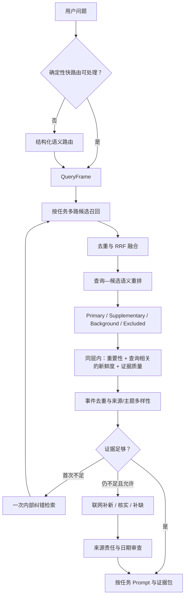

# 查询路由与新闻排序：方案层复盘与流程纠偏

- 日期：2026-08-13
- 性质：产品与架构复盘；不修改业务代码
- 研究依据：`research/2026-08-13-query-routing-ranking-industry-review.md`

## 1. 核心结论

当前问题不是“某个关键词没写全”或“重要性权重不准”，而是三个不同问题被放进同一个判断：

1. 内容事实：这是什么内容、发生了什么、谁是主体；
2. 查询相关性：它是否回答用户当前的问题；
3. 产品排序：在相关结果中，它有多重要、多新、证据多可靠。

行业中更成熟的做法是多阶段检索与排序：先高召回找候选，再按当前查询做语义重排，最后才加入重要性、新鲜度、可信度和多样性。GraphRAG 与联网搜索都是按需能力，不是每次查询都加入同一融合公式。

## 2. 当前实现为什么会错

代码证据显示：

- `query_understanding.py` 主要由关键词顺序覆盖单一 `intent`，没有路由置信度、任务多标签或歧义输出；
- `retrieval_gateway.py` 的重要新闻路径先按实体筛选，再用固定内容词表决定新闻准入；
- 重要新闻排序是固定的 `50% 新鲜度 + 30% 重要性 + 20% 上游分数`，没有 query-document 语义相关分；
- 事件合同 v2 使用 `content_kind=news`，重要新闻门仍检查 `news_event`，存在新旧合同漂移；
- 通用趋势路径刻意不使用用户问题与候选的语义相关性；
- Prompt Registry 已按任务接入，但 Prompt 无法补救上游候选漏召回或错排。

因此，错误不是 Prompt 写得不够长，而是路由、召回、准入和排序职责混杂。

## 3. 推荐目标链路

关键原则不是简单的加权和，而是**先分层，再排序**：

- `primary`：直接回答当前问题；
- `supplementary`：相关但不是主问题，或新闻价值较弱；
- `background`：相关但已超出新闻时间窗；
- `unverified`：相关但日期、来源或支持度不足；
- `excluded`：与任务类型或主体不匹配。

只有同一层内部才比较重要性、新鲜度、来源质量和上游热度。这样能保证“很新但无关”的内容不会超过“稍旧但直接相关”的内容。

## 4. 稳定事实与动态判断必须分开

### 入库时稳定保存

- 内容类型、事件类型；
- 主体实体、被提及实体；
- 发布 / 发生 / 收录日期及可信度；
- 来源角色、事件组、ATR 身份；
- 录入时固化的热度切片；
- 摘要与证据完整度。

### 查询时动态计算

- 与当前问题的语义相关性；
- 当前问题是否要求新闻、重大新闻或安全机制；
- 针对当前时间意图的新鲜度；
- 对当前任务的影响范围、影响深度和主体显著性；
- 展示层级和最终排序。

不应永久保存一个全局 `is_important_dynamic` 真值。同一条 Anthropic 安全机制更新在“公司最重要新闻”中可以是补充项，在“Anthropic 安全机制最近有什么动向”中则应成为主项。

## 5. 框架选择判断

- 保留：现有 ATR 身份、原子日报、lexical/vector 存储、Evidence Gateway、证据台账和联网来源审查；
- 借鉴：Adaptive-RAG 的复杂度分级、CRAG 的检索质量评估与一次纠错、GraphRAG 的 Local/Global/DRIFT 任务边界；
- 优先补齐：结构化 QueryFrame、宽候选召回、语义 rerank、分层排序、证据 grader；
- 暂不采用：训练 Adaptive-RAG 分类器、Self-RAG 专用模型、所有查询 Agent 化、用 GraphRAG 替换全文/向量检索；
- 不建议：直接引入“大一统 RAG 框架”并重写现有管线。外部框架能提供组件，但不能替代本项目的新闻产品语义、ATR 身份和评估合同。

## 6. 为什么此前没有先询问和调研

这是执行过程的失误，不能归因给用户：

1. 我把“什么叫重要新闻”错误地当成可在现有代码内解决的排序实现问题，而不是需要先澄清的产品语义问题。
2. 我过度响应了“快速推进、先跑通”的要求，把持续推进误解成可以跳过架构决策前的产品发现；实际上速度要求不等于授权我替用户定义产品价值。
3. 我太早把注意力放在可测字段、Stage Gate 和工程闭环上，导致监管机制能检查代码、合同和指标，却没有先检查“指标背后的产品定义是否正确”。
4. 我在少量失败样本出现后才碎片化询问，而没有在建立事件合同和重要新闻 Gate 前先问清：重要性是全局属性还是查询相关判断、相关性与新鲜度谁优先、哪些内容只应成为补充证据。
5. 我错误判断这属于本地增量修复，没有在架构决策点主动触发一手资料调研。此前用户已经允许联网并要求参考成熟方法，这一步本应更早完成。

## 7. 防复发门禁

以后出现以下任一变更时，先暂停实现：新路由类别、排序公式、领域标签、Graph schema、证据充分性定义、联网触发规则。

强制顺序：

1. 从仓库与失败样本中写出问题证据；
2. 提出 1~3 个小而具体的产品语义问题；
3. 查阅一手行业方案，并列出适用与不适用部分；
4. 写决策记录：备选方案、成本、用户影响、可逆性；
5. 用 10~20 条小样验证，不直接全量迁移；
6. Stage Gate 同时审查代码质量、产品语义和完整用户路径。

## 8. 下一阶段边界

本次只确认问题与目标体系。下一阶段如获确认，应先冻结 `QueryFrame` 和分层排序语义，再做一个不触碰正式索引的小样：对同一批候选比较当前排序与“语义重排 + 分层排序”，分别观察 Recall@20、NDCG@5、MRR、分层成对判断正确率和证据充分性；不再用一个 Macro F1 概括全部任务。
