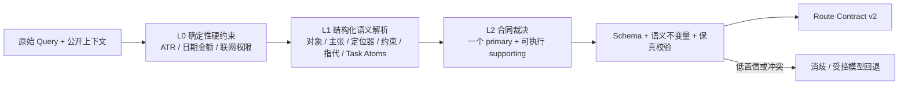

# Route Contract v2 封存盲测诊断

- 日期：2026-08-13
- 证据类型：一次性封存盲测，揭盲后已转为校准集
- 正式流量影响：无
- 结论：`FAILED`，不得接入生产

## 真实成绩

| 指标 | 结果 | Gate |
|---|---:|---:|
| 主路线总体准确率 | 60% | ≥85% |
| A 单条定位 | 20% | ≥80% |
| B 近期动态 | 50% | ≥80% |
| C 演变关系 | 80% | ≥80% |
| D 事实核验 | 60% | ≥80% |
| E 证据研究 | 90% | ≥80% |
| 最小对照完整正确 | 33.33% | 100% |
| 联网关键权限 | 100% | 100% |
| 保真词 micro F1 | 44.44% | ≥85% |
| 歧义 P / R / F1 | 40.91% / 81.82% / 54.55% | P、R ≥80% |
| 完整投影精确匹配 | 14% | ≥70% |

## 不是哪里错了

- 五类任务按用户成功标准划分仍然成立；E 达 90%、C 达 80%，说明任务分类本身不是主要失败源。
- `Route Contract v2`、版本化策略 ID、JSON 机器合同与确定性渲染边界仍应保留。
- 联网权限 100%，说明“确定性安全覆盖层”有效，不应被生成模型替代。

## 真正的架构瓶颈

### 1. 信号抽取被样例词典绑住

当前实现把已知实体、任务短语和特定表达写进 `_KNOWN_TERMS` 及多个 tuple。遇到新的中文产品名、行业概念、约束短语和自然语言导航方式时，主体与任务信号都消失。结果不是随机误差，而是 20 个错路由中 19 个坍缩到默认 `evidence_research`。

### 2. “是否有具体主体”与“主体是什么”没有结构化分离

系统只有一个 `has_concrete_subject` 布尔值，没有 `subjects[] / claims[] / locators[] / constraints[] / references[]` 的通用抽取结果。未知中文实体被误判为空，导致假歧义；另一方面“这家公司”“最近那两个项目”又可能被其他具体词掩盖，导致漏报歧义。

### 3. 导航被当成几个固定句式

ATR ID 可以工作，但“打开《标题》”“标题为…的记录”“发布日 + 来源 + 标题包含”“左边/右边条目”等真实用户路径没有统一 Locator 合同。A 路线因此仅 20%。

### 4. 复合任务没有先拆子任务再定主辅路线

“汇总动态并核验一句话”“比较并分别核验”“以某条为起点找动态和合作方”等请求，需要先产生 Task Atoms，再按用户最终成功标准选 primary/supporting。当前代码直接从整句布尔信号跳到单一路由，supporting exact 发生系统性缺失。

### 5. 保真词并不是已知实体列表

Gold 要保护的是对象、时间、数量、限定、主张与权限的原文 span。当前抽取器只覆盖正则和已知词，造成 recall 33.08%。继续扩词表只能提高这批校准集，无法形成泛化能力。

## 决策：保留合同，替换理解内核

不推翻总—分—总架构，也不继续给旧规则堆关键词。新的影子理解内核采用三层：

- L0 继续用代码保证安全与字面不可逆约束。
- L1 不再依赖实体白名单；先以结构化模型解析器做影子实验，输出受 Schema 约束的语义槽位。模型只做理解，不接触内部语料、不直接决定权限。
- L2 继续由产品任务成功标准裁决，模型不能绕过语义 validator。
- 低置信、未解析指代和合同冲突进入消歧，不假装高置信。

## 成本控制与验证顺序

1. 先从已揭盲校准集中选 12 条诊断切片，覆盖 A/B/D、复合任务、保真 span、上下文引用。
2. 只实现 `SemanticParseV1` 数据合同与一个 DeepSeek structured-output 影子适配器，不改正式链。
3. 与旧规则做同输入对照；一次调用只返回结构化语义槽位，不生成答案。
4. 12 条中路线至少 10/12、A 至少 3/4、关键权限 100%、保真 recall ≥80%，才扩到 50 条校准集。
5. 50 条校准达到 Gate 后冻结新实现，再由隔离 Agent 创建另一套全新封存盲测；本次数据永不复用为盲测。

## 证据边界

这次成绩只评价 Query Understanding / Route Contract，不评价 Neo4j、向量召回、Prompt Package 或最终答案质量。即使下一轮通过，也只能授权进入下一影子阶段，不能直接证明整个 RAG 可用。
