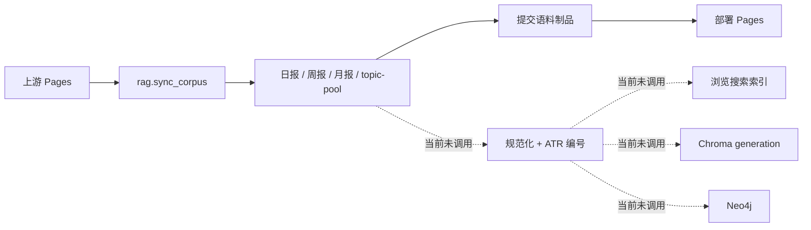

# GitHub Actions、唯一编号与 RAG 入库链路审计

> 日期：2026-08-24
> 审查角色：Terra（只读质量与方向审查）
> 结论：**FAIL——当前只能证明公开语料同步与 Pages 发布，不能证明自动编号后已进入完整 RAG。**

## 用户期望

每次 GitHub Actions 抓取后，应把日报中的每条信息规范化为独立记录，分配稳定的 `ATR-YYYYMMDD-XXXXXX` 编号，并让浏览搜索、Chroma 向量库和 Neo4j 图谱读取同一份规范化结果。周报和月报只供浏览，不参与主检索索引。

## 当前真实链路

- 定时工作流只执行 `rag.sync_corpus`，提交 `digests/`、manifest、feed 和 corpus manifest，然后部署 Pages（`.github/workflows/rag-corpus-sync.yml:99-123`）。
- 同步计划下载日报、周/月报和 topic pool，但没有把 `digests/search-index.json` 纳入计划，也没有调用 manifest/search-index 生成器（`rag/sync_corpus.py:105-140`）。
- 稳定 ATR 编号与歧义身份拒绝逻辑已经存在于 `src/search-document.ts:285-330`；浏览搜索索引生成器存在于 `src/generate-manifest.ts:215-230`。问题不是“没有编号算法”，而是默认 hosted sync 没有执行这条链路。
- 本地运行时具备 staging、generation 切换和图谱更新能力，但当前先发布向量 generation，之后才更新 Neo4j；图谱失败时只标记失败，不会回退已激活的向量 generation（`rag/server.py:376-429`）。
- 日报以原子条目进入向量库，Markdown 不再重复切块；这部分边界正确（`rag/ingest.py:383-404`）。周报/月报保持只供浏览。

## 已实现事实与证据边界

### 已实现

- 日报条目可生成稳定 ATR 编号。
- 同日精确重复可聚合，歧义身份可以 fail closed（拒绝静默合并）。
- 日报以独立条目向量化；Markdown、周报、月报不进入主向量索引。
- 本地运行时有向量 generation、最后可用版本和 Neo4j 单日事务相关实现及测试。

### 尚未实现或不能证明

- GitHub Actions 抓取完成后自动执行规范化和 ATR 编号。
- GitHub Actions 自动重建并验证浏览搜索索引。
- GitHub Actions 自动更新本地 Chroma 与 Neo4j——云端 Actions 本来也无法直接修改用户电脑里的 Docker 数据库，除非增加受控部署端或自托管 Runner。
- Chroma 与 Neo4j 作为一个整体原子切换；当前图谱失败仍可能留下已激活的新向量 generation。
- TypeScript 与 Python 两套规范化逻辑完全一致；Python 路径仍可能静默跳过缺标题或编号冲突项。

## 最小修复顺序

1. **P0：补齐公开语料链路。** hosted sync 下载 `topic-pool.json` 后，必须运行统一规范化器，重建并校验 `search-index.json`，校验通过后才允许提交与部署。
2. **P0：明确自动化边界。** GitHub Actions 负责“公开语料与搜索制品”；本地 Docker 服务负责“Chroma/Neo4j 入库”。两者通过可验证的 corpus manifest/generation contract 连接，不能再把 Pages 成功等同于 RAG 成功。
3. **P0：原子激活。** Chroma staging、Neo4j 写入和一致性校验全部通过后，才切换 active generation；失败继续使用旧 generation。
4. **P1：统一规范化器。** TypeScript 与 Python 共用同一数据契约、编号规则和隔离报告；缺字段、身份冲突必须进入 quarantine（隔离清单），不能静默跳过。
5. **P1：补齐 CI。** 把 generation、corpus update、图事务、唯一编号和周/月报排除规则纳入 P0 检查；workflow 安装完整开发测试依赖，而不只安装 pytest。

## 自动更新恢复 Gate

只有以下证据全部通过，才恢复自动更新：

1. `dry-run` 规范化覆盖率与隔离报告通过；
2. 新日报每条记录具有唯一稳定 ATR 编号；
3. 浏览搜索索引覆盖所有合格日报条目；
4. shadow generation 中 Chroma/Neo4j 数量与身份一致；
5. 故障注入证明任何一步失败都不会切换 active generation；
6. 默认分支干净环境 CI 通过。

## 产品结论

当前应继续冻结自动入库，只修复既有链路，不新增数据源或功能。下一阶段的目标不是“再造一个抓取器”，而是把已有的抓取、规范化、编号、浏览索引和本地 RAG 入库编排为两个边界清楚、可验证、可失败回退的阶段。
