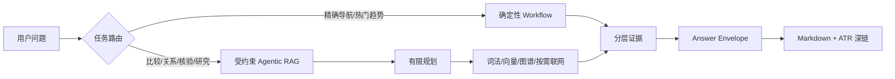

# Agentic RAG 面试能力矩阵

> 日期：2026-08-28
> 目的：把常见 RAG、Agent 与 Agentic RAG 面试问题，映射到本项目可验证的产品与架构事实。
> 边界：这是复盘与答题导航，不是“背标准答案”；没有测试证据的能力不能表述为已完成。

## 一句话产品定义

AI Trend Radar RAG 不是“给向量库套一个聊天框”，而是一个面向 AI 新闻与知识处理的研究工作台：将日报中的原子条目规范化，按用户任务选择确定性检索或受预算约束的 Agentic RAG，在内部证据不足时按权限补充外部检索，并把结论、来源和可跳转条目一起交付给用户。

## 产品采用的范式

关键判断：简单任务不应为了“显得 Agentic”而调用 Agent；复杂任务才允许分解、动态选工具和有限迭代。每次多一步模型推理都会增加延迟、成本和失败面。微软对 agentic retrieval 的说明也把其价值放在复杂问题的分解、并行检索和结构化 grounding，而不是替代所有传统检索。[Microsoft Agentic RAG 指南](https://learn.microsoft.com/en-us/azure/architecture/ai-ml/guide/rag/rag-agentic)

## 面试问题—项目证据矩阵

| 面试主题 | 本项目怎么回答 | 可验证证据 | 当前边界 |
|---|---|---|---|
| 为什么需要 RAG | 新闻答案必须受内部语料和引用约束，模型不能凭参数记忆替代证据 | ATR 唯一编号、内部/外部引用分区、Evidence Integrity | 真实性能指标仍待 G2 正式快照 |
| 文档如何切分 | 日报按独立新闻条目处理，不把 Markdown 表格跨条混切；周报/月报只浏览不入主索引 | `DailyCorpusItem`、`search-index.json`、generation 索引 | 旧历史 generation 仍需后续统一迁移 |
| 为什么混合检索 | 词法处理标题/编号，向量处理语义描述，图谱处理跨日和关系；通道按任务启用 | LexicalStore、ChromaDB、Neo4j、route execution policy | 不宣称图谱能替代事实证据 |
| Query Rewrite 怎么做 | 先保护主体、日期、数字、仓库名等不可丢信息，再按 Route Contract 生成检索查询 | `query_signal_extraction.py`、Route Contract v2 | 未识别的新主体才允许一次语义 fallback |
| 如何避免召回重复 | occurrence 负责当日实例，content ID 负责跨日同内容；趋势路径按稳定内容去重 | ATR、content ID、Graph Observation 链 | 通用 RRF 仍需完整 G2 数据证明 |
| 如何评估 RAG | 分开评估路由、检索、证据层级、回答 groundedness 和 UI 跳转，不用一个总 F1 掩盖问题 | G2 12 条冻结集、离线评估合同 | 非穷尽 Gold 不计算伪精确率 |
| 什么是 Agentic RAG | Agent 可以针对复杂任务规划有限步骤、选择检索工具、基于结果调整；不是无限 ReAct | Agentic GraphRAG 策略、工具 trace、预算与超时 | 当前主要是单 Agent、受约束编排 |
| Workflow 和 Agent 如何取舍 | 高频且边界明确的导航/热门趋势走确定性快路；比较、关系、核验、深研进入受约束 Agent | `route_execution_policy.py`、真实 0-model 导航轨迹 | 不追求“所有问题都 Agent 化” |
| Agent 如何规划与用工具 | Route Contract 先限制任务；Agent 只在允许的通道内选择词法、向量、图谱、Web | Prompt Registry、tool trace、web permission | 计划不是隐藏思维链，不向用户暴露 CoT |
| Agent 的记忆是什么 | 请求内状态记录路由、证据和工具轨迹；可持久化的只有经过验证的结构化知识/主体别名 | Route Contract、Evidence Record、主体集合 | 不把未经验证的模型猜测直接写回知识库 |
| 如何防止循环和成本失控 | 工具次数、联网次数、深抓次数和整体超时都有预算；简单路径零模型 | budget profile、timeout、rate limit、trace timings | 正式压力与成本分布仍待后续运行样本 |
| Agent 失败如何恢复 | 图不可用时按任务决定降级或阻断；证据不足时澄清/拒绝编造；服务有 Doctor 自愈 | graph readiness、clarification、`doctor.command` | “必要图证据”不能静默降级成纯文本结论 |
| 知识如何动态更新 | 稳定编号、content hash、generation 影子构建、校验后切换、可回滚 | index generation、consistency health、G3 计划 | 自动日报更新仍在 G3，尚不能说已全自动上线 |

## 面试中必须主动承认的边界

1. 当前产品是“确定性 Workflow + 受约束单 Agent”，不是成熟多智能体平台。
2. Neo4j 用于关系与趋势证据，不应把共现包装成因果。
3. 通用面试教程可用于发现检查项，但阈值和方案不能直接照抄；真实决策以本项目冻结语料和用户路径评估为准。
4. 当前 G2 功能链路已有大量回归测试，但完整 12 条真实语料评估尚未完成，因此不能发布最终 Precision/Recall/F1。
5. 自动语料抓取、影子索引切换和回滚属于 G3；在通过 Gate 前只能描述为已设计、部分基础设施已具备。

## 参考材料如何使用

- 用户指定的[RAG 面试题系列](https://xiaolinnote.com/ai/rag/rag_info.html)用于补齐 Chunking、Query Rewrite、评估、动态更新等面试检查项，不作为唯一架构依据。
- [Microsoft Agentic RAG 指南](https://learn.microsoft.com/en-us/azure/architecture/ai-ml/guide/rag/rag-agentic)用于校准“复杂问题分解、并行子查询、结构化 grounding”的 Agentic 边界。
- [LangGraph Persistence 文档](https://docs.langchain.com/oss/python/langgraph/persistence)用于校准线程状态、检查点和持久化记忆的区别；本项目不因此默认引入长期记忆或多 Agent。

## 后续只补三类证据

1. G2：完成真实 12 条检索集，按任务输出命中、层级、证据边界和延迟，不伪造一个总分。
2. G3：证明单日新语料能规范化、编号、影子索引、校验、切换和回滚。
3. G4：用干净 clone 证明新用户可以配置 Provider 并一键部署、诊断和恢复。
