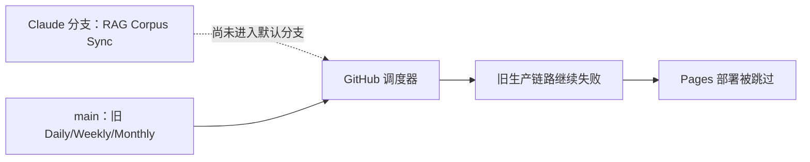
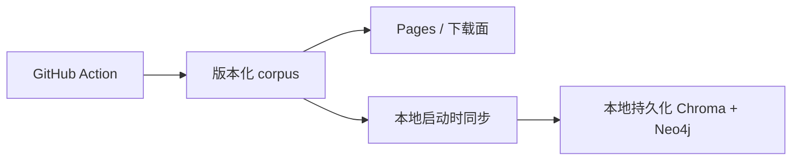

# 自动化、检索与 Web UI 三轨产品诊断

日期：2026-08-10

## 结论先行

目前三个大问题不是彼此独立的 UI 缺陷，而是同一条数据产品链路在三个位置失去契约：

1. **自动化层没有统一“谁生产、谁同步、谁索引”。** 默认分支仍运行旧生产 workflow；Claude 分支设计的新同步 workflow 尚未成为 GitHub 实际调度对象。
2. **检索层没有稳定的条目身份和共享 Search Document。** RAG 以 chunk 为中心、网页搜索以整日 Markdown 为中心，两边都无法稳定回答“这是哪一条、应跳到哪里”。
3. **界面层仍以日报文件和大表格为中心，而不是以用户任务为中心。** 搜索只过滤日期，Agent 与证据钻取是叠加面板，信息层级不足。

因此不能分别用“再补 cron”“把 top_k 调大”“换一套 UI 库”解决。正确顺序是：先恢复自动化事实链路，再建立稳定条目合同，随后分别改善站内搜索和 RAG，最后在已确认的产品信息架构上做 UI 重构。

## 一、证据边界

### 已实现事实

- 当前开发分支：`claude/rag-transformation-checkpoints`，提交 `be0c8f7`；远端默认分支 `origin/main` 为 `2102f39`。
- GitHub 只会对默认分支中存在的 `schedule` / `workflow_dispatch` 文件进行调度与注册。
- 默认分支仍有 `Daily AI Topic Radar`、Weekly、Monthly 旧生产 workflow；Claude 分支才包含 `RAG Corpus Sync` 和“旧生产器仅手动”的设计。
- 已登录 GitHub CLI 读取失败日志后确认：Daily run `31348105733` 中 `DEEPSEEK_API_KEY` 为空，`pnpm digest` 抛出 `Missing DEEPSEEK_API_KEY`。
- Claude 分支 CI run `31141528461` 在 `RAG P0 focused suite` 失败；workflow 只 setup Python，没有安装 `rag/requirements.txt` 及测试依赖。
- `.claude/skills/project-verifier-skill` 是 gitlink，但仓库没有对应 `.gitmodules` 映射，干净 checkout 会出现 submodule 清理/初始化问题。
- 现有 `rag.sync_corpus` 的 11 项离线同步测试通过，包含重试、原子写入、失败不覆盖最后好版本和历史补抓。
- 当前站内搜索把 59 份日期报告并行下载，在浏览器中合并为“每一天一个文本 blob”；结果只显示“匹配 N 天”。
- 浏览器输入 `Open AI` 后显示“匹配 60 天”，但没有条目结果列表，也没有直接跳转入口。
- `digests/search-index.json` 虽存在，但 dashboard 不消费它；`src/generate-manifest.ts` 读取 `pool.topics`，而 59 个 `topic-pool.json` 全部使用 `candidates`，如果现在重建索引会生成 0 条 topic。
- 当前 hash 只支持 `#date/report`，Markdown 表格行没有稳定 item ID，因此引用和站内搜索只能跳到整份日报。
- 2026-08-07 银标检索集结果：查询成功率 75.00%，正确拒答率 0%，macro Precision@10 11.82%，Recall@10 37.63%，F1@10 15.35%，MRR 40.69%，NDCG@10 31.59%。
- 当前 `index.html` 为 2,473 行单文件，HTML、约 700 行 CSS、DOM 交互、搜索、Agent、System 和 Briefs 混合；生成日报的 `src/topic-radar.ts` 还有另一套独立内联 UI。

### 产品意图（已由 Conrad 确认）

- 默认模式：从现有 AI-TREND-RADAR Pages 同步公开语料，新用户无需先维护采集密钥。
- 高级模式：用户可自主管理来源与 Secrets，但不应成为首次使用的必经路径。
- 日报进入 RAG；周报、月报只供浏览，避免二次摘要污染召回。
- 模糊搜索应返回具体词条；标题点击站内具体条目，独立外链按钮跳原始来源。
- UI 应降低配置和研究成本，而不是把工程设置直接暴露给初学者。

### AI 架构判断（待实现验证）

- 采用“共享 Search Document 逻辑层 + 分离物理索引”；站内搜索按条目，RAG 仍按 chunk，两者共享稳定身份和 URL。
- 当前规模约 3,295 条 occurrence、1,523 个去重内容，不足以证明需要新增 OpenSearch/Elasticsearch 常驻服务。
- UI 先渐进重构，不先迁移 React/Tailwind；复杂 drawer/dialog 可在验证后小范围试用 Web Awesome。

## 二、自动化为什么会变成现在这样

### 根因 A1：设计在 Claude 分支，调度在 main

本地存在 workflow 不代表 GitHub 已注册它。只在 Claude 分支提交代码可以完成实现与 CI 验证，但不能让 schedule 正式运行；最终仍需要一次受控合并或切换默认分支，这是后续明确的发布 Gate，而不是代码可以绕过的限制。

### 根因 A2：默认模式与高级模式没有真正隔离

旧 workflow 默认就运行“自行抓取 + DeepSeek 生成”，因此新用户缺一个 key 就让整个发布失败。默认托管同步本应无 Secret；只有自维护来源模式才需要 Provider 和来源 Secrets。

### 根因 A3：CI 自身不可复现

Node 依赖与 Python 解释器已经安装，但 Python runtime/test dependencies 没安装；所以新增 P0 测试后，CI 测到的是“环境未声明”，不是产品代码质量。

### 根因 A4：云端同步与本地索引被用户感知为一件事

GitHub-hosted runner 是短生命周期环境。Action 可以更新 Git 中的 corpus 和 Pages，不能直接更新用户电脑 Docker 里的 Chroma/Neo4j。正确链路是：

## 三、RAG 和站内搜索为什么同时变差

### 根因 R1：没有稳定“条目”合同

当前 RAG 的引用身份混入数组位置，站内页面只知道日期与报告。同一新闻跨日出现、条目排序变化或标题调整后，ID 和目标位置都不稳定。

需要区分：

- `content_id`：跨日期稳定的内容身份，优先 canonical URL / 上游 source ID。
- `occurrence_id`：某内容在某日日报中的出现身份，例如 `date + content_id`。
- `chunk_id`：RAG 内部段落身份，必须反向携带 parent content/occurrence。

### 根因 R2：站内搜索的对象和呈现都错了

- 对象是“日期 blob”，不是候选条目。
- 规范化把空格等删除，`Open AI` 会泛化命中大量含 `openai` 的日报。
- 页面只隐藏/展开日期，没有结果面板、相关性排序、命中字段或置信度。
- 每次打开页面并行下载全部 Markdown，数据量增长后首屏成本继续增加。

### 根因 R3：生成索引与消费索引已经断裂

- 生成器仍读取旧字段 `topics`，数据已经统一为 `candidates`。
- 当前 `search-index.json` 是历史产物，不证明当前生成代码能重建它。
- dashboard 又绕过该文件，自行构建另一套日期索引。

这造成“文件看起来有索引、页面也看起来能搜”，实际上两套实现都不是可靠条目搜索。

### 根因 R4：RAG 召回、重排和拒答同时存在缺陷

- Chroma 热更新后长期句柄可报 `Error finding id`，异常被吞成空结果。
- 固定 query expansion 把公司、产品、模型及相关概念混成泛化词。
- 中文相关性使用空格 `split()`，通常得到整句 token；乘法重排把其他有效分数归零。
- official/source family 映射与真实 metadata 不一致。
- 热门趋势排序没有消费候选本身的业务 score。
- entity 被识别但没有可靠进入 filter/boost。
- 没有校准过的低置信拒答阈值，虚构查询也会返回最近邻。

## 四、UI 为什么“丑”且越修越复杂

问题不主要是颜色，而是界面仍把数据结构原样暴露出来：

- 八列表格要求用户横向理解评分、摘要、分类、推荐题、理由和证据，扫描成本高。
- 全站等宽字体、细边框和低差异灰阶让“导航、数据、证据、操作”视觉权重接近。
- Agent、System、Briefs 是三套自制 overlay，但没有统一 dialog/drawer 语义和完整焦点管理。
- 导航按月份/日期/文件组织，而用户更常从“今天有什么、某公司、某主题、某来源”进入。
- 工作台与生成报告有两套设计 token，任何局部美化都可能继续漂移。

因此 UI 改造的第一问必须是产品主任务，而不是先选颜色或组件库。

## 五、推荐与不推荐

### 推荐

1. 默认托管 corpus 无 Secret；高级自维护生产器独立 workflow。
2. 统一 corpus contract，并增加 schema/revision/checksum/complete 状态。
3. 建立共享 Search Document，分离站内条目索引与 RAG chunk 索引。
4. 先用相同 query set 对 FlexSearch CJK 与 MiniSearch 自定义中文 tokenizer 做小型 bake-off，再选一个。
5. 保留 Chroma + Neo4j；增加 lexical channel、RRF 和可选 rerank，而不是先换数据库。
6. UI 采用原生语义 HTML + 项目 token 渐进重构；Web Awesome 仅用于复杂交互试点。

### 暂不推荐

1. 为当前规模立即引入 OpenSearch/Elasticsearch 第三套服务。
2. 用更多固定 query expansion 掩盖实体模型缺失。
3. 让 fuzzy edit distance 无差别处理中文短词。
4. 用 title slug 或数组下标作为条目 ID。
5. 为视觉升级整体迁移 React/Tailwind。
6. 把 Chroma/Neo4j 作为 GitHub Actions cache/artifact 持久化。

## 六、调研产物

- `docs/research/2026-08-10-github-actions-automation-options.md`
- `docs/research/2026-08-10-rag-and-fuzzy-search-options.md`
- `docs/research/2026-08-10-ui-skills-and-design-systems.md`
