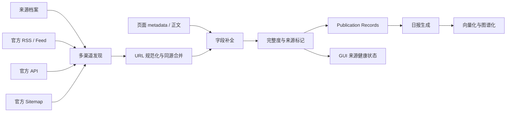

# 通用官网采集模块设计计划

日期：2026-08-07

> 2026-08-07 复核说明：本文的完整 Publication Record、字段级 provenance 和 GUI 健康面板超出了当前空摘要缺陷的最小修复范围，暂不直接实施。当前执行基线改为 `2026-08-07-summary-system-reassessment.md`；本文只保留为长期演进候选。

## 问题定义

当前 `src/web.ts` 同时承担官网发现、站点特例、网页抓取、状态保存与内容降级。OpenAI 被整体设为 `metadataOnly` 后，摘要必然为空；未来每增加一个官网，主流程还会继续积累站点分支。

目标不是强制所有官网采用同一抓取顺序，而是让每个官网声明可用的 Official Channels，由统一模块把多个渠道合并为带来源和质量状态的 Publication Records。

## 设计比较

### 方案 A：每站点专用流程

- 优点：短期修改少。
- 缺点：质量规则、去重、日期语义和错误处理散落，GUI 无法统一解释状态。

### 方案 B：固定 RSS → sitemap → page 流水线

- 优点：容易理解。
- 缺点：错误假设所有站点能力相同；无法优先使用更可靠的官方 API，也无法处理没有 RSS 的官网。

### 方案 C：能力驱动的来源档案 + 统一流水线（推荐）

- 每个官网档案声明 Discovery Adapters（发现适配器）、Enrichment Adapters（内容补全适配器）和字段优先级。
- 统一模块负责 URL 规范化、同源合并、发布/更新时间区分、质量状态、预算、重试和降级。
- 报告生成器只消费 Publication Records，不知道内容来自 RSS、API、sitemap 还是页面。

## 模块接口草案

```ts
collectOfficialPublications(profile, state, transport): Promise<CollectionResult>
```

调用者只需要来源档案与上次状态；返回标准发布记录、来源健康情况和质量统计。RSS、官方 API、sitemap、页面 metadata、正文提取是模块内部 adapters，不泄漏到报告生成器。

## 字段级来源优先级

统一默认规则不是“渠道整体覆盖渠道”，而是逐字段选最可靠值：

1. canonical URL：官方页面 canonical / 官方 feed link / sitemap loc。
2. title：官方 API 或 feed title / 页面 OpenGraph / URL slug。
3. summary：官方 API 或 feed description / 页面 description 或 JSON-LD /可信正文压缩 / missing。
4. published_at：官方结构化发布日期优先。
5. updated_at：官方更新时间；不得覆盖 published_at。
6. content：官方 API 正文 / 页面可信正文；不因缺正文丢弃已有官方摘要。

每个字段记录 provenance，避免把 URL 推断标题与官方摘要标成同一种证据质量。

## 当前来源档案

| 官网 | 发现渠道 | 补全渠道 | 初始策略 |
|---|---|---|---|
| OpenAI | 官方 RSS + sitemap | RSS description + 页面 metadata/正文 | RSS 提供字段，sitemap 补覆盖 |
| Anthropic | sitemap | 页面 metadata/正文 | 保留正文抓取，增加质量状态 |
| Google DeepMind | sitemap | 页面 metadata/正文 | 保留正文抓取，增加质量状态 |

后续新增官网只增加来源档案和必要 adapter，不修改统一编排流程。

## GUI 映射

“数据源”配置页按官网展示卡片，而不是暴露 workflow 代码：

- 启用状态；
- 自动策略（推荐）/高级策略；
- 当前可用官方渠道；
- 最近成功采集时间；
- 摘要完整率；
- metadata-only 与 missing-summary 数量；
- 最近一次降级原因。

默认托管模式只读展示来源健康；自建模式允许启停内置官网和配置需要密钥的官方 API。任意自定义 URL 属于后续能力，需要单独设计 SSRF（服务器请求伪造）安全校验，不能直接把一个 URL 输入框暴露给采集器。

## 数据链路



## 分阶段执行与验证

1. 定义 Publication Record 与来源档案 → 验证：报告层不再读取 `WebPageItem.content` 作为唯一摘要。
2. 建立 feed/sitemap/page adapters → 验证：fixture 中渠道可独立失败且流水线正确降级。
3. 迁移 OpenAI → 验证：三条已知记录获得官方摘要，发布日期与更新时间分离。
4. 迁移 Anthropic、DeepMind → 验证：现有正文能力不退化，统一输出质量状态。
5. 加入采集质量门禁 → 验证：空摘要率超阈值时工作流降级告警而非静默成功。
6. 接入 GUI → 验证：用户无需编辑代码即可查看来源状态和切换内置来源。
7. 干净仓库验证 → 验证：托管模式零采集配置可用，自建模式按 GUI/Secrets 指引完成。

## 非目标

- 第一阶段不重写 Product Hunt、GitHub、Hacker News 等已有官方 API adapters。
- 不用 LLM 根据标题猜摘要。
- 不把任意网址抓取直接开放给无校验的 GUI。
- 不把周报/月报纳入 RAG 索引。
