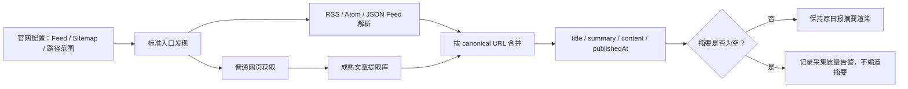

# 摘要系统复核与最小修复计划

日期：2026-08-07

## 结论

摘要展示不需要重新设计成复杂系统。当前缺陷的根因是官网采集器把“可展示摘要”和“供分析使用的正文”混成同一个 `content` 字段，再由日报把它直接当作 `summary`，而不是摘要折叠、浏览器渲染或 LLM 生成失败。

## 证据链

1. 初始提交 `4a263856` 已将 OpenAI 设为 `metadataOnly: true`，并固定生成 `content: ""`。提交注释说明原因是文章页在数据中心 IP 下可能被 Cloudflare WAF 返回 403。
2. 提交 `7bcdd2b` 后，日报新增可见的“摘要”列，并直接展示 `item.content`，但没有补上“摘要必须非空”或降级规则。
3. 对当前历史日报按日期和 URL 去重：OpenAI 46 条记录全部为空摘要；Anthropic 96 条、Google DeepMind 58 条均为非空摘要。
4. 因此用户记忆中的“原来整体摘要比较正常”成立：其他来源一直有摘要；更早的日报也没有暴露空摘要列。OpenAI 的数据缺口则从第一版就存在。
5. Anthropic、DeepMind 的“非空摘要”实际上来自 `extractText()` 截取的最多 1500 字页面正文；`topic-radar.ts` 将这段 `content` 直接映射为 `summary`。这正是摘要过长、后来不得不尝试前端折叠的原因。

## 不采用的复杂方案

- 不修改前端摘要正文，不再增加折叠、占位或自动隐藏逻辑。
- 不让 LLM 根据标题猜摘要。
- 不为了三个官网引入完整浏览器集群、代理池、任务队列或字段级溯源平台。
- 不把所有官网强制改成 RSS；很多官网没有 RSS，强制统一渠道反而不普适。

## 推荐的最小通用链路

统一的是接口和降级顺序，而不是来源渠道：

1. Feed 中已有官方 description 时直接使用。
2. Feed 不存在或未覆盖时，由 Sitemap 发现 URL，再用成熟文章提取器分别读取页面 description/excerpt 与正文 content。
3. 页面不可达且 Feed 也没有摘要时，记录缺失并告警；不把标题伪装成摘要。

`summary` 与 `content` 必须保持两个字段：前者用于表格展示，应当短而忠于原始来源；后者供 LLM 分析和后续 RAG 使用，可以更长。前端不再承担“把正文伪装成摘要后再折叠”的补救责任。

## 开源组件选型边界

- 第一候选：轻量 Feed 解析器 + `@extractus/article-extractor`。后者直接返回 title、description、content、published，并支持自定义 fetcher，适合当前 TypeScript 数据生产链路。
- 稳健备选：`@mozilla/readability` + DOM 实现。它是 Firefox Reader View 使用的核心提取器，成熟度更高，但 Node.js 还需引入 jsdom 等 DOM 库，集成与安全处理更重。
- 暂不采用 Crawlee：它解决大规模抓取、队列、浏览器、代理和重试；当前每天只处理少量已发现 URL，投入大于收益。
- 暂不采用 Firecrawl 作为默认：托管方式增加 API Key、费用和外部依赖；自托管又增加一个服务和 AGPL 许可证边界。可作为以后处理高难动态页面的可选适配器。

## 执行计划（确认后实施）

1. 先写失败测试：OpenAI Feed fixture 中三条已知记录必须产生非空官方摘要。
2. 引入一个标准 Feed 解析器和一个文章提取器；安装前单独列出依赖和许可证。
3. 将 `WebPageItem` 最小扩展为独立的 `summary` 与 `content`，再把 `SiteConfig` 从 `metadataOnly` 改为可声明 `feedUrls`、`sitemapUrl` 和路径过滤；不引入来源专属执行分支。
4. 用 canonical URL 合并 Feed 与 Sitemap；Feed description 优先，页面提取补缺。
5. 前端摘要渲染保持不动；`topic-radar.ts` 只做一处语义修正，从 `item.content` 改为读取 `item.summary`。正文继续供分析 Prompt 使用。
6. 增加质量门禁：官方来源进入高分选题时摘要不得静默为空。
7. 只对受影响的 OpenAI 历史数据制定单独回填方案；先验证，不直接批量重写历史日报。

## 验证表

1. Feed 解析 → 验证：标题、URL、description、发布日期正确。
2. Feed + Sitemap 合并 → 验证：相同 canonical URL 只保留一条。
3. 页面提取降级 → 验证：无 Feed 的 Anthropic、DeepMind 摘要不退化。
4. 页面 403 → 验证：OpenAI 仍可通过官方 Feed 获得摘要，日报不中断。
5. 字段分离 → 验证：日报只展示 description/excerpt，分析链仍能读取较长正文。
6. 报表回归 → 验证：摘要原样显示，不出现折叠按钮和虚构占位内容。
7. 数据质量 → 验证：空摘要被明确计数并导致测试/工作流告警。

## 执行状态（2026-08-07）

- [x] OpenAI 官方 Feed 与 Sitemap 合并；三条已知记录均有非空官方摘要。
- [x] `summary` 与 `content` 分离，日报不再把最长 1500 字正文直接当摘要。
- [x] Anthropic、DeepMind 使用成熟文章提取器，不新增站点专属 DOM 解析器。
- [x] 空摘要进入日报质量告警，不用标题或 LLM 生成内容冒充来源摘要。
- [x] 修复旧 `web-state.json` URL 无尾斜杠导致全量重抓的兼容问题。
- [x] 增加同步防回退：上游摘要为空时，不覆盖同 URL 已有的非空本地官方摘要。
- [x] 对 2026-08-05 三条 OpenAI 空摘要做定点回填；未重算分数、排名及历史时间字段。
- [x] 浏览器实测三条摘要均可见，页面处于本地服务模式且无连接失败。

完整执行证据见 `../execution-log/2026-08-07-summary-pipeline-implementation.md`。
