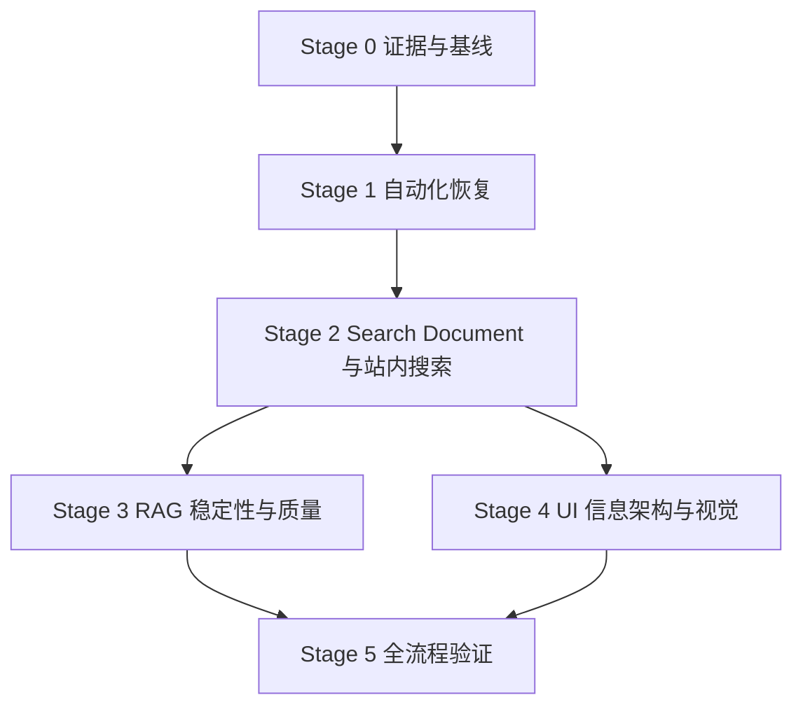

# 产品恢复与质量提升路线图

日期：2026-08-10

## 目标

将当前“能局部运行但自动化、检索与 UI 契约断裂”的状态，推进到：

1. GitHub Actions 在默认/高级模式下都有清晰、可解释、可恢复的数据链路；
2. 站内搜索能够从模糊词返回具体条目并直接定位；
3. RAG 检索质量有数据集、指标、回归门槛和可解释优化；
4. UI 围绕研究任务重构，保持静态浏览与本地 Agent 双模式；
5. 所有阶段在 Claude 分支完成，未获得明确授权前不改动 main。

## 依赖关系

UI 风格调研和 Grill 可提前进行，但生产实现要等 Search Document 与条目深链合同稳定，避免界面先绑定错误数据结构。

## Stage 0 — 证据冻结与可复现基线（已完成）

预计：0.5 天；状态：完成。

### 产出

- GitHub Actions 远端/本地分支差异与失败日志。
- RAG 12 题银标基线和逐题结果。
- 站内 `Open AI → 匹配 60 天` 浏览器复现。
- 三份一手资料研究报告。

### Gate 0

- 不再把“Action 失败”“检索差”“UI 丑”作为无证据笼统描述。
- 每个后续改动至少对应一个失败用例和验收指标。

## Stage 1 — GitHub Actions 与数据链路恢复（P0）

预计：1.5–2.5 天；状态：**本地代码 Gate 已获独立监管批准；等待默认分支云端激活 Gate**。

### 1A. CI 先恢复可重复性

1. 拆分 Python runtime/test requirements，CI 显式安装。
2. 修复 `.claude/skills/project-verifier-skill` 的无映射 gitlink；这是仓库元数据动作，执行前单独列出保留/移除方案。
3. 增加 workflow 静态校验与最小离线测试。
4. 升级并锁定官方 Actions 版本，处理 Node 20 deprecation。

验证：干净 runner 中 Node 与 Python P0 套件都运行；失败指向真实代码，而不是缺包。

### 1B. 拆清默认模式和高级模式

1. `corpus-sync.yml`：默认托管模式，只同步公开 corpus，不要求 LLM/来源 Secrets。
2. `corpus-producer-self-managed.yml`：高级模式，默认手动；显式 preflight Provider 和 required/optional Secrets。
3. 两者输出相同 corpus contract；周报/月报只部署浏览，不进入 RAG ingestion。
4. Pages 只在 corpus 发布成功后部署 allowlist `_site/`。

验证：默认模式无数据源 Secret 也能完成；高级模式缺 Secret 时明确列出缺失名称但不泄露值。

### 1C. 发布可靠性

1. validate/publish 分 job，写权限只给 publish。
2. 固定 publish concurrency，不中断已进入写入阶段的运行。
3. 增加 schema version、revision、checksum、size、complete marker。
4. 增加 dry-run、step summary、诊断 artifact 和 freshness 告警。

验证：坏 JSON、半批文件、checksum 错误、无变化、push 冲突都不会覆盖最后好版本。

### Gate 1

- [x] 在 Claude 分支完成静态/本地验证。
- [x] 默认托管与高级自维护模式在 workflow、权限、语料合同和用户文档中拆分。
- [x] 真实公开 Pages dry-run 验证无变化时幂等：上游/本地最新日期均为 2026-08-10。
- [ ] 在 GitHub Actions 中从默认分支完成一次手动 dry-run 与一次发布验证。
- **GitHub schedule 真正运行仍需要 workflow 进入默认分支。** 到该点必须由 Conrad 明确授权合并/切换；在此之前绝不声称“云端自动化已经上线”。

## Stage 2 — 共享 Search Document、条目搜索与深链（P0/P1）

预计：2–3 天。

### 2A. 先写合同和失败测试

定义：

- `content_id`、`occurrence_id`、`item_anchor`；
- title/summary/source/category/score/action/tags/entities/aliases；
- `local_url` 与 `external_url`；
- schema version 与 deterministic fingerprint。

失败用例：

1. `pool.candidates` 被完整索引，不能重建为 0 条。
2. 同一 URL 跨日共享 `content_id`。
3. 条目重排不改变 `occurrence_id`。
4. `Open AI`、`OpenAI`、别名、拼写错误与中文短词有明确正负例。
5. 点击结果直达对应条目并高亮，前进/后退可恢复。

### 2B. 轻量搜索 bake-off

在同一专项集上比较：

- FlexSearch CJK；
- MiniSearch + `Intl.Segmenter`/字符 bigram。

指标：Hit@1/3、Recall@10、MRR、短词误纠正率、索引体积、构建时间、P95 交互延迟。

只保留胜出的一个依赖；不把二者都带入生产。

### 2C. 搜索结果与深链

1. 页面直接加载条目索引，不再抓取全部 Markdown 建日期 blob。
2. 提供独立结果面板：标题、命中原因、日期、来源、类别、分数。
3. 标题点击 `#date/report/item/<occurrence_id>`；外链图标打开原始来源。
4. 报告渲染后给条目挂载稳定 ID，滚动、聚焦并短暂高亮。

### Gate 2

- 搜索不再显示“匹配 N 天”作为最终结果。
- 精确标题/明确别名 Hit@1 目标 ≥ 95%；deep-link correctness = 100%。
- 模糊搜索阈值必须由专项集决定，不凭视觉体验拍脑袋。

## Stage 3 — RAG 稳定性与检索质量（P0/P1）

预计：3–5 天。

### 3A. 先修错误语义和热更新

1. vector/graph 通道返回结构化 `success/empty/error`。
2. 禁止把必需通道异常吞成“知识库没有内容”。
3. ingestion 使用 staging snapshot，校验后原子切换；服务替换 retriever snapshot。
4. 增加“更新前查询 → 增量更新 → 同进程继续查询”回归测试。

验证：检索错误误报为空结果 = 0；连续热更新不再出现 `Error finding id`。

### 3B. Query Planning 与实体

1. 固定扩展词改为按意图/实体类型触发。
2. 别名只表示同一实体；公司—产品—模型使用关系，不塞进同义词表。
3. exact title/entity/alias 优先，低置信实体只 boost、不 hard filter。
4. source family 与实际 metadata 规范化。

### 3C. 三路召回与排序

1. exact/lexical/vector 并行；明确实体时才图扩展。
2. 各通道独立排名后用 RRF，禁止直接相乘异质量纲分数。
3. 按意图有限加入 freshness、业务 score、source quality。
4. 对 Top 20–50 做“无 reranker vs BGE multilingual reranker”离线消融；收益不达门槛则不引入模型。
5. 用 hard negatives 校准拒答/澄清阈值。

### Gate 3

银标集先以以下目标作为 release floor，之后由人工 gold v1 再校准：

- macro Precision@10 ≥ 45%；
- Recall@10 ≥ 55%；
- F1@10 ≥ 50%；
- 精确标题 MRR ≥ 0.8；
- 正确拒答率 ≥ 90%；
- 每条 citation 都带稳定条目 local URL。

## Stage 4 — UI 信息架构、交互与视觉（P1）

预计：2–4 天，取决于 Grill 结论。

### 4A. Grill 与原型

1. 先确认第一屏主任务与三类读者优先级。
2. 再确认信息密度、视觉性格、Agent 地位、数据呈现和移动端策略。
3. 每次只问一个决定；形成两种低成本原型，确认后再实现。

### 4B. 无依赖的结构修复

1. 定义工作台/静态报告共享语义 token。
2. 把可点击 `div` 改为语义 button。
3. 统一 drawer/dialog 的焦点、Escape、焦点归还和 reduced motion。
4. 将 `index.html` 按职责拆分，保持静态 Pages 与同源本地服务兼容。

### 4C. 条件引入

- Web Awesome：只试一个 drawer/dialog 和一个 menu/tooltip；验证后再扩大。
- ECharts：只有明确要回答趋势/分布问题时引入，并提供文字/表格等价信息。
- AG Grid：只有候选数据量和交互需求证明原生表格不足时评估。

### Gate 4

- 用户能在 3 个动作内完成“发现趋势 → 查看证据 → 向 Agent 追问”。
- 键盘可完成报告导航、搜索、面板打开/关闭和 Agent 提交。
- 桌面与移动端完成视觉回归；不以“更漂亮”替代任务成功率。

## Stage 5 — 全流程验证与发布收尾（P0）

预计：1–2 天。

1. 干净 clone / Docker 一键部署。
2. 默认托管与高级自维护两种 onboarding 路径。
3. CI、corpus sync、Pages、本地启动、增量 ingest、站内搜索、Agent、引用深链全链路。
4. mock 质量测试、真实 API 可用性测试、检索 benchmark、错误注入。
5. README 与配置向导仅写已验证步骤；失败和限制明确展示。

### Gate 5

- 所有证据落盘；失败路径可复现和恢复。
- 只在 Claude 分支提交。
- “已达到发布标准”必须附具体测试快照，不能使用笼统结论。

## 安装与依赖清单（本阶段未安装）

执行到对应阶段前再次核对版本、许可证和安全公告：

1. `actionlint`：Stage 1 workflow 静态校验；优先固定官方 release/checksum。
2. `flexsearch`、`minisearch`：Stage 2 只作为隔离 benchmark 候选；最终只保留胜者。
3. `BAAI/bge-reranker-v2-m3`：Stage 3 可选离线消融，体积较大，不作为默认安装。
4. Web Awesome：Stage 4 可撤销的小范围交互试点；未通过主题/无障碍/离线测试不进入生产。
5. ECharts：仅在已确认图表问题后按需引入。

暂不安装 OpenSearch/Elasticsearch、React/Tailwind、AG Grid、Crawlee 或新的向量数据库。
