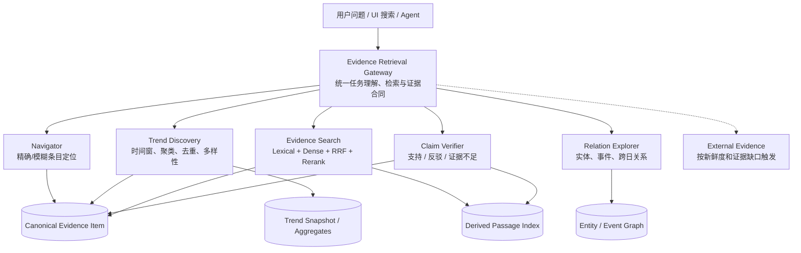

# RAG 架构重估：从“通用检索管线”转向“任务化证据检索”

日期：2026-08-10
状态：架构复盘草案，冻结实施，等待产品方向确认
分支：`claude/rag-transformation-checkpoints`

## 1. 为什么现在必须暂停局部调参

当前方向性评估从纯向量基线提升到向量 + 词法后：

- Macro Precision@K：12.73% → 25.45%
- Macro Recall@K：8.03% → 22.90%
- Macro F1@K：9.54% → 23.02%
- MRR：0.1364 → 0.4773
- 正确拒答率：仍显示 0%

这证明词法通道和稳定条目身份有价值，但不能证明现有检索架构成立。继续叠加阈值、boost、Top K 和关键词规则，可能提高少数题，却让整体系统更加难以解释和维护。

同时，23.02% 也不能被直接解释为“产品检索质量只有 23%”，因为评估合同本身存在三类污染：

1. 32 道题中只有 11 道可回答题，另外 21 道被统一按“零引用才算正确拒答”处理；但其中 12 道是 `claim_refutation`，正确行为应是检索相关证据并反驳，而不是零召回。
2. `RQ01` 宽泛趋势题有 15 个相关条目，但 cutoff 为 10，其 Recall 理论上限只有 66.67%，且“全部相关趋势”的银标集合未经过人工完备性审查。
3. 精确标题、宽泛趋势、实体动态、事件聚类、证据充分性被混进一个 Macro F1；这些任务的成功标准并不相同。

结论：**当前低分同时包含真实架构缺陷和评估失真。两者必须分开修，不能用失真的单一总分驱动重构。**

## 2. 架构级根因

### 2.1 产品任务被错误地建模成同一种“相似文本搜索”

当前多数调用最终收敛到近似统一的接口：

```text
search(query, k, where) -> chunks
```

但用户实际在完成至少五种不同任务：

| 用户任务 | 示例 | 正确的核心操作 |
|---|---|---|
| 精确导航 | “OpenAI Economic Research Exchange 是什么？” | 标题/实体精确与模糊匹配，直接定位条目 |
| 趋势发现 | “最近有什么热门趋势？” | 时间窗过滤、聚类、去重、多样性与业务排序 |
| 实体调研 | “OpenAI 最近有哪些重要动态？” | 实体规范化、近期事件召回、证据重排 |
| 关系解释 | “Anthropic 与某技术趋势有什么关系？” | 图关系与跨日事件聚合 |
| 事实核验 | “OERX 是否发行了加密货币？” | 检索支持/反驳证据，并判断充分/不足 |

这些任务不应只靠更大的 Top K 来区分。尤其“最近有什么热门趋势”本质是结构化发现和聚合，不是普通语义相似度问题。

### 2.2 现有检索模块是浅模块

`VectorOnlyRetriever` / `HybridRetriever` 的外部接口很小，但调用者仍必须知道：

- 该选哪个 intent、time window 和 metadata filter；
- graph 是 disabled、optional 还是 required；
- 结果是否需要来源限制、多样性、freshness 或业务 score；
- 空结果是无证据、通道故障还是检索策略不合适；
- 哪类题应该拒答，哪类题应该检索证据后反驳。

因此复杂度并没有被接口隐藏，而是泄漏到了 query understanding、retrieval planning、chat service、citations、Agent tools 和 UI 搜索等多个调用点。删除这一模块后，复杂度并不会显著增加——说明它尚未形成足够的深度与杠杆。

### 2.3 数据的“权威检索单位”不统一

当前向量库同时包含：

- `topic_candidate`：条目级候选；
- `report_chunk`：日报正文切块；
- 图通道返回的 topic occurrence；
- 新建立的 Search Document / lexical 条目。

同一新闻可能以条目、日报二次摘要、图节点等多种形态出现。虽然近期已用 `content_type` 过滤缓解噪声，但根本问题仍是：系统没有明确规定“回答、导航、聚合和引用分别以什么对象为准”。

### 2.4 表示层与语料语言不匹配

`VectorStore` 依赖 Chroma 默认 embedding，语料和问题却是中英混合、包含大量专有名词与短标题。当前结果中，真正相关条目与虚构实体负例的向量相似度明显重叠，因此单靠相似度阈值无法同时获得高召回和高拒答。

这属于表示架构问题，但不代表应该立刻换模型。必须先用同一快照比较 Recall@20/50，确认问题发生在候选召回还是候选排序，再做多语言 embedding bake-off。

### 2.5 图目前更像“图形索引”，还不是趋势推理模型

现有主要关系是实体经 `MENTIONS` 连接 Topic，再经 `APPEARED_ON` 连接 DailyDigest。它能做实体扩展，但不足以稳定表达：

- 同一事件跨多天的演进；
- 多来源是否在描述同一事件；
- 趋势热度如何随时间变化；
- 某条证据支持还是反驳某个 claim。

因此 Graph RAG 不应作为每次普通查询的平行召回器。短期应只用于已有关系确实能回答的问题；中期再根据关系分析产品需求决定是否引入 Event/Claim 等模型。

### 2.6 UI 搜索与 Agent 检索没有共享同一语义合同

Web UI 已使用 Search Document + MiniSearch 提供条目定位与 deep link；Agent 则主要搜索 RAG chunks。两者对“Open AI/OpenAI”“模糊词”“命中后跳到具体条目”的理解仍由两套实现分别维护。

结果是：UI 找得到的条目，Agent 不一定找得到；Agent 的引用也未必能复用 UI 的定位能力。稳定 ID 已经建立，但还没有成为统一检索接口的核心。

## 3. 对外部建议的取舍

转述分析中以下建议成立，但只适用于“语义证据检索”路径：

- 分开 candidate budget 与 final evidence budget；
- 测 Recall@5/10/20/50 以区分召回问题和排序问题；
- Dense + lexical/BM25 后再做 RRF；
- 只有候选 Recall 足够时 reranker 才有意义；
- Answerability/证据充分性需要独立 Gate。

以下部分不能直接照搬：

1. 它默认所有问题都走 Dense + BM25 + RRF + Reranker，而趋势聚合、精确导航和事实核验应有不同路径。
2. Query expansion 对开放式语义查询可能有帮助，但对标题、公司名和事件名可能扩大噪声；只能由任务计划器按需启用。
3. “正确拒答率 0%”目前不是纯生产缺陷，也有评估把 `claim_refutation` 错当零召回题的因素。
4. 当前 graph 的问题不是“要不要再加入融合”，而是其领域模型是否能表达产品真正需要的关系。

## 4. 推荐的目标架构

不建议重写整个项目，也不建议立刻替换成某个 GraphRAG 框架。推荐在现有数据、运行时和 UI 之上建立一个新的深模块：**Evidence Retrieval Gateway（证据检索网关）**。

它只暴露一个主要接口：

```text
retrieve(ResearchRequest) -> EvidenceBundle
```

调用者只表达用户目标、时间上下文、显式过滤和是否允许联网；模块内部决定用哪种检索路径。UI、Agent、Benchmark 和未来自动报告都通过同一条 seam 使用它。



### 4.1 统一权威对象：Canonical Evidence Item

现有 Search Document 应演进为内部权威条目，而不是只服务前端搜索。至少包含：

- 稳定 `content_id` / `occurrence_id`；
- title、summary、source、published_at、canonical URL、local URL；
- category、tags、entities、业务 score；
- 内容质量状态与解析来源；
- 派生 passage 和 graph 节点的反向引用。

日报页面是展示容器；passage 是语义检索派生物；graph 是关系派生物；三者都不再自行成为权威身份源。

### 4.2 按任务选择检索路径

#### A. 精确导航

标题/实体标准化 → exact/prefix/fuzzy → 返回稳定条目与 deep link。默认不调用向量和图。

#### B. 最近趋势

最近 7/14/30 天 Canonical Items → 去重/事件聚类 → 按热度、新鲜度、来源质量排序 → 类别和来源多样化 → 可选 LLM 解释。

这里的“趋势结果”由结构化聚合产生，语义检索只用于聚类或解释，不负责从全库猜 Top 趋势。

#### C. 实体/主题调研

实体规范化 → 时间/来源过滤 → lexical + multilingual dense 扩大候选 → RRF → 可选 reranker → EvidenceBundle。

candidate Top N 与给 LLM 的 final Top M 分离。

#### D. 关系与演进

只有明确需要跨日、实体关系或事件链时才调用 graph。Graph 不可用时明确降级，不伪装成完整关系答案。

#### E. 事实核验

先检索与 claim 中实体/事件相关的证据，再判断 `supported / contradicted / insufficient`。`contradicted` 必须有引用，不能被当作“零召回拒答”。

### 4.3 Graph 的中期领域模型

先不一次性重建。只有当关系类评估证明现有图不足时，再逐步引入：

```text
EvidenceItem -> DESCRIBES -> Event
Event -> INVOLVES -> Entity
Event -> OCCURRED_ON -> Date
Event -> BELONGS_TO -> Topic
EvidenceItem -> MENTIONS -> Entity
```

Claim/支持/反驳关系属于更高成本能力，待事实核验路径的真实需求和数据质量得到验证后再决定，不先过度设计。

## 5. 哪些现有工作保留，哪些暂停

### 继续保留

- Search Document 的稳定身份与 deep link；
- SQLite FTS5 lexical 通道；
- generation snapshot、单写者、last-known-good 和通道错误语义；
- internal-first、外部搜索开关和来源质量边界；
- 周报/月报只供浏览、不进入向量主索引的产品决策。

这些工作属于数据身份、运行稳定性和安全边界，不因检索架构调整而作废。

### 立即暂停

- 继续增加固定关键词扩展；
- 在统一结果上叠加更多 freshness/source/score 乘法；
- 用一个全局相似度阈值解决所有拒答；
- 未测 Recall@20/50 前引入 reranker；
- 把当前 Macro F1 当作唯一发布门槛；
- 在未明确图问题类型前扩大 graph 参与范围。

## 6. 三种路线比较

| 路线 | 工程成本 | 短期收益 | 长期风险 | 判断 |
|---|---:|---:|---:|---|
| A. 继续修补统一 Hybrid 管线 | 低 | 个别题可能继续上涨 | 规则堆积、任务相互污染、质量上限低 | 不推荐 |
| B. 保留现有存储与 UI，新增任务化 Evidence Retrieval Gateway | 中 | 可先修最痛的导航/趋势路径 | 需要重做评估合同和调用 seam | **推荐** |
| C. 全面迁移到现成 GraphRAG/Agentic RAG 框架 | 高 | 可能快速获得部分能力 | 数据模型、部署和评估重新开始，且未证明框架适配本产品 | 暂不推荐 |

路线 B 不是“大重写”。它把已经验证有效的基础设施保留，只替换目前最薄弱的 seam：从“所有问题返回 chunks”改为“按用户任务返回可审计 EvidenceBundle”。

## 7. 分阶段路线与 Gate

### Stage A：修正质量地图，不改生产检索

1. 将数据集按五类产品任务拆分。
2. 修复 `entity_absent` 与 `claim_refutation` 的判定合同。
3. 保证被测索引与标注快照一致。
4. 输出分任务基线，不再只报一个 Macro F1。

Gate：每题的成功标准、相关集、时间窗和数据快照可解释；Conrad 完成人工抽查后才升级为 Gold。

### Stage B：建立统一 Evidence Item 与 Gateway seam

1. 让 Search Document 成为 UI 与 RAG 共同的条目身份源。
2. 定义 `ResearchRequest` 与 `EvidenceBundle`，隐藏内部通道细节。
3. UI 搜索、Agent 引用和测试共用同一结果身份。

Gate：同一条目在 UI、Agent 和评估中的 ID、标题、日期、来源和 deep link 一致。

### Stage C：先实现两个最高价值路径

1. 精确/模糊导航路径。
2. 最近趋势结构化发现路径。

Gate：

- 导航：Hit@1、MRR、deep-link success；
- 趋势：Freshness、NDCG@10、来源/类别覆盖、重复率；
- “最近有什么热门趋势？”不再依赖全库语义相似度猜答案。

### Stage D：语义证据路径实验

1. 分别记录 Recall@5/10/20/50。
2. 对当前 embedding、`multilingual-e5-small` 和可选 `bge-m3` 做同快照 bake-off。
3. 只有 Recall@20/50 足够但 Top5 排序差时才加入 reranker。
4. Query rewrite 仅对开放式主题调研启用，并做单变量消融。

Gate：模型和 reranker 的选择必须由分任务增益、P95 延迟、索引体积与构建时间共同决定。

### Stage E：事实核验与拒答

1. 三分类：supported / contradicted / insufficient。
2. entity-absent 题校准拒答；claim-refutation 题校准有证据反驳。
3. 外部搜索只补新鲜度或内部证据缺口，并单独标记。

Gate：三分类 Macro F1、正确拒答率、错误强答率分别报告。

### Stage F：Graph 模型是否升级的决策 Gate

1. 用 10–20 道真实关系/演进题测试现有图。
2. 若错误主要来自关系表达缺失，再引入 Event 模型。
3. 若错误主要来自实体解析或数据缺失，先修 ingestion，不重建图。

Gate：没有关系任务证据，不启动完整图重构。

## 8. 新的质量仪表盘

| 任务 | 核心指标 | 辅助指标 |
|---|---|---|
| 精确/模糊导航 | Hit@1、MRR | deep-link success、拼写变体覆盖 |
| 最近趋势 | NDCG@10、Freshness | 来源/类别覆盖、重复率 |
| 实体/主题调研 | Recall@20/50、NDCG@10 | reranker lift、P95 latency |
| 关系与演进 | path/evidence faithfulness | graph availability、降级正确率 |
| 事实核验 | supported/contradicted/insufficient Macro F1 | 正确拒答率、错误强答率 |
| 最终回答 | citation precision、claim support | 可读性、延迟、外部证据占比 |

发布时可以给出一个产品级总览，但不能再用跨任务平均的单个 F1 掩盖具体能力。

## 9. 当前架构判断

当前项目不是“全部推倒重来”，而是已经具备数据抓取、稳定身份、前端浏览、词法索引、向量索引、图存储、运行快照和引用治理等有价值资产；真正缺失的是一个把这些能力按用户任务组织起来的深模块。

因此下一步的正确动作不是继续调参，也不是引入更多框架，而是先确认产品任务合同，然后把检索 seam 重构为 Evidence Retrieval Gateway。只有这一层明确后，Top K、embedding、reranker、Graph 和 web search 才有正确的落点。
