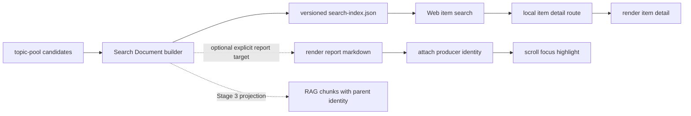

# Stage 2：Search Document、条目搜索与稳定深链实施计划

日期：2026-08-10
状态：Gate Review 通过，待 Claude 分支 checkpoint
分支：`claude/rag-transformation-checkpoints`

## 1. 目标与证据起点

本阶段解决两个已经复现的问题：

1. Web UI 搜索对象是“整日 Markdown”，用户输入 `Open AI` 后只能得到“匹配 N 天”，不能看到具体条目或直接定位。
2. RAG chunk、站内搜索结果和日报 DOM 没有共享的稳定条目身份，导致引用、搜索和后续趋势详情无法指向同一个对象。

现有证据：

- `src/generate-manifest.ts` 仍读取 `pool.topics`，当前语料实际使用 `pool.candidates`；重建时可能得到 0 条 topic。
- `index.html` 会并行下载所有 Markdown，并按日期建立文本 blob；它没有条目级结果模型。
- 当前 hash 只有 `#date/report`，日报表格行没有稳定 `occurrence_id`。
- 64 天共有 3,558 个 candidates；其中 1,180 个 URL 没有出现在对应日报，1,061 个匹配到多个展示位置。候选池与日报行不是一一对应，不能靠标题猜落点。
- 同日存在 41 组 canonical URL 重复记录；`date + report + content_id` 不能唯一表示每个不同候选。
- 2026-08-07 RAG 银标基线为 Precision@10 11.82%、Recall@10 37.63%、F1@10 15.35%；这些指标属于后续 Stage 3，本阶段不冒充已修复 RAG 排序。

## 2. 产品合同

### 2.1 Search Document

建立一个共享逻辑合同，站内搜索按条目消费，RAG ingestion 后续按 chunk 投影：

| 字段 | 合同 |
|---|---|
| `schema_version`, `id_scheme` | schema 与身份算法显式版本；未知版本拒绝静默消费 |
| `content_id` | 跨日期稳定内容身份；优先 upstream stable ID，其次 canonical URL |
| `occurrence_id` | 某日候选出现身份；由日期、报告和稳定 candidate identity 推导，不使用数组位置 |
| `item_anchor` | 路由稳定锚点；只有 producer 明确给出 report-entry mapping 时才映射 DOM 行 |
| `date`, `report_id`, `report_type` | 日报候选定位；rollup 不生成 Search Document、不进入条目索引或 RAG |
| `title`, `normalized_title`, `summary` | 原始可展示内容；不重新生成摘要，不改写语义 |
| `source`, `category`, `score`, `action` | 展示、过滤与有限排序信号 |
| `display_fields` | 详情页所需的上游原始字段：`recommended_topic`、`reason`、`angle`、`evidence`；字段缺失允许为空，但详情页不再二次请求 topic pool |
| `tags` | 上游原始字段 |
| `entities`, `aliases` | 可选 enrichment；缺失允许为空，alias 仅代表同一实体 |
| `external_url` | 原始来源链接 |
| `local_url` | `#date/report/item/<occurrence_id>`，始终可打开独立条目详情 |
| `report_target` | `null | { report_id, anchor_id }`；anchor 必须由 producer 写进可渲染报告，consumer 不猜标题、URL 或行号 |
| `content_fingerprint`, `occurrence_fingerprint` | 分开的确定性变更检测 |
| `duplicate_count` | 完全相同候选的聚合计数，避免制造不可区分的重复结果 |

### 2.2 身份与 URL 规则

1. `id_scheme=sd-v1`；标识符使用 SHA-256 前 128 bit（32 hex），构建期强制唯一性检查，发现碰撞即失败而不是覆盖。
2. 优先 upstream stable ID；否则清理 CDATA 包装并解析 URL。只删除明确 tracking 参数（`utm_*`、`fbclid`、`gclid` 等），保留可能决定资源身份的 fragment 和业务参数。
3. URL 的 username/password、query 与 fragment 含 credential-like 参数时，不把敏感值写入公开索引；采用拒绝、脱敏或 URL 缺失回退。诊断日志只记录日期、字段名与错误类别，不记录 credential 值。
4. `content_id` 从 upstream ID 或 canonical URL 推导；URL 不可用时回退到 `source + normalized_title`。
5. `candidate_identity` 优先使用带 provider/source namespace 的 upstream item ID；否则使用 canonical URL + normalized source/channel。只有同 URL、同来源仍存在多个不同候选时，才用 normalized title 作降级 discriminator，并显式标记 `identity_quality=degraded`。
6. summary、score、action、tags、reason 等可修订字段不得进入 `candidate_identity`；标题降级身份后续变化由 `legacy_ids` 映射承接，不能让历史链接静默失效。
7. 完全相同 candidate 记录聚合为一个 occurrence并记录 `duplicate_count`；`duplicate_count` 表示该文档聚合的源记录总数（最小为 1），不同 candidate 不因共享 URL 碰撞。
8. `occurrence_id` 由 `date + report + candidate_identity` 推导，不含数组位置；条目重排不改变链接。
9. 首版上线前没有历史 item deep link；以后升级 canonicalizer 时必须保留 `legacy_ids` 映射，不能静默让旧链接失效。
10. 搜索结果标题进入独立详情 `local_url`；外链图标进入 `external_url`。只有 `report_target` 存在时才提供“在日报中查看”。

### 2.3 候选与日报落点合同

采用“短期独立详情、长期 producer 明确映射”的演进方式：

1. 全量 candidates 进入 Search Document；完全相同的重复记录聚合但计入覆盖统计。
2. 每个 candidate 都能打开独立条目详情，直接消费 Search Document 的原始 title、summary、source、日期、标签、`display_fields` 和外链；不在详情页重新请求或重算源数据。
3. 未进入日报的候选不伪造表格行，也不承诺“在日报中查看”。
4. 旧语料没有可靠 mapping 时，`report_target=null`；禁止运行时用标题/URL 猜规范落点。
5. producer 后续输出稳定 `report_entries`，并把对应 `anchor_id` 写入 Markdown/HTML 可渲染产物后，Search Document 才可携带 `{ report_id, anchor_id }`；consumer 只执行 `getElementById(anchor_id)`。anchor 不存在时显示“日报定位不可用”，不得回退到标题、URL 或行号匹配。

## 3. 执行步骤与验证表

| 步骤 | 实施 | 验证 |
|---|---|---|
| 2A-1 | 将身份、URL、规范化和 Search Document 构建放入独立深模块 | 单元测试覆盖候选覆盖、去重计数、同 URL 不同候选、确定性、跨日、重排、URL 安全和摘要原样保留 |
| 2A-2 | 生成 versioned `digests/search-index.json` | `source_candidate_count = sum(document.duplicate_count)`；全量候选可审计；除显式 volatile metadata 外结果稳定 |
| 2A-3 | 建立专项搜索 query set | 包含 `Open AI`/`OpenAI`、Claude/Anthropic、中文短词、拼写错误、精确标题和 hard negatives |
| 2B-1 | 在隔离 harness 对 FlexSearch CJK 与 MiniSearch + `Intl.Segmenter`/bigram 做 bake-off | 输出 Hit@1/3、Recall@10、MRR、误纠正率、体积、构建时间、P95；只保留胜者 |
| 2C-1 | Web UI 加载条目索引，显示独立结果面板 | 搜索结果是具体条目；显示规范化解释、匹配原因、日期、来源、分类、分数及时间/来源/类别筛选 |
| 2C-2 | 实现 route-backed 独立条目详情；只消费显式 `report_target` | 所有结果可直达详情；有 target 才滚动/聚焦/高亮日报行，无 target 时不显示失效操作 |
| 2C-3 | 扩展 hash 路由并支持浏览器历史 | `#date/report/item/<occurrence_id>` 刷新、前进、后退均恢复目标 |
| 2C-4 | 用同一 Playwright 场景分别启动静态 HTTP server 与 FastAPI | 两种运行模式的搜索、详情、刷新、前进/后退和可选 report target 行为一致 |

## 4. 紧反馈测试（写生产代码前）

先建立以下红色测试命令：

```bash
pnpm vitest run src/__tests__/search-document.test.ts src/__tests__/item-search.test.ts src/__tests__/report-route.test.ts
pnpm playwright test tests/e2e/item-search.spec.ts
```

- Vitest 保持 Node 环境，只测纯逻辑 interface。
- DOM identity 挂载先从内联页面提取为可注入函数，再做 DOM adapter 单元测试。
- Playwright 负责真实点击、刷新、history、滚动与高亮；同一 spec 通过两个 webServer project 覆盖静态 HTTP 与 FastAPI。
- 新依赖执行前单独列清：`flexsearch`、`minisearch` 仅用于开发 bake-off；`@playwright/test` 用于 E2E，并安装 Chromium runtime（`pnpm exec playwright install chromium`）。生产依赖最终只保留搜索胜者。
- Playwright 两个 project 的启动合同固定为：静态模式运行项目静态 server 并等待 `/manifest.json`；服务模式运行 FastAPI 并等待 `/health`。具体端口写入 Playwright 配置，不依赖开发者手工先启动。

必须能捕获用户的原始症状，而不是只测内部 helper：

- 从真实形状 `pool.candidates` 构建后不能为 0 条；
- 查询 `Open AI` 返回条目列表且第一层结果不是日期；
- 点击精确标题后 URL 含 occurrence 且条目详情可见；只有显式 target 的 fixture 才断言目标行高亮；
- 短摘要和空摘要保持源数据原样，不由搜索/深链层改写。

## 5. 分层假设与排查顺序

在紧反馈测试变红后，按以下预测逐个验证：

1. **H1（最高）— 生成合同断裂。** 如果根因是 `topics`/`candidates` 漂移，则用真实候选 fixture 重建会得到 0 条；修正 schema adapter 后恢复完整条目。
2. **H2 — 搜索粒度错误。** 如果根因是日期 blob，则相同查询无法产生条目身份或匹配原因；改用 Search Document 后无需扩大模糊阈值即可返回具体条目。
3. **H3 — 身份依赖展示顺序。** 如果 ID 混入数组位置，则打乱候选顺序会改变链接；内容身份与出现身份分离后应保持不变。
4. **H4 — 候选与日报行被错误假定为一一对应。** 如果强制运行时猜映射，未选中候选和重复展示必然产生错误落点；独立详情 + 可选 producer target 后应消除假链接。
5. **H5 — 中文/别名分析不足。** 如果前四项正常但 `Open AI`、中文短词仍失败，专项 bake-off 应显示 tokenizer/normalizer 差异；只按实测结果选引擎。

## 6. 模块与 seam

### 外部 interface

```ts
buildSearchDocuments(input: CandidatePoolInput): SearchDocumentBuildResult
buildSearchIndex(documents): SearchIndexArtifact
searchDocuments(index, query, filters?): SearchResult[]
parseReportRoute(hash): ReportRoute
```

调用方只需要知道稳定字段和错误模式，不需要知道哈希、tokenizer、别名或评分实现。搜索引擎适配器放在模块内部；只有 bake-off 证明第二个实现确实需要长期存在时，才保留可替换 seam。

### 数据流



## 7. 非目标与回滚边界

- 不在本阶段引入 OpenSearch/Elasticsearch、React/Tailwind 或新的向量数据库。
- 不在本阶段修改 RAG query planning、rerank 或拒答阈值；只为 Stage 3 提供稳定 parent identity。
- 不修改摘要生产策略，不重新生成、截断或折叠摘要。
- 本阶段是“条目结果 first slice”：实现全历史默认搜索、时间/来源/类别筛选和可见规范化解释；实体纠错交互、趋势结果类型和完整分层结果延后到 Stage 3/4。结果 schema 使用可扩展 `result_type`，但不预造空实现。
- Rollup 只保留导航浏览：不生成 Search Document，不进入站内条目索引，也不进入 RAG。
- bake-off 的两个候选依赖先作为开发时实验；生产只保留胜者，若两者均未达标则回退到无依赖的确定性 exact/alias 搜索并记录缺口。
- 每个子步骤可通过删除新索引消费路径回退到旧日期搜索，但旧路径不作为最终 Gate 通过方案。

## 8. Gate 2

- 精确标题/明确别名 Hit@1 ≥ 95%；别名指标只统计存在人工或 producer 明确 alias 的样本，aliases 全空不得判定通过。
- item-detail deep-link correctness = 100%；显式 report-target fixture 的日报行 deep-link correctness = 100%。
- `pool.candidates` 覆盖率 = 100%；完全重复记录可聚合，但 `source_candidate_count` 与 `duplicate_count` 必须可审计。
- 模糊阈值来自专项数据集，不凭视觉体验写死。
- 静态 Pages 与本地服务都能完成“搜索 → 条目详情 → 原始来源”的路径；Agent 上下文传递属于 Stage 4 UI 集成，不冒充本阶段已完成。
- 独立监管 Agent 无 P0/P1 阻塞项后，才允许提交 Stage 2 checkpoint。

## 9. Gate 2 结论

2026-08-10 独立双轴复审结论：Standards **APPROVE**，Spec **APPROVE**；两条轴线均为 P0=0、P1=0。

- 3,558 条源候选以 `duplicate_count` 闭合为 3,550 条 Search Documents，覆盖率 100%。
- 专项代理集的精确标题、实体字面词、中文短词与测试 typo Hit@1/Hit@3/MRR 均为 100%；这不是人工相关性 gold，不能外推为完整搜索质量。
- Playwright 在静态 HTTP 与 FastAPI 两种模式共 4/4 通过，覆盖具体条目结果、item deep link、刷新、history、外链与显式 report target。
- 空摘要保持上游原始空值；本阶段没有修改摘要生产策略，也没有声称修复 Stage 3 的 RAG 召回排序。

Gate 2：**通过**。允许在 Claude 分支建立 checkpoint；不得据此宣称默认分支或正式发布已完成。
