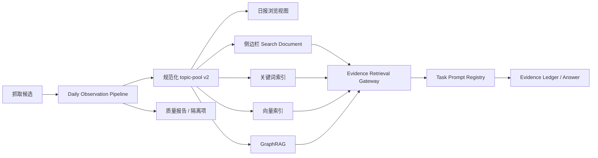

# Canonical Daily Observation、GraphRAG 与任务路由统一计划

日期：2026-08-11
状态：计划与自审完成；尚未修改业务代码或正式索引
上位决策：ADR-0003、ADR-0004
承接计划：2026-08-10 Stage A 任务评估、Stage B Evidence Retrieval Gateway

## 1. 目标与问题定义

本计划不是继续微调 Top K、向量权重或 RRF，而是先修复输入语料和任务接口：让每一条正式日报信息在入池时成为结构统一、身份稳定、可独立召回的日信号观测，再让路由按用户任务选择正确的检索视图、GraphRAG 关系、Prompt 和输出契约。

当前审计基线：

- ChromaDB 共有 6,098 个向量；
- 3,295 个是结构化 `topic_candidate`；
- 2,803 个是 Markdown `report_chunk`，其中 2,734 个来自 `ai-topic-radar`；
- 3,558 条原始候选中，109 条无摘要、54 条摘要少于 20 字、255 条摘要超过 1,000 字；
- 发现 149 个异常发布日期文本和至少 11 组同日 URL 身份冲突；
- 当前问题分类主要依赖关键词规则；检索 Gateway 只为 Navigator 和 generic Trend 提供了明确路径；Prompt 仍以单一 System Prompt 加运行时上下文为主。

根因不是单点检索参数，而是四套解释同时存在：原始候选、Markdown 报告切块、Search Document、Python ingest metadata。它们对身份、摘要、日期和引用的解释并不完全一致。

## 2. 统一领域模型

### 2.1 Daily Signal Observation

每条正式进入日报的信息形成一条独立记录，核心字段为：

```text
身份
  daily_item_id        ATR-YYYYMMDD-XXXXXX，唯一公开身份
  content_id           内部跨日内容身份
  previous_daily_item_id
  report_date          入池日期

内容
  title
  summary
  source
  category
  canonical_url
  publication_date

产品判断
  score
  action
  recommended_topic
  reason

趋势观测
  signal_metrics
  observation_reason
  source_policy

质量与证据
  evidence[]
  completeness
  summary_quality
  identity_quality
  diagnostics[]
```

约束：

1. `daily_item_id` 在清洗、去重并确认入日报时生成；同日报重跑必须复用。
2. 日期段表示入池日期，不表示网页发布日期。
3. 分数和排序不进入 ID；沿用现有选题分，不新增重复的“质量总分”。
4. 缺失摘要必须显式标记，不得用推荐理由或模型文本冒充原始摘要。
5. 同一条观测可以有一个主文档和若干同条目子块，但任何 chunk 都不得跨越 Daily Item ID。
6. 周报、月报以及渲染后的日报 Markdown 只供浏览，不进入主向量索引。

### 2.2 跨日观测规则

- 内容和信号均无实质变化：不产生新观测。
- 正文发生实质更新：生成新 Daily Item ID，并关联原内容。
- 热度、排名、评论或版本状态达到来源策略阈值：生成新 Daily Item ID，并记录变化原因和前序观测。
- GitHub、Hacker News、Product Hunt、官方渠道分别使用可解释规则；未知来源先采用保守的内容变化规则。

### 2.3 GraphRAG 关系

确定关系：

```text
(Observation)-[:OBSERVES]->(Content)
(Observation)-[:PREVIOUS_OBSERVATION]->(Observation)
(Observation)-[:MENTIONS]->(Entity)
(Observation)-[:ABOUT]->(Topic)
(Observation)-[:FROM]->(Source)
(Observation)-[:PUBLISHED_IN]->(DailyReport)
```

推断关系必须记录推断方法、置信度和支持证据，不能与确定关系混用。横向趋势优先通过 Topic、Entity、Source 等中心节点形成，不创建所有相似条目的两两连接。

## 3. 三个深模块与 interface

### 3.1 Daily Observation Pipeline

唯一外部 interface：

```text
process_daily_report(DailyReportInput) -> DailyObservationBatch
```

模块内部隐藏字段校验、标准化、URL 规范化、ID 分配与复用、同日/跨日去重、来源变化策略、摘要质量门、诊断和旧 ID 映射。当前 `topic-pool.json` 升级为带 schema version 的规范化批次产物，避免再新增第二份事实源。

该模块位于 TypeScript 报告生产阶段、日报渲染之前；identity registry 与 source policy registry 作为构造依赖注入，调用方只使用一个 `process_daily_report` 方法，测试也通过同一 interface 验证。

输出：

- admitted observations；
- rejected/quarantined observations；
- legacy ID map；
- quality report；
- deterministic batch fingerprint。

### 3.2 Evidence Retrieval Gateway

保留 Stage B 的唯一外部 interface：

```text
retrieve(ResearchRequest) -> EvidenceBundle
```

但把任务输出升级为明确的检索视图：

| Task Family | 检索视图 | 关键行为 |
|---|---|---|
| `item_navigation` | `exact_observation` | 完整 ID 或精确标题；不调用 LLM |
| `trend_discovery` | `cross_section` | 按 content 去重，跨来源/主题聚合 |
| `timeline` | `observation_timeline` | 展开同一主体的多日观测 |
| `evidence_research` | `representative_evidence` | 每个主体优先一条代表证据 |
| `relation_exploration` | `typed_graph` | 区分确定关系与推断关系 |
| `claim_verification` | `claim_evidence` | 支持、反对、证据不足三态 |

完整 Daily Item ID 在分类器之前解析；未命中明确失败，不降级为模糊或向量搜索。

### 3.3 Task Prompt Registry

唯一外部 interface：

```text
compile_prompt(TaskRoute, EvidenceBundle) -> PromptEnvelope
```

`PromptEnvelope` 包含：共享安全与证据规则、任务专属指令、必需证据形状、输出契约和失败策略。Prompt 不再按 OpenAI、Claude、RAG 等主题拆分，而按稳定任务拆分。

| Prompt 模块 | 输出约束 |
|---|---|
| Item Navigation | 确定性条目卡片和 deep link，不生成长回答 |
| Trend Discovery | 趋势簇、时间方向、来源多样性、证据标记、局限性 |
| Timeline | 按日期列出观测变化，不能把缺失日期补成事实 |
| Evidence Research | 每个核心结论绑定 Evidence Record |
| Relation Exploration | 展示关系类型；共现不得表述为因果 |
| Claim Verification | supported / contradicted / insufficient，附证据矩阵 |

如果 required evidence shape 不满足，Prompt 编译器返回可解释的 insufficient 状态，而不是把任务塞回通用 Prompt。

## 4. 统一数据流



## 5. Web UI 与搜索行为

### 5.1 日报展示

- 原标题链接与外部 URL 行为保持不变；
- 标题下方显示不可点击的弱化 Daily Item ID；
- 不增加复制按钮，不增加新表格列；
- 现有分数保持原位置和含义。

### 5.2 侧边栏搜索

- 完整 Daily Item ID：独立 exact path；
- 普通关键词：规范化、别名和有限拼写容错，不使用向量搜索；
- 返回条目级结果并按日期分组；日期只展开/收起，标题负责跳转；
- 排序：字段相关性 → 新鲜度 → 现有分数；
- 点击结果后加载对应日报，将目标条目置于内容区顶部并短暂高亮；
- deep link 统一为 `#date/report/item/<daily_item_id>`；
- 旧链接通过只读 legacy map 跳转，新输出只使用新 ID。

## 6. 分阶段执行与验证表

### Stage 0：冻结基线与单日样本

1. 固定当前索引快照、现有检索指标和 10 条小型查询集。
   验证：结果文件记录当前 exact、普通、趋势三类表现。
2. 选择一个同时含重复、缺摘要、异常字段和跨日项目的日期。
   验证：样本理由和预期结果人工可读。

### Stage 1：Daily Observation Pipeline 单日影子实现

1. 先写失败测试，再实现批次 schema、随机短码分配器和持久化复用。
   验证：ID 匹配 `ATR-YYYYMMDD-XXXXXX`、当日唯一、重跑不变。
2. 实现字段标准化、日期诊断、摘要完整度和隔离结果。
   验证：异常日期不静默通过；空摘要不被伪造。
3. 实现同日与跨日身份策略。
   验证：无变化不新建；正文更新和显著信号变化产生关联观测。

Gate 1：只生成影子 `topic-pool v2`，不写正式历史文件、不发布索引。失败则停在 Stage 1。

### Stage 2：统一投影与候选索引

1. 让日报、Search Document、lexical、vector、graph 读取同一批次。
   验证：每个下游记录可回溯到一个 Daily Item ID。
2. 停止将 `ai-topic-radar` Markdown 作为主向量语料。
   验证：候选索引中无跨条目 chunk，无 report/item 双重索引。
3. 对缺摘要条目按 completeness 决定 lexical/vector 资格。
   验证：不会把通用推荐理由冒充正文嵌入。

Gate 2：在候选 generation 上运行 10 条查询；exact ID 10/10，精确标题 Top-5 不低于基线，generic trend 不退化，引用全部定位到条目。

### Stage 3：Web UI 条目搜索与 deep link

1. 标题链接旁独立显示 ID。
   验证：标题仍打开原来源，ID 无点击/复制行为。
2. 侧边栏升级为条目级分组结果。
   验证：同日多结果可分别选择。
3. deep link、顶部定位、高亮和浏览器历史。
   验证：刷新、前进、后退均恢复同一条目。
4. exact ID 独立错误语义。
   验证：未知 ID 不触发模糊或向量结果。

Gate 3：浏览器端到端测试全部通过后才能迁移历史。

### Stage 4：GraphRAG 纵向与横向关系

1. 写入 Content、Observation、Topic、Entity、Source 和 DailyReport。
   验证：同一 content 的观测按日期可追踪。
2. 消费 Pipeline 已判定的 Material Signal Change，建立时间关系。
   验证：每个新观测都有 observation_reason、previous ID 和可追踪的来源策略。
3. 区分事实关系与推断关系。
   验证：任何推断关系均有 confidence、method 和 evidence IDs。
4. 普通查询折叠，timeline 展开，cross-section 去重。
   验证：同一主体不在普通答案刷屏，趋势查询保留时间序列。

### Stage 5：Task Prompt Registry

1. 为每个 Task Family 先写输入/输出契约测试。
   验证：路由选择同时决定 retrieval view 与 prompt module。
2. 将共享安全、证据边界和 citation 规则提取为公共基座。
   验证：各 Prompt 不复制矛盾规则。
3. 实现 task-specific PromptEnvelope。
   验证：趋势、时间线、关系和核验输出结构不同且可检查。
4. 删除调用链中不再使用的通用 Prompt 拼接路径。
   验证：没有双重 Prompt 或旧 fallback 静默生效。

Gate 5：任务路由数据集逐类通过；item navigation 不调用 LLM；证据不足走明确失败策略。

### Stage 6：历史回填与正式发布

1. 在副本中为全部历史日报生成 Daily Item ID 和 legacy map。
   验证：全局唯一、同日重跑稳定、批次 fingerprint 可复核。
2. 重建候选 lexical/vector/graph generation。
   验证：一致性、数量、最新日期和 citation completeness 全部通过。
3. 原子发布新 generation，保留旧 generation 回滚。
   验证：服务切换失败时旧索引仍可使用。
4. 执行全量质量测试、真实可用性测试和检索评估。
   验证：达到预设 Gate 后才提交发布结论。

## 7. 验收指标

### 数据质量

- Daily Item ID 格式、唯一性、重跑稳定性：100%；
- 每个下游记录可回溯到 Daily Item ID：100%；
- 跨条目 chunk：0；
- 异常日期静默进入正式批次：0；
- Markdown 日报主索引记录：0；
- legacy map 冲突：0。

### 检索与导航

- 完整 ID exact lookup：100%；
- 精确标题目标进入 Top 5：不低于单日基线，目标为 100%；
- 普通查询同 content 重复结果：0；
- sidebar 点击后正确日报、正确条目、正确高亮：100%；
- citation deep link 可恢复：100%。

### 趋势与回答

- timeline 能返回有序多日观测；
- cross-section 至少包含多主体、多来源证据；
- 推断关系冒充事实：0；
- claim verification 输出三态且每个核心结论绑定 Evidence Record；
- 任务路由、检索视图、Prompt 模块三者一致率：100%。

Precision、Recall、F1 必须在固定人工标注集上报告，不能用上述结构指标代替。

## 8. 明确不做

- 不在本计划中更换 Chroma、Neo4j 或 embedding 模型；
- 不引入第二套报告事实源；
- 不把分数写入 ID，也不新增重复的内容质量总分；
- 不让 LLM 生成或修补身份；
- 不让 LLM 决定确定性图谱关系；
- 不把周报、月报或 Markdown 日报重新加入主索引；
- 不在小样未通过时全量回填或重建正式索引。

## 9. 风险、回滚与证据落盘

| 风险 | 控制 |
|---|---|
| 随机 ID 在重跑中变化 | 首次生成即持久化；重跑按已规范化身份复用；冲突检测后再生成 |
| 历史回填改变大量文件 | 单日 canary → 副本回填 → diff 审计 → 单独提交 |
| Graph 关系数量爆炸 | 通过 Topic/Entity 中心节点连接；推断关系不做全量两两边 |
| 新索引质量反而下降 | shadow generation 与旧 generation 对照；Gate 未过不发布 |
| 路由与 Prompt 再次分离 | TaskRoute 同时携带 retrieval_view 与 prompt_key，契约测试绑定 |
| 缺摘要条目被错误嵌入 | completeness 驱动通道资格，原始与补全内容分字段保存 |

每个 Stage 必须落盘：计划状态、测试命令、结果文件、失败原因、修复说明、Gate 结论和回滚点。计划与执行记录分离，执行证据写入 `docs/rag-transformation/execution-log/` 与 `evals/`。

## 10. 实施前自审

### 反向质疑一：是否为了一个编号过度设计？

否。编号本身很小，但它暴露了日报、UI、向量、图谱和引用各自生成身份的问题。计划没有增加用户需要理解的第二个 ID；复杂度集中在一个 Pipeline 模块内，下游反而减少解释。

### 反向质疑二：是否把所有改动绑成一次大重构？

否。每个 Stage 有独立 shadow Gate。Stage 1 失败不会触碰索引；Stage 2 失败不会触碰 UI；Stage 3 失败不会回填历史；Stage 5 Prompt 改造晚于稳定证据结构。

### 反向质疑三：随机 ID 是否不如确定性哈希科学？

随机短码的产品可读性更好；科学性由持久化、唯一约束、幂等复用和 legacy map 保证，而不是要求用户理解哈希。内部 content identity 继续承担跨日关联。

### 反向质疑四：GraphRAG 是否被提前扩大？

图模型只承接已确认的纵向观测和横向主题/实体关系；没有在本计划中引入社区检测、图嵌入或自动因果推断。推断边必须显式可审计。

### 反向质疑五：Prompt Registry 是否只是把大 Prompt 拆文件？

如果只拆文件则是浅模块，不实施。它必须同时约束所需证据形状、检索视图、输出结构和失败语义，调用方只学习 `compile_prompt` interface。

### 自审结论

`APPROVE WITH STAGED GATES`：架构方向成立，但只能从 Stage 0 和 Stage 1 单日影子样本开始。任何 Gate 未通过都不得以“后续再优化”为理由进入全量迁移。
