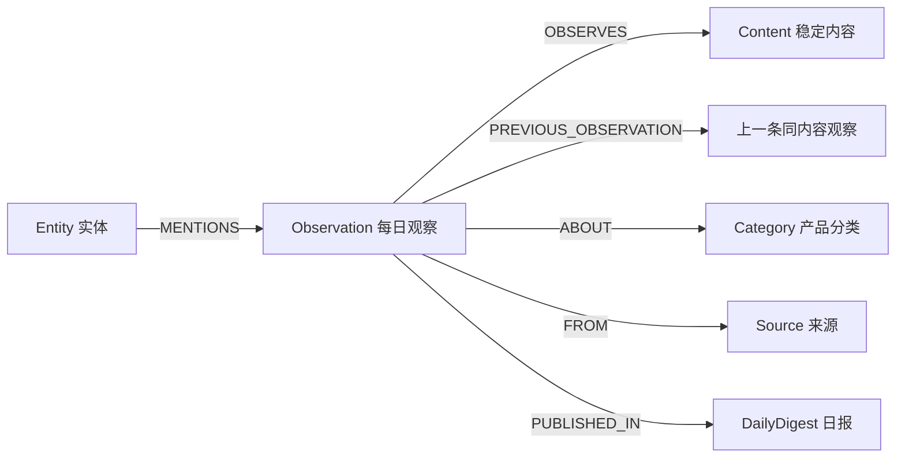

# Stage 8：Observation Graph 纵向链与横向视图

## 决策目标

把现有“写入了 Observation、查询仍依赖旧 Topic 聚合”的半迁移状态收敛为可验证的 Observation-first GraphRAG。此阶段不做语义主题聚类，也不重写全部 Agent，只完成能直接支撑用户趋势问题的最小图结构。

## 事实基线（2026-08-12 运行库）

- 3663 个 `Observation`
- 1691 个稳定 `contentId`
- 295 个内容跨日重复，覆盖 2267 条观察
- 单个内容最多连续出现 66 天
- OpenAI 实体覆盖 105 条观察、41 个日期、3 个来源
- 当前来源关系写为 `Observation -> Source`，旧查询却从 `Topic` 读取来源，统计存在结构性错位
- 当前 `Topic.id` 来自新闻标题，不等于“趋势主题”，不能继续被当作语义聚类节点

## 最小目标模型

说明：

- `Content` 负责把同一新闻在不同日期的观察聚合起来。
- `PREVIOUS_OBSERVATION` 只表达时间先后，不声称因果或正文变化。
- 横向趋势先复用已有 Category、Entity、Source 中心节点，不制造任意两条新闻之间的两两关系。
- 旧 `Topic` 和旧关系暂时保留作兼容层，但新推理不得把标题节点称为“趋势主题”。

## 本阶段范围

1. Schema 增加 `Content`、`Category` 唯一约束。
2. 新写入同时产生 `OBSERVES`、`ABOUT`、`FROM`、`PUBLISHED_IN`。
3. 同一 `contentId` 的观察按日期形成确定性的 `PREVIOUS_OBSERVATION` 链。
4. 图推理改从 Observation 读取日期、来源、分类和内容身份。
5. 输出明确区分：观察数、稳定内容数、日期数、来源数、重复内容数。
6. 保持旧图关系，避免一次性破坏现有工具。

## 明确不做

- 不把 Category 冒充动态语义趋势簇。
- 不自动推断因果关系。
- 不在本阶段删除 Topic 或旧关系。
- 不全量重建向量索引。
- 不先做复杂社区发现或额外模型分类。

## 小样验收门槛

1. 两个相同 `contentId`、不同日期的观察必须只对应一个 Content。
2. 后一观察必须指向前一观察；重跑后不得产生重复链。
3. 来源统计必须从 Observation 关系得到，不能再从 Topic 读取。
4. OpenAI 真实查询必须返回非零观察、日期和来源。
5. 现有 GraphRAG、Prompt、检索相关单测不得回归。

## Stage Gate

完成上述小样后，由独立质量监管 Agent 同时审查：

- 架构方向是否符合已确认的 Observation-first 路线；
- 查询数字是否与真实用户问题含义一致；
- 是否引入不必要的复杂度或破坏旧用户路径；
- 是否可以进入 Prompt Registry 接线阶段。
