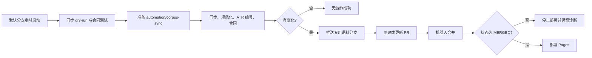

# Automated Corpus PR Delivery

## 目标

将 hosted 语料更新从“机器人直接写默认分支”改为“专用语料分支 → 自动 PR → 自动合并 → Pages”，在不要求日常人工介入的前提下保留审计记录和失败隔离。

## 产品边界

- Hosted corpus sync 只通过 PR 向默认分支交付已经完成同步、规范化、ATR 身份、覆盖率和 corpus contract 检查的语料变更；不对仓库其他工作流作越界承诺。
- 不要求日常人工 review；任何失败停止合并和部署并保留 PR/日志。
- 不使用 workflow 更新本地 Docker、Chroma 或 Neo4j。
- 开发提交仍留在 `claude/rag-transformation-checkpoints`；只有最终验收后的 workflow 才需要一次性进入默认分支，才能获得 GitHub schedule。

## 计划链路

## 验收合同

1. Workflow 不允许无目标的 `git push`，不得直接推送默认分支。
2. 专用分支名称固定为 `automation/corpus-sync`，并用 concurrency 避免并发写入。
3. 只有有语料变化时才推送、创建或更新 PR。
4. 使用 `GITHUB_TOKEN` 的最小权限：publish job 仅增加 `pull-requests: write`。
5. 合并必须绑定本轮已验证的 commit SHA；PR 头发生漂移时停止合并。
6. PR 合并命令失败或合并后状态不是 `MERGED` 时 job 非零退出，Pages 不运行。
7. 无变化时不创建空 PR、不重复部署 Pages，但 publish job 可正常结束。

## 一次性仓库配置

- GitHub Settings → Actions → General：允许 Actions 创建 Pull Request。
- 默认分支规则允许机器人在无需人工 review 的情况下合并已验证 PR；若强制人工审批，则自动化会按设计停止。

## Stage Gate

合同测试、YAML 解析、现有 hosted 临时链路通过后，由 Terra 同时审查代码逻辑和无人值守用户流程。
