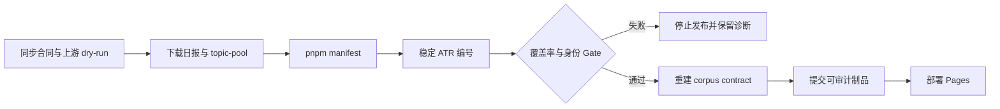

# Hosted Sync → ATR Search Index Gate

## 目标

修复现有 GitHub Actions 的公开语料同步链路：上游日报下载后，必须通过仓库现有的统一日报规范化器生成稳定 ATR 编号并重建 `digests/search-index.json`；任何覆盖率或身份冲突都阻止提交和 Pages 发布。

## 本阶段不做

- 不让 GitHub Actions 直接连接用户电脑的 Docker、Chroma 或 Neo4j。
- 不恢复本地启动时自动入库。
- 不新增数据源、编号算法或第二套规范化器。
- 不改变周报、月报只供浏览的产品边界。

## 计划链路

## 验收合同

1. Workflow 的干净 Runner 只安装合同测试实际需要的 pytest、PyYAML，以及 Node 与锁定版本 pnpm；不下载无关 RAG 运行时依赖。
2. `rag.sync_corpus` 完成后、任何 `git add` 前，必须执行 `pnpm manifest`。
3. `pnpm manifest` 继续复用 `buildSearchDocuments`，不复制编号或规范化逻辑。
4. 生成器 coverage mismatch、ATR 冲突或非法 topic pool 必须以非零退出码终止 Workflow。
5. 重新生成 corpus contract 后才允许提交；提交包含 `digests/search-index.json`、manifest、feed 与 corpus manifest。
6. Workflow 合同测试明确锁定以上顺序，防止以后回归。

## 验证范围

- `rag/tests/test_workflow_contracts.py`
- `src/__tests__/generate-manifest.test.ts`
- YAML 解析和 action pin 检查
- `git diff --check`

## Stage Gate

只有 Terra 确认“抓取后编号与浏览索引闭环成立、但没有越界宣称更新本地 RAG”后，本阶段才可标记完成。
