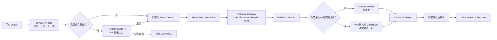

# 2026-08-25 后端延迟与编排收敛计划

## 1. 决策摘要

当前性能问题不是语料规模本身，而是请求编排发生架构漂移：仍处于影子验证边界的
DeepSeek Ordered Route Contract 被接成了正式聊天的前置必经步骤，随后请求还可能继续进入
检索、ReAct Agent、多轮工具调用和引用修复。一个简单问题因此可能串行触发多次远程模型工作。

本轮不引入新的 RAG 框架、不训练分类模型、不重建索引。优先重新编排仓库里已经存在的模块：

- `query_signal_extraction`：确定性提取字面信号和硬约束；
- `task_route_resolution`：按 A–E 用户任务确定主辅路线；
- `EvidenceRetrievalGateway`：按 Route Contract 选择检索视图；
- `prompt_registry`：按同一任务路线编译回答合同；
- `Answer Renderer`：把机器结果确定性渲染给用户。

核心原则：**确定性优先、模型按需、每条路线有独立预算、Route Contract 只生成一次。**

关键路径排序、成熟方案取舍和适配架构详见
[后端关键路径、成熟方案与适配架构复盘](../research/2026-08-25-backend-critical-path-and-solution-review.md)。

## 2. 证据与根因

### 已确认事实

1. “最近有什么热门趋势？”的 30 秒真实复现只返回 `accepted`，没有进入 `understanding`；
   DeepSeek 路由请求约 31 秒后才返回 HTTP 200。
2. Docker、Neo4j、Chroma 和前后端连接均健康，请求在检索前已经等待。
3. `rag/server.py::_build_query_contract_resolver` 为所有 DeepSeek 运行时创建远程路由器；
   `rag/chat_service.py` 在正式请求中优先调用它。
4. `docs/rag-transformation/plans/2026-08-21-ordered-route-contract-v3-5-remediation.md`
   明确写明 v3.5 只能进入固定语料影子检索，不得直接接正式 Agent。
5. 该生产接线来自提交 `44755f3`，属于 Stage Gate 边界漂移。
6. 当前总请求超时为 195 秒；Agent 路线预算为 75 / 150 / 180 秒。
7. 当前正文不是 provider token streaming；完整回答和引用校验结束后才分块传输。
8. 未完成或被取消的请求不会进入现有 `/metrics/recent`，性能故障缺少阶段证据。

### 根因排序

| 优先级 | 根因 | 用户后果 |
|---|---|---|
| P0 | 模型路由成为大多数请求的同步前置条件 | 简单问题在检索前等待数十秒 |
| P0 | Route Contract、旧 `analyze_query` 与 Agent 工具路由职责重叠 | 重复分类、结果漂移、调用次数不可预测 |
| P0 | 简单任务仍可能进入 ReAct Agent | 一次回答扩展为多轮模型与工具循环 |
| P1 | 引用失败使用第二次模型修复 | 延迟和成本进一步增加 |
| P1 | 按全局最大值设置超时 | 简单问题也可能等待 195 秒 |
| P1 | 指标只在请求结束时记录 | 超时和取消请求不可诊断 |

## 3. 目标架构



### 对外深模块接口

```text
ChatOrchestrator.handle(ChatRequest) -> ChatResult
```

调用方只知道一次请求和一次结果。路由、检索、模型预算、证据验证和降级都隐藏在模块实现内。

### 内部真实 seam

```text
QueryRouteResolver.resolve(QueryInput) -> RouteResolution
EvidenceRetrievalGateway.retrieve(ResearchRequest) -> EvidenceBundle
AnswerComposer.compose(PromptPackage) -> AnswerEnvelope
```

`QueryRouteResolver` 有两个真实适配器：确定性适配器与 DeepSeek 低置信回退适配器；测试使用
脚本化适配器。DeepSeek 不再由 `server.py` 直接注入为所有请求的默认入口。

## 4. A–E 路线预算

| 路线 | 默认检索 | 默认生成 | 路由模型 | 目标总时延 |
|---|---|---|---:|---:|
| A 精确条目导航 | Lexical / ID | 确定性 Builder | 0 | < 1 秒 |
| B 动态与趋势 | Structured recent；趋势聚类时对候选做受限 Graph 扩展 | 确定性榜单或一次 Composer | 0（明确表达） | < 20 秒 |
| C 时间与关系 | Lexical + Vector + Graph | 一次 Composer；必要时一次受控规划 | 0–1 | < 60 秒 |
| D 主张核验 | Lexical + Vector，按需 Web | 一次结构化 Composer | 0–1 | < 45 秒 |
| E 证据研究 | Lexical + Vector，证据不足时一次 Web | 一次 Composer | 0–1 | < 60 秒 |

约束：

- 精确导航和明确趋势速览不得调用路由模型；
- Graph 只进入 C，或 B 中明确/隐含要求趋势聚类与关系解释的 `trend_clusters`；
- Web 只由明确授权、语料时效缺口或证据等级不足触发；
- 普通路线不进入 ReAct；ReAct 只保留给确实需要受控补证的复杂请求，最多一次循环；
- 单次请求付费模型调用目标为 0–1，复杂歧义请求硬上限为 2；
- 不使用第二次模型调用仅修复引用格式，格式失败时优先确定性降级。

## 4.1 Neo4j 主动就绪检验

Graph 路线不能把“进程存在”或“驱动对象已创建”当成数据库可用。系统统一通过一个
`GraphReadinessProbe` 模块收口主动检验，调用方只消费 `ready / degraded / unavailable`
三态结果，不直接理解连接、索引和数据一致性的实现细节。

主动检验分三层，避免把深度检查塞进每个用户请求：

1. **启动就绪检查**：验证 Bolt 连接、执行最小只读查询、关键索引为 online、核心标签存在；失败时自动重连一次，仍失败则以 vector-only 启动并明确降级。
2. **请求前轻量检查**：仅当路线需要 Graph 且缓存的健康结果过期时执行轻量探针；使用短 TTL 和熔断状态，不能让每次请求承担完整一致性检查。
3. **深度质量门**：在 ingestion 后、Stage Gate、发布前检查图/向量日期一致性、ATR ID 覆盖、关键关系可查询和查询延迟预算；不通过则阻止把 Graph 声明为 ready。

异常处理只允许“重连或降级”，不得因为连接失效自动重建容器、镜像或索引。运行状态必须在
`/health`、System 面板和检索 trace 中统一呈现，避免后台实际不可用而界面仍显示已连接。

## 5. 为什么暂不训练分类器

传统机器学习分类器需要稳定且足够大的标注集、持续重训和漂移监控。当前 A–E 数据主要是几十条
校准/盲测资产，且历史 Gold 与评分合同曾多次修订，训练分类器会把旧标注偏差固化进模型。

更适合当前阶段的组合是：

1. 高置信字面任务由确定性算法处理；
2. 模糊、复合和指代问题最多调用一次严格结构化模型；
3. 所有模型结果继续经过 Schema、权限和保真校验；
4. 未来积累足够真实 Query 与人工裁决后，再评估小型分类器替代远程路由。

## 6. 执行阶段与 Gate

### Stage 1：恢复正确路由边界

- 保留当前未部署的通用热门趋势快速路径；
- 新建统一 `QueryRouteResolver`，复用 Query Facts 与 A–E 路由；
- 只有低置信或歧义请求调用 DeepSeek；
- 移除正式链对 v3.5 resolver 的无条件依赖；
- Route Contract 成为后续唯一事实源，不再二次分类。

Gate：A–E 路由矩阵、模型调用次数和权限约束测试通过；明确热门趋势为零路由模型调用。

### Stage 2：按路线收敛执行策略

- 引入 `RouteExecutionPolicy`；
- 引入 `GraphReadinessProbe`，统一启动预检、按需轻量探针、一次自动重连与显式降级；
- A 使用确定性 Builder；
- B 的 `important_news` 使用 Structured trend + 确定性 Builder；`trend_clusters` 在首轮候选上做受限 Graph 扩展，深度归纳才使用一次 Composer；
- C/D/E 才按合同启用 Graph、Web 或受控 Agent；
- A 与 B-`important_news` 不开启 Graph；B-`trend_clusters` 只扩展候选集；C 才允许完整关系图计划；D/E 默认文本证据优先；
- 删除调用方需要理解的全局 `max_tool_calls` 推断。

Gate：每类路线的检索通道、模型调用上限和错误降级均可从公共聊天 seam 验证；Graph 健康、索引异常和连接中断均能被主动识别，且不会触发容器或索引重建。

### Stage 3：单次生成与证据校验

- Composer 直接输出受 Schema 约束的 Answer Envelope；
- Renderer 确定性生成 Markdown；
- 取消普通路线的二次“引用修复”模型调用；
- 校验失败返回证据边界明确的降级结果。

Gate：正确 Envelope 可渲染；缺失/伪造证据 ID 被拒绝；普通路线最多一次生成模型调用。

### Stage 4：分路线超时、流事件与可观测性

- 路由模型 5–8 秒硬超时；
- 按 A–E 设置不同总预算，不再共享 195 秒；
- 超时、取消和失败也在 `finally` 记录阶段耗时；
- UI 获得真实 `route_ready / retrieval_ready / generation_started / failed` 事件；
- 记录 Lexical / Vector / Graph / Web / Deep Fetch 的分阶段耗时；
- 联网 Provider 从全串行改为有预算的 hedged fallback，达到证据门槛即取消剩余工作；
- 同步 Deep Fetch 进入线程池，避免“async 外壳”阻塞事件循环；
- 不展示隐藏思维链。

Gate：故意注入慢路由、慢检索和慢生成时，系统在对应预算内给出可诊断反馈。

### Stage 5：一次性运行时验收

- 不重建索引；
- 后端全部回归通过后，只重建一次 `app` 容器；
- 保留 Neo4j、Chroma 和语料数据卷；
- 运行 5 条真实 DeepSeek Canary，覆盖 A–E，不连续运行 10 次；
- 记录 P50/P95、模型调用数、检索时延、最终引用完整性；
- 验收后只清理构建缓存，不删除运行镜像和数据卷。

## 7. 明确不做

- 不靠继续放大超时掩盖慢链路；
- 不把所有分类都交给 AI；
- 不继续给旧关键词表无限追加实体；
- 不训练数据不足的小分类器；
- 不引入大型第三方 Agent/RAG 框架替换现有可用模块；
- 不在每个 Stage 重建 Docker；
- 不在本轮修改语料、索引 Schema、前端视觉或 GitHub Actions。

## 8. 回滚

- 所有新编排通过功能开关接入；
- 旧索引和数据卷保持只读兼容；
- Stage 1–4 只改 Python 编排与测试，不需要重建数据；
- 若 A–E 保护测试退化，停止当前 Stage，不推进 Docker；
- 最终应用容器更新失败时，恢复上一运行镜像，数据卷不变。
