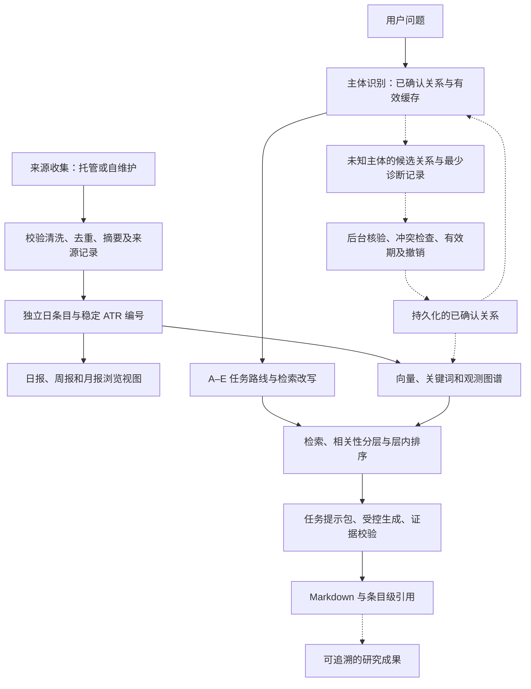

# 全局缺口与后续收敛基线

> 版本：v1.0 · 更新：2026-08-26 · 状态：缺口基线已整理，后续执行计划与 Gate 阈值待确认。
> 用途：作为下一份完整实施计划、Stage Gate（阶段验收关口）和模型分工的输入，不是“全系统已完成”的证明。
> 本轮仅整理文档，没有运行新的质量评测、调用付费 API、改动数据库、重建容器或提交 GitHub。
> 正式执行计划见：[G0–G4 收敛实施计划与 Stage Gate](2026-08-26-g0-g4-implementation-and-stage-gates.md)。

## 1. 一页结论

项目已有可复用的产品与工程基础，不应因局部失败从零重写。下一步是把现有链路的质量、失败恢复和运行证据收敛，再补入受控的主体知识反哺。

**已经存在的基础**：原子日报与 ATR 编号、向量/关键词/图检索、A–E 任务路由、任务 Prompt、结构化回答及引用校验、本地 Web UI、数据库重连、两种语料工作流。

**需要优先闭合的缺口**：

1. 整体检索和回答质量尚无覆盖当前系统的可信验收结论；局部通过不能代替全局 Precision/Recall/F1。
2. 主体注册表能够查已知关系，但未知主体解析、候选关系核验、持久化复用和撤销尚未形成闭环。
3. 图谱与向量更新不是一个跨库原子事务；现有降级保护不等于已经实现“双库成功才整体切换”。
4. 云端公开制品发布、本地拉取和本地索引激活必须分别验收；真实 Runner 和长期无人值守证据不足。
5. 本地改动、运行镜像、GitHub 提交和治理文档之间存在状态漂移，容易重复建设或过度宣称完成。

**产品方向（用户已确认）**：逐步从新闻查询工具升级为 Agent 主导的知识处理流程，贯通收集、清洗、汇总、后处理、检索与研究成果复用。程序负责确定性工作，AI 负责必要的语义判断；不是让每一步都调用模型。

**当前约束仍有效**：正式 RAG 语料保持冻结，先调好现有链路；自动更新恢复、全量迁移、新框架与发布动作必须有对应计划及验收。本文件不自动解除冻结。

## 2. 证据口径与前轮复盘纠偏

### 2.1 如何阅读状态

| 标记 | 含义 | 后续动作 |
| --- | --- | --- |
| 已证实缺口 | 本轮代码检查或明确的现有记录证明缺失/不符合约定 | 针对性修复或明确调整合同 |
| 实现已有，验证不足 | 找到了实现或小样成功，不能推出全面稳定 | 先验收，不重复开发 |
| 待核实风险 | 观察到可能的问题，尚未复现或没有新运行证据 | 最小诊断后决定是否修复 |
| 已确认新增方向 | 用户已认可产品边界，但实现尚未完成 | 纳入计划，不写成现存故障 |
| 有意边界 | 为安全、成本、产品范围而保留的限制 | 不作为必须补齐的功能 |

本文件覆盖本轮已知问题，不代表穷尽全部代码缺陷。历史 bug 未复现不能直接标成“仍坏”；缺少证据也不能直接标成“未实现”。后续通过证据关闭问题，保留历史记录。

### 2.2 必须纠正的旧结论

| 前轮总览/旧文档中的说法 | 本轮核对结果 | 正确的后续任务 |
| --- | --- | --- |
| 主向量库仍把日报 Markdown 和原子条目重复入库 | `ingest_vector_chunks_for_date` 当前只写原子条目；运行时已有原子迁移路径。保留旧辅助函数不等于主路径仍使用它 | 验收当前活动索引的身份、覆盖和遗留数据，不再重做原子入库 |
| A–E 路由及 Prompt 还没有真正打通 | 8 月 25 日记录已有 A–E 真实请求验收；Prompt Registry 和 Answer Envelope 均存在 | 改进任务质量与覆盖，不再重新搭五套路由 |
| 还没有来源配置引导 | `docs/github-automation.zh.md` 已有 Secrets、Variables、来源三态和 GUI 向导说明 | 验证新用户能否操作成功，修正文档与当前工作流差异 |
| 所有请求仍然需要等待两分钟 | 历史曾发生；8 月 25 日五条小样为 0.774–15.700 秒，之后 Claude 请求记录约 18.8 秒 | 分路线复测冷/热态与瓶颈，不能用五条样本宣称长期延迟达标 |
| 不使用完整 LangGraph 就意味着 Agent 不完整 | 当前受控任务编排已实现；框架选择不是产品验收条件 | 只在现有编排无法满足具体需求时评估替换 |
| 没有任何指标，或已有指标已证明整体质量 | 两者都不准确：已有大量局部评估，但样本、语料和口径不同 | 统一当前版本的任务评估，禁止拼接旧分数成为新总分 |

### 2.3 当前证据快照，不等于本轮重新运行

- 本轮本地 Git HEAD：`22191bfaed62c4f51c36c8f0e0445394976a7e08`；分支 `main`；有大量已修改及未跟踪文件。HEAD 单独不能复现未提交的运行代码。
- 8 月 26 日记录：21 个登记主体、9 条标为 `verified` 的关系、8 条诊断样例。`verified` 目前是配置标记，不等于每条关系已经附有可审计的外部证据。
- 8 月 26 日证据文件：Neo4j 可连接，hybrid，4133 向量，活动世代 `gen-20260821T074117-404548ad`。这是保存的运行快照，不是本轮实时探针。
- 8 月 26 日执行记录：897 tests、36 subtests 通过；本轮没有重跑。测试数量不代表语义正确率。
- 8 月 25 日 A–E 验收：A 精确导航零模型；B 热门趋势有引用；C 成对关系有图证据；D/E 可按证据不足安全收口。**安全拒答是行为正确，不是任务内容已经完成。**
- 8 条主体样例明确属于诊断回归，不是独立盲测。文件名含 `blind` 容易误导，应修正名称/入口引用但保留历史证据。

## 3. 不应再反复争论的产品约束

1. **身份独立**：ATR 是日条目公开身份；标题原始超链接不变；不增加强制复制按钮。跨日观测可有不同 ATR，但关联同一内容主体，不能因改标题或排序随意重编号。
2. **原始与派生分开**：日报 Markdown 是浏览视图；主检索以独立日条目为单位；周报/月报只供浏览，不重复向量化或图谱化。
3. **摘要真实**：恢复普通正文展示，不重新引入已被否决的摘要折叠逻辑；缺失内容明确标识，AI 补写、原文摘要和原始摘录不能混称。
4. **相关不等于相同**：Claude 与 Anthropic 是不同主体；别名归一和关系扩展是两种行为。关联不能自动传递为所有权，更不能把共现写成因果。
5. **任务相关性先行**：先判断主答案、补充、背景、待核实或排除，再在每层按重要性、新鲜度、证据质量和上游信号排序；不是一个全局热度分统治全部问题。
6. **重要新闻有两个条件**：重要且新。巨头争议可能重要，但旧闻不能充当最新动态；价格、配置细节默认不抢占主榜，除非问题明确相关或影响/讨论足够大。
7. **内部优先不强塞内部**：先检索本地；有合格内部证据优先呈现，不能为展示本地结果而保留无关内容。联网许可、是否实际联网、引用是否合格分别展示。
8. **可用不等于 Docker 已启动**：要验证 API、Neo4j 查询、向量索引与世代；优先重连/启动现有容器，日常数据更新不等于重建镜像。
9. **自动化不跨越权限**：GitHub Runner 发布公开制品，不直接连接用户本地数据库；GUI 不偷偷执行任意 Bash，不收集或展示仓库密钥。
10. **少而有效的测试**：大改先小样，冻结对比口径；关口验收用户流程和答案质量，不只看代码全绿；不反复消费同一盲测集调参。

## 4. 统一产品链与反哺方向

下图为目标结构，虚线表示尚需补齐或验收的连接，不代表已经全部实现。

### 4.1 已确认的反哺边界

- **已确认关系**：有可核查来源的关系，供后续解析和检索复用。
- **临时解析缓存**：相同主体及消歧条件下的短期结果，用于减少重复模型调用；不能自行变成事实。
- **候选关系**：AI 发现但未核验的关系，隔离保存；不能直接进入正式事实图谱。
- 自动记录候选；符合充分证据标准的低风险关系自动收录；冲突或证据不足保持待确认/过期失效。不把每条关系都交给用户裁决。
- “模型很有信心”及“模型重复说了多次”不是独立证据；关系类型、方向、来源、时间和适用范围必须明确。
- 记录结果、证据和版本，不保存完整思维链；默认不长期保留完整用户对话。用户私有上下文不得自动提升为跨用户公共知识。
- 关系复用只能省下重复理解；用户问“最新新闻”时仍应检索新内容，不返回过期答案。
- 后台核验需有预算、去重、退避、失败上限和人工复核出口；不做无界自主扩展。
- 反哺应包括撤销与失效：关系被纠正后，使依赖缓存和图投影同步失效。不得把 Agent 答案重新包装成原始证据。

## 5. 缺口登记册

优先级含义：P0 为相应上线/自动更新关口的阻断项，不代表当前所有功能都不能用；P1 为本轮收敛主线；P2 为后续能力与体验优化。下面是候选优先级，不是已经批准的排期。

### 5.1 语料与双库更新

| ID / 优先级 | 状态与证据 | 用户影响 / 改进方向 | 关闭依据 |
| --- | --- | --- | --- |
| DATA-01 / P1 | 实现已有，验证不足。原子入库、ATR、迁移均存在，见 S1/S2 | 不再重写管线；抽查来源字段、空/短摘要、坏日期、重复 URL、身份冲突与隔离记录，复核当前世代实际内容 | 合格、隔离、拒绝数量可对账；ID 稳定；无跨条目混块或主索引 Markdown 重复 |
| DATA-02 / P0（自动更新） | 已证实合同缺口。S3 先发布 vector-only 新世代，再更新图；失败标记状态，不整体回退 | 已有降级与读者排空，不能说完全无保护；但未满足旧审计“双库成功才切换”要求。选择最简一致读/补偿恢复方案，不强行造跨库事务 | 故障注入证明不会以 healthy hybrid 提供混代结果；旧可用状态可恢复；重复更新幂等 |
| DATA-03 / P1 | 已证实验证粒度不足。S4 主要比较日期覆盖 | 同日丢失部分条目仍可能被日期检查漏掉；按 ATR/内容映射核对，不能要求所有图节点数等于向量数 | 同日漏条目、错误映射可被发现；差异有原因和位置 |
| DATA-04 / P1 | 待核实风险。TS 搜索制品、Python 运行时回退及旧事件兼容并存，见 S1/S5 | 防止同一新闻在 UI、向量、图和引用里身份分叉；先合同测试，再决定是否合并重复实现 | 同一输入跨入口得到一致身份、来源、日期和跳转；旧数据兼容有明确退场条件 |
| DATA-05 / P1 | 实现已有，验证不足。内容/观测/时间模型见 S1/S6 | 新正文与热度变化不能混称新发布；纵向变化与横向主题需可追溯，不把重复抓取当趋势 | 跨日相同内容、真实正文更新、热度变化、乱序日期均有正确观测与证据 |

### 5.2 主体关系与受控知识反哺

| ID / 优先级 | 状态与证据 | 用户影响 / 改进方向 | 关闭依据 |
| --- | --- | --- | --- |
| ENT-01 / P1 | 已证实覆盖有限。21 主体/9 关系，见 S7 | 不是追求穷尽名单；覆盖真实语料及高频提问。检验大小写、空格、连字符、版本名、中文别名及 X 等短词歧义 | 已知主体正确识别；负例不误扩展；新增关系有依据而非任意补齐 |
| ENT-02 / P1 | 已证实缺口。S8 的 AI 兜底针对路由置信度，不单独检测主体覆盖 | “知道这是新闻问题”不代表“认识这个新产品”；增加未知/歧义主体判定，复用已有语义调用入口而不是串联多个 Agent | 已知问题零新增解析调用；未知主体走有界解析；模型失败不静默改成无主体搜索 |
| ENT-03 / P1 | 已证实证据缺口。S7 的关系带 verified/weight，但无来源与有效期字段 | 当前标记不能当作已经核验；补关系出处、方向、时间及冲突状态，权重不能替代证据 | 正式关系逐条可溯源；未知或冲突关系不能作为事实边 |
| ENT-04 / P1 | 已证实缺口。S9 可投影，但未发现生产启动/受控更新入口自动调用；S10 记录含先后矛盾 | 手工影子探针成功不等于干净部署自动拥有关系；需要版本激活、撤销与缓存刷新，避免旧版本关系叠加 | 干净测试环境或影子库可复现装载；升级/重复执行/撤销一致，不破坏新闻图与 ATR |
| ENT-05 / P1 | 已确认新增方向；S7–S9 未形成自动候选提升路径 | 自动收集 AI 解析结果 → 隔离候选 → 后台核验 → 低风险关系收录；不直接写正式注册表 | 真关系、错关系、歧义、来源冲突、超时均有确定结局；错误候选不污染正式图 |
| ENT-06 / P1 | 已确认新增方向；当前主体注册表为进程加载的静态数据 | 持久化复用、失效与纠错；缓存需考虑主体、上下文、策略/关系版本、权限及时间 | 同条件第二次少一次重复调用；重启后已批准知识可用；纠错立即失效；新闻仍新鲜 |

### 5.3 路由、召回、证据与性能

| ID / 优先级 | 状态与证据 | 用户影响 / 改进方向 | 关闭依据 |
| --- | --- | --- | --- |
| RAG-01 / P1 | 实现已有，验证不足。A–E、Prompt/Envelope 见 S11/S12 | 不重造五条线；验证主体扩展、改写、时间与来源约束在整条路线中不丢失，复合问题不相互覆盖 | A 导航、B 动态、C 关系/时间线、D 核验、E 研究各有端到端合同样例 |
| RAG-02 / P1 | 实现已有，语义验收不足。S13 有直接/关联/背景排序 | 直接匹配不能把不重要配置项顶上新闻主榜；关联匹配也不能淹没用户目标。维持相关性分层，再做层内排序 | 用已确认的人类新闻标准复核；测任务覆盖、排序、新鲜度、来源多样性和误扩展 |
| RAG-03 / P1 | 已知能力缺口。S11 的 E 问题无法得到足够概念对比证据 | 区分语料没有答案、路由错误、召回漏掉和证据门误拒，避免所有失败都归因于模型 | 每个失败有层级归因；可回答题改善，确实无证据题保持恰当拒答 |
| RAG-04 / P1 | 实现已有，验证不足。S14/S15 有来源准入、深抓和引用治理 | 官网域名不等于内容直接支持；登录页、目录页、旧文章或抓取时间不能伪装最新新闻 | 正/负例验证日期、内容相关性、出处和结论引用；联网失败不拖垮合格内部答案 |
| RAG-05 / P1 | 已证实设计局限。S14 的搜索缓存 key 仅规范化原始问题，TTL 300 秒 | 不足以表达配置、时间和策略变化；主体缓存不能照搬它。修复时先证明跨条件错误复用路径 | 相同条件命中，条件变化不串用；权限关闭不会由缓存绕过；有容量和失败缓存策略 |
| RAG-06 / P1 | 实现已有，稳定性证据不足。S11/S10 有阶段耗时与预算 | B 五样本中 9.739 秒，C 15.700 秒；Claude 18.8 秒而检索约 2 秒，剩余耗时原因未被精确定位 | 同一代码/语料/配置记录冷热态首反馈、首正文、总耗时、各层时间和调用数；只优化已量出的瓶颈 |
| RAG-07 / P1 | 实现与用户“流式”预期有差异。S16 先发真实进度，完整校验后再分段发正文 | 不是模型生成 token 级流式；不能声称已经解决正文首字等待。评估保持证据校验与更早展示的取舍 | 产品明确何时见进度/正文；取消、超时、重试正确；未验证内容不伪装已核实结论 |
| RAG-08 / P2 | 实现已有，泛化验证不足。S6/S17 有观测图、成对关系和注册表证据 | 超出成对问题的路径与趋势质量待测；不因未上多跳框架就直接重构 | 实际关系任务不把共现当因果；时间链、横向模式有独立新闻证据；需要更复杂推理时再选型 |

### 5.4 评估与发布结论

| ID / 优先级 | 状态与证据 | 用户影响 / 改进方向 | 关闭依据 |
| --- | --- | --- | --- |
| EVAL-01 / P0（质量宣称） | 已证实证据缺口。S11/S18 仅小样运行与局部规则通过 | 不能给整体 Recall/Precision/F1 或发布完成结论；冻结当前系统、语料、题集、标签与口径 | 有逐题原始结果、分任务指标、分母和限制；旧版与新版同口径对比 |
| EVAL-02 / P1 | 已证实命名问题。S18/S19 为开发诊断却名含 blind | 校准、诊断和未见测试必须分开；测试暴露后转回归，不继续称盲测 | 资产用途明确；独立样本不参与调参；难例、未知主体、负例和证据不足题均覆盖 |
| EVAL-03 / P1 | 待核实覆盖风险。CI 运行 `rag:check:p0`，手动全量 pytest 不能代表 CI 同覆盖，见 S20 | 新主体、更新一致性及路由测试需检查是否进正式 CI | 列出关键测试→CI 命令映射；正确/退化/错误结果能被评分器区分 |

### 5.5 自动化、部署与用户流程

| ID / 优先级 | 状态与证据 | 用户影响 / 改进方向 | 关闭依据 |
| --- | --- | --- | --- |
| OPS-01 / P0（自动发布） | 实现已有，Runner 验证待补。S21–S23 | hosted/self-managed、专用分支、PR、机器人合并与 Pages 已有代码；配置存在不等于真实运行成功 | 保存真实 dry-run、发布、无变化、失败阻断 run/PR/commit；按计划验证后再宣称全自动 |
| OPS-02 / P0（自动更新） | 有意冻结 + 验证待补。S24/S3 | 云端成功不代表关机的本地数据库已更新；明确启动补齐、运行中更新、断网重试和状态展示 | DATA-02/03 通过后单次受控新语料激活，再验证连续更新与恢复；冻结模式不被旁路 |
| OPS-03 / P1 | 已有向导，易用性待验收。S25/S26 | 用户只部署一个项目；托管无需源 API，自维护配置 Provider/来源。GUI 当前生成配置和设置链接，不直接写 GitHub | 干净目录按指南完成安装、配置、首问、关机后再启动；缺密钥有明确恢复；不要求另部署上游 |
| OPS-04 / P1 | 实现已有，验证不足。S27/S10/S3 | Docker 运行不等于数据库 ready；前端 file 模式不等于后端连接。测试前主动检查依赖，优先重连现有容器 | 断连/停止/索引不可用被分别识别；恢复可重复；浏览器不能任意启动 shell |
| OPS-05 / P1 | 待核实风险。历史发生 Docker 体积膨胀，本轮未测容量 | 区分磁盘缓存、镜像/卷和 RAM；新新闻不必重建 Docker，也不应每条入库后清空有效缓存 | 记录前后 disk/RAM；限定可再生缓存范围和保留策略；数据库、模型缓存与最后可用索引不误删 |
| UX-01 / P1 | 历史 bug 有修复记录，当前全流程验收待补。S28/S29 | 复核报告 404、摘要原样、模糊别名/ATR 搜索、条目滚动、三筛选/清除、侧栏拖动收起、引用与外链、回退、System 联动 | 最新后端与实际页面一起做浏览器用例；不因旧截图直接重写已修好的功能 |
| UX-02 / P2 | 用户既有方向，最终设计未验收 | Agent 入口突出、弱化/移除顶栏 Briefs；未来研究成果入口另行设计。以信息可读、低配置成本为先，不先换框架 | 固定页面原型和用户路径后再实现；键盘/窄屏/长文本可用，术语和状态一致 |
| SEC-01 / P0（对外发布） | 待核实风险；不是已确认存在漏洞 | 对当前代码复查认证、配置写入、XSS、URL 抓取/内网访问、日志密钥、限流和本地绑定；自动关系候选也属于不可信输入 | 有范围明确的安全检查和阻断修复；不得沿用旧 subagent 的“已安全”结论 |

### 5.6 知识产品与治理

| ID / 优先级 | 状态与证据 | 用户影响 / 改进方向 | 关闭依据 |
| --- | --- | --- | --- |
| PROD-01 / P2 | 已确认新增方向；旧 Brief 生成器只是基础，见 S30 | 从回答进一步沉淀可更新研究成果；保留证据、时间、版本及再核验，不重新当原始新闻入库 | 先选一种成果（如专题简报）打通生成、保存、查看、更新与来源追溯；不一次做全自动知识平台 |
| GOV-01 / P1 | 已证实文档漂移。roadmap/AGENTS/handoff 大量 6 月状态，S10 同文件含阶段先后矛盾 | 旧阶段、旧分支、框架和测试结论导致错误排期；本基线是当前缺口入口，历史保留 | 新计划逐项引用缺口 ID；完成状态绑定版本与证据；旧文档明确是历史，不继续当执行事实 |
| GOV-02 / P0（发布） | 已证实本地存在大量未提交修改 | 本地功能不等于 GitHub 用户能拿到；不能把当前运行状态直接称为已发布版本 | 归属清点、秘密扫描、针对性回归、main 提交/运行镜像对应、干净克隆验证；本轮不自动提交 |
| GOV-03 / P1 | 用户分工与旧 skill/仓库角色规则不同 | 未核实的模型不得冒充；重复阅读、重复派工、每小步全量测试浪费成本 | 采用第 8 节分工，记录实际角色/模型/档位，按阶段交付而不是零碎停顿 |

## 6. 后续完整计划的输入：候选阶段与 Gate

以下仅为下一份计划的骨架，**不表示现在已经批准全部实施或阈值**。不要新造另一套平行 roadmap；完整计划逐项引用上述 ID，注明具体文件、依赖、工时区间、验证命令、调用预算和停止条件。

| 候选阶段 | 交付的用户价值 | 覆盖缺口 | 关口要求 |
| --- | --- | --- | --- |
| G0 统一事实基线 | 不重复开发，不拿错版本测 | GOV-01/02/03、EVAL-01/02 | 固定源码差异清单、语料世代、配置及评估口径；已有成果保留；未见样本独立 |
| G1 主体解析与反哺小闭环 | 认识新主体，复用后更快，不记住错误 | ENT-01–06、RAG-01/05 | 已知不额外调用；未知首次解析、核验、第二次复用；错误不入正式图；撤销、重启与失效可用 |
| G2 当前知识库回答质量收敛 | 常问问题找对内容、答得快、可点击核验 | RAG-01–08、EVAL-01–03、UX-01 | A–E 同口径评估；完整浏览器路径；延迟按冷/热态分层；拒答正确与有效回答率分别报 |
| G3 自动更新安全恢复 | 新语料来后不用改架构，也不会破坏现有库 | DATA-01–05、OPS-01/02 | 双库失败隔离与恢复通过；云端制品→本地 ID/图/向量/引用可对账；真实 Runner 通过后才解除冻结 |
| G4 本地开源发布验收 | 新用户少配置即可使用，重启后能恢复 | OPS-03–05、UX-01/02、SEC-01、GOV-02 | 固定 main 版本干净克隆；部署/Provider/来源配置/首问/重启完整通过；运行状态与发布版本一致 |
| G5 研究成果增值 | 新闻转成可复用知识，而非重复阅读 | PROD-01、ENT-05/06 | 一个证据可追溯的成果闭环先通过；再决定是否扩大 Agent 自主性和支持更多成果 |

依赖说明：G0 后可为 G1/G2 共用一次冻结评估准备；G3 的安全设计可以提前，但真实自动更新不能在 G2 的固定语料对比中途启用。G5 是后续产品方向，不阻塞修好当前查询和发布。发布前任何安全阻断必须先处理。

### Gate 的统一模板

每个关口只维护一份记录，包含：

1. 用户任务、输入和预期可见结果；
2. 对应缺口 ID、版本、数据世代、配置和证据路径；
3. 产品、工程、数据、性能、安全各自的通过条件；
4. 真实输出与失败案例，不能只有测试数量；
5. `通过 / 修复后再验收 / 需调整方案`，以及未关闭风险；
6. 下一阶段是否可以推进，是否需要用户的产品判断。

**阈值先定、结果后测**：下一份计划应先冻结可回答题比例、分任务 Precision/Recall/F1、排序/引用质量、误扩展率、首反馈/首正文/总时长及模型预算的目标。当前没有充分基线，不在此虚构 90% 或任意秒数作为既定承诺。硬约束如 ID 不冲突、错误证据不升级、失败不误报健康可直接作为必过项。

评估说明：Precision 是返回内容中有多少相关；Recall 是应找到内容中找到了多少；F1 是两者的综合，不是“回答正确率”。只对定义了相关集合的检索题算这些值。导航用命中率，核验用判定与证据正确性，趋势用覆盖/多样性/新鲜度。少量样本报告原始计数和限制，不把小样 P95 当稳定服务承诺。

## 7. 不要因此扩大范围

- 不为“看起来更 Agentic”引入完整多 Agent 平台、全图多跳或新框架。
- 不重新搭已经实现的 ATR、A–E、Prompt、GUI 向导、原子索引；先检查验收缺什么。
- 不把所有新主体默认关联到大公司，不穷举全世界关系，也不靠无限联网核验覆盖率。
- 不把研究结果、周/月报、模型答案混进原始新闻索引以制造更多证据。
- 不把修复已知缺口扩展为大规模 UI 改版；已确认的摘要原样展示不反复改回折叠。
- 不因软件版本没有变化而重建 Docker；不把向量索引/数据库/有效关系记忆误当缓存清理。
- 不要求用户替工程团队判断阈值公式、实现库或每条候选关系；只在产品取舍、权限、付费边界改变时询问。

## 8. 后续分模型路由与成本控制

这是**开发协作的模型分工**，不是产品内部每次提问必须调用 Sol/Luna/Terra。产品继续复用已配置 Provider，不因此增加用户调用成本。

| 角色 | 用户已要求的责任 | 不应做的事 |
| --- | --- | --- |
| 主会话（用户偏好 medium） | 持有目标、追踪依赖、组合交付、解释关键决策 | 声称自身能无证据切换模型/档位；重复工人的完整调查 |
| Sol | 大方向、复杂架构与规范制定 | 每个小改动都重新规划或全量审阅 |
| Luna / Max | 已定接口、文件范围和验收命令的具体实施 | 自行扩架构、改 Gate、部署/删除/提交 |
| Terra | 跨模块判断、阶段质量与方向把控、代码及真实用户流程验收 | 只看代码是否能跑；实现者自审冒充独立质量审阅 |

执行规则：

1. 默认一个实施者；只有写入范围独立且真能节省时间才并行。真正 Stage Gate 使用新上下文的 Terra 做行为只读审阅；小文档更新不派审阅代理。
2. 任务包只发：目标、缺口 ID、精确文件范围、输入输出合同、禁区、验证命令、预算和停止条件；不转发整段历史。
3. 委派前核实运行时工具、角色、模型和档位。插件里的旧规则要求 Sol/High 主会话及 Sol 审阅，与用户指定的 medium/Terra 分工不同；不能静默把旧模板当作已配置成功。需要时仅暂停受影响通道并说明，不重复尝试或假称已经多模型运行。
4. 本轮只参考 `sol-advisor` 的最少代理、明确任务包和证据核实原则，采用 solo 整理；没有修改模型设置，也没有进行独立代理审阅。
5. 工程方先选最廉价且充分的验证：合同/小样→相关回归→阶段真实用户路径。盲测只在候选版本冻结后运行；不用每个小改都跑全量或真实模型。
6. 同一原因一次纠偏后仍失败，整理证据并升级判断，不进行无目的重试。预算以模型调用次数、输出上限、耗时和真实费用记录；无法观察的 token 指标注明未知。
7. 每个 Gate 只生成一份摘要和可复用证据；通过后再更新状态、提交范围及断点。完成的子代理关闭，不让“等待代理”成为无实际任务的状态。

## 9. 维护方式与下一步交付

- 本文是缺口/方向基线，不替代逐模块策略文档。后续计划只引用本表 ID，避免复制出多个互相矛盾的任务清单。
- 状态更新格式：`ID → 实施版本 → 验证版本/数据 → 结果 → 残余风险 → 证据链接`。不删已关闭项，只标记关闭。
- 关键不可逆取舍写入现有 `docs/adr/` 或 `decisions/`；普通实现细节留在计划/执行记录，不为每次改名新建 ADR。
- 后续代码提交遵循用户最新要求走 `main`，先核对权限和未提交改动归属；不沿用旧 claude/codex 分支指令，不强推、不自动打包全部脏工作区。本轮不提交。
- 下一份交付应是**完整但精简的实施计划**：G0–G4 明确先后依赖与每个可交付范围，G5 为后续方向；阶段验收指标与预算先定，再实施。用户确认阶段产品边界，具体工程实现由开发与 Terra 验收负责。

## 10. 可追溯证据索引

以下链接是本地源码和已有记录；“代码存在”“记录宣称”“本轮复验”必须分开，本轮没有重新验证远端或运行时状态。

- S1：[入库及原子迁移](../../../rag/ingest.py)
- S2：[原子观测 ADR](../../adr/0003-atomic-daily-observations-as-canonical-corpus.md)
- S3：[运行时索引发布和数据库重连](../../../rag/server.py)
- S4：[双库一致性检查](../../../rag/consistency.py)
- S5：[搜索文档与 ATR](../../../src/search-document.ts)
- S6：[原子语料与观测图执行记录](../execution-log/2026-08-11-stage-1-atomic-corpus-and-atr-graph.md)
- S7：[主体注册表](../../../rag/entity_registry.json)
- S8：[路由兜底](../../../rag/query_route_resolver.py)、[主体归一](../../../rag/entity_identity.py)
- S9：[主体关系投影](../../../rag/entity_registry_projection.py)
- S10：[主体链路执行记录](../execution-log/2026-08-26-entity-aware-recent-route.md)
- S11：[A–E 真实运行验收](../execution-log/2026-08-25-stage-5-runtime-canary-acceptance.md)
- S12：[任务 Prompt](../../../rag/prompt_registry.py)、[回答合同](../../../rag/answer_envelope.py)
- S13：[检索网关与排序](../../../rag/retrieval_gateway.py)
- S14：[Chat 编排、搜索缓存与证据](../../../rag/chat_service.py)
- S15：[外部证据准入](../../../rag/external_source_admission.py)、[深抓策略](../../../rag/deep_fetch_policy.py)
- S16：[进度与正文事件](../../../rag/chat_stream.py)
- S17：[图谱关系证据](../../../rag/graph_reasoning_service.py)
- S18：[主体诊断结果及局限](../evidence/2026-08-26-entity-relation-integration.json)
- S19：[八条诊断题集](../evals/sealed/entity-relation-blind-2026-08-26.json)
- S20：[CI](../../../.github/workflows/ci.yml)、[检查命令](../../../package.json)
- S21：[Hosted 工作流](../../../.github/workflows/rag-corpus-sync.yml)
- S22：[Self-managed 工作流](../../../.github/workflows/corpus-producer-self-managed.yml)
- S23：[自动 PR 执行记录及未完成真实 Runner 验证](../execution-log/2026-08-24-automated-corpus-pr-delivery.md)
- S24：[冻结语料约定](2026-08-21-frozen-corpus-system-tuning.md)
- S25：[GitHub 自动化配置指南](../../github-automation.zh.md)
- S26：[新用户指南](../../getting-started.zh.md)、[部署指南](../../deployment.zh.md)
- S27：[macOS 启动器](../../../start.command)、[Docker Desktop 检查](../../../scripts/docker-desktop.sh)
- S28：[当前 Web UI](../../../index.html)
- S29：[目录/语料世代修复记录](../execution-log/2026-08-25-docker-corpus-generation-reconciliation.md)
- S30：[现有 Trend Brief 生成器](../../../rag/generate_trend_brief.py)
- 补充：[自动化/编号/入库审计](../evidence/2026-08-24-github-actions-ingestion-id-audit.md)、[旧路线图](../roadmap.md)、[领域词汇](../../../CONTEXT.md)

## 11. 变更记录

| 版本 | 日期 | 变更 | 验证范围 |
| --- | --- | --- | --- |
| v1.0 | 2026-08-26 | 汇总 34 项缺口/风险/新增方向；纠正旧复盘；记录知识反哺边界、候选 Gate 和用户指定模型分工 | 本地代码与既有证据核对、文档链接/ID/差异检查；非新性能评测、非发布验收 |
