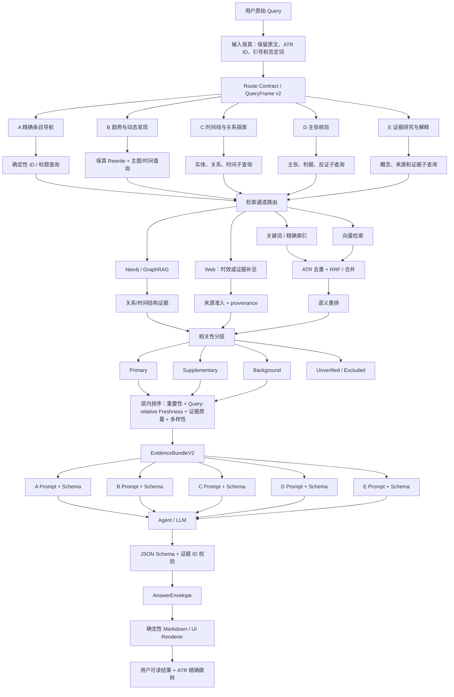

# AI Trend Radar 端到端 Query Routing / Agentic GraphRAG 策略研究

- 日期：2026-08-13
- 状态：研究结论；不代表已经实现
- 研究范围：用户 Query → 意图理解与稳定任务路由 → Query Rewrite / Decomposition → 关键词、向量、图谱、Web 检索 → 融合、相关性分层与层内排序 → 任务 Prompt → 结构化结果 → Markdown / UI → 引用与条目深链
- 本地约束：5 类稳定任务路由、ATR 唯一 ID、Neo4j + 向量 + 关键词检索、用户最终不直接查看 JSON
- 来源原则：只使用或优先使用官方文档、官方源码/接口文档、原始论文和公开规范；本文中的项目建议会明确标注为“本项目建议”，避免把行业事实与架构推断混为一谈。

## 1. 执行摘要

用户提出的“总—分—总”方向成立，但需要避免把它实现成五套互相复制、逐渐漂移的流水线。推荐结构是：

1. 用户原问题先转换为一个**稳定且版本化的 Route Contract（路由合同）**；
2. Route Contract 中保留一个 `primary_task_family` 和零到多个 `supporting_task_families`，而不是用后出现的关键词覆盖先前意图；
3. 输入侧 Query Rewrite、检索通道选择、GraphRAG 进入条件、排序目标、输出 Prompt 和 JSON Schema 都读取同一份 Route Contract；
4. 五类任务共享检索基础设施，但拥有不同的**检索视图、证据要求、Prompt 模板和输出 Schema**；
5. 模型输出先成为经过 Schema 校验的机器对象，再由确定性 Renderer 转为 Markdown / UI；模型不直接负责拼接最终 HTML；
6. `daily_item_id = ATR-YYYYMMDD-XXXXXX` 是贯穿向量、关键词、Neo4j、证据账本和深链的稳定主键；请求内的 `[E1]` 只是临时显示编号，不能替代 ATR 身份；
7. Top-K 不是一个值，而是多个阶段的独立预算：每通道召回 K、融合窗口 K、语义重排 K、证据上下文 K、用户展示 K；
8. GraphRAG 只在问题需要关系、时间演化或全局主题结构时进入，不应成为所有问题的默认昂贵通道。

本项目不需要现在引入一个覆盖全项目的大型 RAG 框架。最优渐进路线是保留现有 ATR 原子语料、Neo4j、向量/关键词索引、Evidence Ledger 和深链，替换目前容易漂移的 QueryPlan / 路由 / 排序 / 输出合同中间层。

## 2. 研究方法与证据边界

### 2.1 本地代码审计

审计的主要现有模块包括：

- `rag/query_understanding.py`：当前 `QueryPlan`、关键词意图识别、时间窗口和 Graph requirement；
- `rag/retrieval_gateway.py`：任务族映射、精确导航、趋势和关系检索路径；
- `rag/prompt_registry.py`：五类任务 Prompt 的雏形和 claim verification 的隐藏 JSON 合同；
- `rag/chat_service.py`：检索、Web、深抓取、Evidence Ledger、Prompt 拼装和返回；
- `rag/retriever/hybrid.py`、`rag/retriever/lexical_store.py`：向量、关键词、图谱融合及 ATR 深链；
- ADR-0001、ADR-0003、ADR-0004、ADR-0005 与 `query-evidence-routing-contract-v1.md`。

### 2.2 一手来源范围

研究使用 Microsoft Azure AI Search、Microsoft GraphRAG、LlamaIndex、Elastic、DeepSeek、JSON Schema、W3C、IETF、CommonMark、OWASP 的官方资料，以及 Adaptive-RAG、CRAG、RAG-Fusion 原始论文。没有用搜索结果摘要本身替代原文结论。

### 2.3 当前项目的已实现事实与缺口

| 模块 | 已有事实 | 主要缺口 |
|---|---|---|
| 任务族 | 已出现 `item_navigation`、`trend_discovery`、`timeline`、`relation_exploration`、`claim_verification`、`evidence_research` 等名称 | 当前实现口径不是严格五类；timeline 在部分地方是独立族，部分地方又像 trend 的子模式，需要统一产品合同 |
| 输入理解 | `QueryPlan` 已提取实体、主题、来源、时间和 Graph requirement | 单值 `intent` 会被后续关键词覆盖；没有置信度、歧义、结构化 rewrite variants、子问题依赖关系 |
| Query Rewrite | 会把领域术语附加到一个 `retrieval_query` 字符串 | 原问题、精确标识、词法查询、语义查询、图查询和 Web 查询没有分开；扩展词可能污染精确查询 |
| 检索 | 已有关键词、向量、Neo4j、Web 和深抓取能力 | 通道由分散规则决定，缺少统一通道计划和每通道可观察结果 |
| Prompt | 已有 `prompt_registry.py` | 输入 rewrite 和输出 Prompt 没有读取同一版本合同；多数任务仍没有严格输出 Schema |
| 输出 | API 返回 answer、citations、trace；claim verification 有隐藏机器结果 | 机器对象与用户表现层没有形成统一 `AnswerEnvelope`；部分任务仍依赖模型自由生成 Markdown |
| 引用 | Evidence Ledger 分配 E 编号；ATR ID 和 `local_url` 已进入索引 | 需要正式规定 ATR → 请求证据 ID → claim → UI deep-link 的不可断裂映射 |

## 3. 目标架构：一份合同驱动“总—分—总”



### 3.1 建议固定的五类任务路由

为了满足“5 类稳定路由”且不让路线无限增长，建议正式收敛为以下五类。复杂问题通过一个主路由加辅助路由表达，不再新增第六、第七类：

| 代码 | 稳定任务族 | 用户目标 | 默认生成模型？ | Graph 默认？ |
|---|---|---|---|---|
| A | `item_navigation` | 找到一条具体内容并跳转 | 否；确定性返回 | 否 |
| B | `trend_discovery` | 最近动态、重要新闻、热门趋势 | 是 | 趋势聚类时可选；普通新闻列表不必 |
| C | `temporal_relation_exploration` | 时间线、实体关系、纵横趋势 | 是 | 是，要求结构证据时进入 |
| D | `claim_verification` | 验证一个可判定主张 | 是 | 仅在图关系直接参与判据时可选 |
| E | `evidence_research` | 解释、比较、深挖、证据型研究 | 是 | 多跳关系或全局主题时可选 |

说明：现有 `timeline` 与 `relation_exploration` 合并为 C 的两个 `answer_mode`，不是抹掉差异。它们共享“顺序/关系证据”的入口条件，但输出可分别使用 timeline 或 relation 视图。`evidence_research` 保留为 E，而不是把所有未识别问题都静默塞入一个无约束 fallback；低置信度时必须保留歧义或澄清。

## 4. 稳定 Route Contract：输入 rewrite 与输出 prompt 的共同事实源

### 4.1 为什么不能分别维护两套路由

如果 Query Rewrite 使用一套 A–E 判断，而 Prompt Registry 再独立判断一次，会出现典型漂移：输入按“趋势”扩大时间和主题，输出却按“核验”要求直接证据；或者输入按关系检索调用 Neo4j，输出仍按普通新闻列表呈现。正确做法是分类只发生一次，后续模块只消费合同。

### 4.2 推荐合同

```json
{
  "schema_version": "atr.route/2.0",
  "request_id": "uuid",
  "original_query": "用户原文，永不覆盖",
  "primary_task_family": "trend_discovery",
  "supporting_task_families": ["evidence_research"],
  "answer_mode": "important_news",
  "route_confidence": 0.86,
  "ambiguities": [],
  "subjects": [{"id": "entity/openai", "label": "OpenAI"}],
  "topics": [],
  "claims": [],
  "temporal": {
    "expectation": "recent",
    "lookback_days": 14,
    "date_basis": "event_or_publication"
  },
  "source_constraints": [],
  "web_permission": "on_demand",
  "rewrite_plan": {
    "preserve_exact_tokens": ["OpenAI"],
    "lexical_queries": ["OpenAI 重要动态"],
    "semantic_queries": ["OpenAI 近期影响范围较大的产品、组织、研究或战略事件"],
    "graph_queries": [],
    "web_queries": []
  },
  "retrieval_policy_id": "trend_discovery/v1",
  "prompt_contract_id": "trend_discovery/v1",
  "output_schema_id": "atr.answer.trend/v1",
  "budget_profile": "balanced"
}
```

### 4.3 不变量

- `original_query` 永远保留，任何 rewrite 只能新增检索变体，不能替换原问题；
- ATR ID、引号内原文、产品名、数字、日期、否定词和用户指定来源属于 `preserve_exact_tokens`；
- `primary_task_family` 决定主要检索视图、Prompt 与输出 Schema；辅助任务只增加证据需求，不覆盖主任务；
- `retrieval_policy_id`、`prompt_contract_id`、`output_schema_id` 必须属于同一合同版本族；
- 路由低置信或存在互斥理解时，不静默覆盖：可进行一次小范围并行检索，或向用户提出一个澄清问题；
- 每次路由、rewrite、通道选择和降级原因都进入 trace，便于评估“错在分类、召回还是生成”。

### 4.4 路由实现优先级

推荐采用“确定性优先、模型补歧义”的两级方案：

1. ATR ID、精确标题、明确日期/来源、明确核验句式先用规则解析；
2. 规则置信度不足或一个 Query 含多个任务时，最多调用一次小模型输出 Route Contract；
3. 合同必须通过枚举、必填字段和交叉字段校验；
4. 不在首版训练专用分类器。Adaptive-RAG 证明了按问题复杂度选择无检索、单步和多步策略的价值，但其方法包含训练分类器；当前项目缺少足够稳定的路由标签，不宜直接复制训练路径。[Adaptive-RAG 原始论文](https://arxiv.org/abs/2403.14403)

LlamaIndex 的官方 RouterRetriever 也采用“根据 query 与候选 retriever 元数据选择一个或多个 retriever”的模式，可作为接口设计参照，而不是必须引入的依赖。[LlamaIndex RouterRetriever](https://docs.llamaindex.ai/en/stable/api_reference/retrievers/router/)

## 5. Query Rewrite 与 Decomposition 策略

### 5.1 Rewrite 不是润色用户问题

Rewrite 的产品目标是提高召回，而不是把用户说法改得更漂亮。Azure 官方资料把它用于修正拼写、扩展同义词和产生替代表达，同时明确警告：重写可能丢失产品代码或唯一标识中的精确词。[Azure Query Rewrite](https://learn.microsoft.com/en-us/azure/search/semantic-how-to-query-rewrite)

因此本项目应使用多视图 rewrite：

| 查询视图 | 用途 | 约束 |
|---|---|---|
| `exact_query` | ATR ID、完整标题、URL、明确来源 | 不改写 |
| `lexical_queries[]` | BM25 / 关键词索引 | 保留实体和高信息量名词；可补别名与中文/英文规范名 |
| `semantic_queries[]` | 向量召回与语义 rerank | 保留原意，可增加同义表达和任务语境 |
| `graph_queries[]` | Neo4j 实体、关系、时间遍历 | 转成实体 ID、关系需求、时间约束，不拼自然语言 Cypher |
| `web_queries[]` | 最新性或缺证补充 | 带时间、官方域名偏好和待核验主张；只有 Web 被允许时生成 |

### 5.2 何时 decomposition

不是每个 Query 都拆子问题。Azure Agentic Retrieval 的官方工作流在低/中推理强度下用 LLM 生成聚焦子查询并并行检索，但也明确指出它比单次查询增加延迟和成本；minimal 模式会跳过 LLM planning。[Azure Agentic Retrieval Overview](https://learn.microsoft.com/en-us/azure/search/search-agentic-retrieval-concept)

本项目建议只在以下情况拆分：

- 用户同时询问多个实体、多个时间段或多个判断标准；
- 比较任务需要为每个主体取得对称证据；
- 核验任务需分别找支持、反证和缺失判据；
- 关系/时间线任务需要实体解析与跨日期观测；
- 第一轮证据评级不足，允许一次 corrective rewrite。

不拆分：ATR 精确导航、单实体普通解释、简单标题查找、已有足够证据的单步问答。

### 5.3 Rewrite 质量门

- 每个变体必须记录 `derived_from=original_query`；
- 变体不得删除保真 token；
- 最多 3 个内部子查询，首版避免无界 fan-out；
- 原查询必须始终参与检索，防止 rewrite 偏航；
- 子查询结果合并后仍以原问题做语义重排；
- RAG-Fusion 的原始研究展示了多查询 + RRF 的覆盖收益，同时也报告了派生查询偏离原意时会跑题，因此不能把 query generation 结果无条件视为真意图。[RAG-Fusion 原始论文](https://arxiv.org/abs/2402.03367)

## 6. Lexical / Vector / Graph / Web 检索路由

### 6.1 通道职责

| 通道 | 擅长 | 不应承担 |
|---|---|---|
| 关键词/精确索引 | ATR ID、标题、产品名、稀有词、日期、来源过滤 | 泛化语义和跨措辞理解 |
| 向量 | 中文模糊表达、概念近义、描述性问题 | 唯一编号、精确数字和严格否定逻辑 |
| Neo4j / GraphRAG | 实体关系、同事件跨日观测、时间线、主题网络、全局趋势结构 | 所有普通问答的默认首召回 |
| Web | 内部语料截止后信息、官方核验、证据缺口 | 掩盖内部索引或路由故障 |

### 6.2 按五类任务的默认通道路由

| 路由 | 关键词 | 向量 | Graph | Web |
|---|---:|---:|---:|---:|
| A 精确导航 | 必选 | 标题模糊时降级 | 否 | 否 |
| B 趋势动态 | 必选 | 必选 | 只有“趋势结构/跨日演化”时进入 | 明确最新或内部时效不足时 |
| C 时间关系 | 实体解析/过滤 | 补文本证据 | 必选 | 只补缺失外部事实 |
| D 主张核验 | 必选 | 必选 | 判据涉及关系时 | 一手来源核验或内部不足时 |
| E 证据研究 | 必选 | 必选 | 多跳/全局问题时 | 用户要求或证据不足时 |

### 6.3 GraphRAG 何时进入

Microsoft GraphRAG 官方区分：Local Search 面向具体实体并结合图数据与文本；Global Search 面向整个数据集的全局问题，采用 community report 的 map-reduce，资源开销较高；DRIFT 从社区信息出发扩展局部搜索并产生跟进问题；Basic Search 则是普通向量 RAG 对照。[Microsoft GraphRAG Query Overview](https://microsoft.github.io/graphrag/query/overview/)

结合当前项目，Graph 进入条件应是**证据形状**而不是出现“趋势”一词：

- 必选：实体之间关系、同一内容跨日期变化、事件时间线、主题网络、跨来源/跨日期趋势结构；
- 可选：普通近期动态，但需要做趋势聚类、确认多个事件是否构成同一方向；
- 禁用：ATR ID 精确导航、单条标题定位、普通定义解释；
- 全局图搜索只用于“整个语料中最显著的主题/结构是什么”，并设置更高成本预算；
- 图返回的是路径、关系、时间和支持它们的 ATR 观测，不与文本候选直接共享一个原始相关性分数。

首版不应迁移到 Microsoft GraphRAG 的完整社区摘要索引，因为当前 Neo4j 已保存产品特有的 ATR 观测和纵横关系；应借鉴其 local/global/drift 边界，而不是替换现有图模型。

### 6.4 Web 进入条件与一次纠错

CRAG 的原始方法先用轻量 evaluator 判断检索质量，再触发不同纠错动作，并把 Web 作为静态语料不足时的扩展，而不是每次默认搜索。[CRAG 原始论文](https://arxiv.org/abs/2401.15884)

本项目建议：

1. 内部检索后产生 `evidence_grade = sufficient | partial | insufficient`；
2. `partial/insufficient` 时最多做一次内部 corrective rewrite；
3. 仍不足且用户允许 Web，或用户明确问“最新/今天/联网”，才进入 Web；
4. Web 结果经过官方源优先、日期核验、来源角色和 deep-fetch 准入；
5. 外部证据必须标为 external，不能伪装成内部 RAG；
6. 如果联网也不满足正式证据标准，回答“证据不足”，而不是把搜索摘要包装成结论。

## 7. 候选融合、相关性分层、语义重排与层内排序

### 7.1 正确顺序

```text
每通道宽召回
  → ATR / content identity 去重
  → RRF 合并不同分数尺度
  → 使用原问题做语义重排
  → Primary / Supplementary / Background / Unverified / Excluded 分层
  → 同层按重要性、新鲜度、证据质量排序
  → 多样性约束
  → Evidence Bundle
```

Azure 官方 Hybrid Search 让全文和向量并行执行，再用 RRF 合并；语义 ranker 是 BM25/RRF 初排后的二阶段重排，而不是全库召回器。[Azure Hybrid Search](https://learn.microsoft.com/en-us/azure/search/hybrid-search-overview)、[Azure Semantic Ranking](https://learn.microsoft.com/en-us/azure/search/semantic-search-overview)

RRF 适合作为第一版融合，因为关键词、向量、图检索原始分数不可直接相加。Elastic 官方也把 `rank_window_size` 与最终 `size` 分开，并说明更大融合窗口通常以性能换相关性。[Elastic RRF Retriever](https://www.elastic.co/guide/en/elasticsearch/reference/8.19/retriever.html)

### 7.2 相关性分层合同

- `Primary`：直接回答 Query Frame 的主问题；
- `Supplementary`：直接相关但影响较小、间接支持或补充维度；
- `Background`：历史、机制或上下文，不得冒充当前动态；
- `Unverified`：可能相关但证据来源/日期/正文不足；
- `Excluded`：不相关、重复、冲突、越界或质量不合格。

分层只看与当前任务的作用。重要性、新鲜度和上游价值分不能把 Supplementary/Background 提升为 Primary。

### 7.3 层内排序

首版避免冻结一个看似科学但没有标签支持的万能加权公式。建议保留可解释因子：

- Dynamic Importance：影响范围、影响深度、主体显著性、事件新颖度、讨论价值；
- Query-relative Freshness：用户时间要求、事件/发布日期、旧闻回流识别；
- Evidence Quality：一手来源、正文完整度、日期可信度、独立佐证、是否直接支持结论；
- Upstream Value：日报原有分数/热度快照，只作层内弱信号；
- Diversity：同事件、同来源、同主题占位上限。

### 7.4 Top-K 必须按阶段设置

Top-K 的本质是每个阶段的预算和信息损失边界，不应只有一个全局 `top_k=10`。

| 阶段 | 建议首轮范围 | 目的 | 调优指标 |
|---|---:|---|---|
| 每个 lexical query | 30–50 | 保住精确词、实体和标题 | Recall@K |
| 每个 vector query | 30–50 | 保住模糊语义候选 | Recall@K |
| Graph path/observation | 10–30 个结构记录 | 避免图展开失控 | path coverage、延迟 |
| RRF fusion window | 50–100 个唯一 ATR/content identity | 容纳多查询与多通道重叠 | Recall@50/100 |
| 语义 rerank 输入 | 20–50 | 控制 cross-encoder/模型成本 | NDCG@5、MRR、P95 |
| 分层后证据上下文 | Primary 5–8；Supplementary 2–4；Background 0–3 | 控制生成上下文与噪声 | 主答案相关率、faithfulness |
| UI 展示 | 主结果 3–5，补充可折叠 | 用户扫描效率 | 点击、跳转和满意度 |

这些数字是**启动区间，不是行业真理**。Azure 的语义排序示例通常建议向 reranker 提供最多约 50 个候选；Azure agentic retrieval 也区分最多 50 个语义排序候选与更小的 L3 文档数，说明不同阶段本来就有独立预算。[Azure Hybrid Query](https://learn.microsoft.com/en-us/azure/search/hybrid-search-how-to-query)、[Azure Retrieval Reasoning Effort](https://learn.microsoft.com/en-us/azure/search/agentic-retrieval-how-to-set-retrieval-reasoning-effort)

本项目最终数值必须通过小批量 route-balanced 校准集确定。调参顺序是：先把每通道 K 加宽直到 Recall@candidate 不再显著增加，再确定 rerank K，最后根据上下文忠实度和延迟确定 evidence K；不能用最终展示 5 条反推初召回也只取 5 条。

## 8. Task-specific Prompt Assembly

### 8.1 Prompt 由模块编译，不由字符串到处拼接

推荐接口：

```text
PromptRegistry.compile(
  route_contract,
  evidence_bundle,
  answer_schema,
  runtime_policy
) -> PromptPackage
```

每个 PromptPackage 固定包含：

1. 全局安全与证据边界；
2. 任务族目标和禁止事项；
3. Query Frame（用户原问题、主体、时间、主/辅任务）；
4. 分层 Evidence Bundle，包含 ATR ID 和请求内 Evidence ID；
5. 回答 Schema 与字段语义；
6. 不足证据时的标准降级；
7. 禁止输出内部思维链，只输出可审计的 `method_summary` / `limitations`。

### 8.2 五类 Prompt / 输出关注点

| 路由 | Prompt 的核心约束 | 输出形态 |
|---|---|---|
| A | 不扩写、不猜测；精确展示标题、日期、来源和本地链接 | `NavigationAnswer` |
| B | 多事件才能称趋势；主动态与补充/背景分离；强调“重要 + 新”但不越过相关性层级 | `TrendAnswer` |
| C | 按时间或关系类型组织；共现不等于因果；区分 confirmed/inferred | `TimelineRelationAnswer` |
| D | verdict 只能 supported / contradicted / insufficient；每个判据绑定证据 | `VerificationAnswer` |
| E | 结论—证据结构、比较维度对称、明确局限 | `ResearchAnswer` |

### 8.3 不应让 Prompt 负责的事情

- 不让 Prompt 从 100 条噪声中自行“检索”；
- 不让 Prompt 补造缺失标题、日期、URL 或摘要；
- 不让 Prompt 决定一个 citation 是否真的在 Evidence Ledger 中；
- 不让 Prompt 把 JSON 手写成 HTML；
- 不让 Prompt 以“更有文采”为由更改 route 或证据层级。

## 9. Structured JSON Output 与 Schema Validation

### 9.1 机器合同与用户表现分离

模型输出 JSON 的目的，是让程序验证和渲染，不是让用户阅读。推荐统一外层：

```json
{
  "schema_version": "atr.answer/1.0",
  "request_id": "uuid",
  "route": {
    "primary_task_family": "trend_discovery",
    "answer_mode": "important_news"
  },
  "headline": "OpenAI 近期重要动态",
  "summary": "...",
  "sections": [],
  "claims": [
    {
      "claim_id": "C1",
      "text": "...",
      "evidence_ids": ["E1", "E3"]
    }
  ],
  "citations": [
    {
      "evidence_id": "E1",
      "daily_item_id": "ATR-20260805-99E550",
      "local_url": "#2026-08-05/ai-topic-radar/item/ATR-20260805-99E550",
      "external_url": "https://example.com/source"
    }
  ],
  "limitations": [],
  "method_summary": "使用内部关键词与向量检索；未使用联网搜索"
}
```

路由特定字段通过 `oneOf` / 可复用 `$defs` 组合，但外层 `citations`、`claims`、`limitations`、`route` 保持稳定。JSON Schema 官方规范适合定义类型、必填字段、枚举和组合合同，并建议声明具体 draft 与 `$id`。[JSON Schema 2020-12](https://json-schema.org/specification)、[JSON Schema 入门](https://json-schema.org/learn/getting-started-step-by-step)

### 9.2 DeepSeek 的现实约束

DeepSeek 官方 JSON Output 保证输出是有效 JSON 字符串，但仍要求 Prompt 明确包含 JSON 指令和示例，并提示可能出现空内容或 token 截断；这不等于业务 Schema 一定正确。[DeepSeek JSON Output](https://api-docs.deepseek.com/guides/json_mode/)

因此当前项目推荐：

1. 使用 `response_format={"type":"json_object"}`；
2. 仍在应用层用 Pydantic / JSON Schema 校验；
3. 校验失败最多一次“只修复格式、不重新推理事实”的重试；
4. 第二次失败返回受控错误或保守降级，不把未验证 JSON 交给 UI；
5. `finish_reason=length`、空内容和未知 evidence ID 直接失败；
6. 如未来采用 DeepSeek strict function schema，可实验其官方 Beta strict tool mode，但不把 Beta 能力设为本地项目的唯一运行前提。[DeepSeek Tool Calls Strict Mode](https://api-docs.deepseek.com/guides/tool_calls)

### 9.3 语义校验不能只靠 JSON Schema

Schema 只能证明字段结构正确，不能证明结论有证据。还需应用层不变量：

- 每个 `claims[].evidence_ids[]` 必须存在于本次 Evidence Ledger；
- citation 的 ATR ID、标题、日期、链接由账本注入，不接受模型自报；
- D 类的 contradicted 必须包含直接反证判据；
- B 类趋势必须至少满足跨事件或跨来源/日期结构要求；
- C 类 inferred relation 必须显式标注，不能渲染成 confirmed；
- Primary/Supplementary/Background 的分层来自检索合同，不允许模型改写。

## 10. Deterministic Markdown / UI Rendering

### 10.1 Renderer 是纯函数

```text
render_answer(answer_envelope, ui_capabilities, locale) -> RenderModel
render_markdown(RenderModel) -> CommonMark
render_ui(RenderModel) -> Components
```

同一个经过验证的 `AnswerEnvelope` 可以渲染成 Markdown、Web UI 卡片或 API JSON。这样用户不看 JSON，但调试、评估和未来多端展示仍共享机器事实。

CommonMark 提供可预测的 Markdown 基础语法；建议只使用标题、段落、列表、强调和链接的安全子集，复杂关系图由受控组件渲染，不让模型输出任意 HTML。[CommonMark 规范](https://spec.commonmark.org/spec)

### 10.2 安全与可读性规则

- 所有标题、摘要和模型文本默认作为文本节点渲染；
- 若 Markdown 转 HTML，禁用或清洗 raw HTML；
- URL 只允许 `http`、`https` 和本项目受控 hash route；
- 外部证据显示“联网”标记，内部证据显示“内部语料”；
- 主答案直接展示，补充和背景可折叠，但不能丢失正文；
- 无正文/摘要时不渲染虚假的“展开摘要”按钮；
- UI 渲染不得重新排序证据或改变层级；
- 流式输出时先展示状态事件，只有完整 JSON 验证后才提交最终答案卡片；若需要文字流式体验，可流式展示非权威草稿区，但正式引用结果必须原子提交。

OWASP 建议优先使用框架自动转义和安全 DOM sink；确需渲染 HTML 时使用维护中的 sanitizer，并对 URL 做协议白名单和上下文编码。[OWASP XSS Prevention](https://cheatsheetseries.owasp.org/cheatsheets/Cross_Site_Scripting_Prevention_Cheat_Sheet.html)

## 11. Citation、ATR Deep Link 与 Provenance

### 11.1 三种身份不能混用

| 身份 | 生命周期 | 用途 |
|---|---|---|
| `daily_item_id` / ATR ID | 永久 | 语料、向量、关键词、Neo4j、UI 深链的统一公开身份 |
| `content_id` / event group | 永久、内部 | 关联跨日重复、更新和趋势，不直接替代当日观测 |
| `evidence_id` / E1 | 单请求 | Prompt 压缩和 claim 引用；请求结束后没有全局意义 |

### 11.2 推荐 provenance 记录

```text
EvidenceRecord
  evidence_id
  daily_item_id
  content_id
  source_type       internal | external | graph
  source_role       official | primary_reporting | secondary | community
  title / source / date
  excerpt
  local_url
  external_url
  retrieved_by[]
  query_variant_ids[]
  relevance_tier
  provenance_status
```

W3C PROV-O 的基本模型用 Entity、Activity、Agent 及 `wasGeneratedBy` 等关系表达数据从何而来和如何生成。本项目不需要完整实现 PROV-O，但可以借用其分离“证据实体、检索/生成活动、来源主体”的思想。[W3C PROV-O](https://www.w3.org/TR/prov-o/)

### 11.3 深链规则

- 每个内部引用必须含 `daily_item_id` 与 `local_url`；
- 推荐 URL 继续使用 `#YYYY-MM-DD/ai-topic-radar/item/ATR-...`，fragment 用于标识主页面中的次级资源符合 URI 的通用语义。[RFC 3986 §3.5](https://www.rfc-editor.org/rfc/rfc3986.html#section-3.5)
- UI 点击本地引用应加载日报并滚动到唯一 item anchor，而不是只到日报首页；
- 外部跳转独立为明确图标或按钮，不能让本地引用与外部 URL 竞争同一个点击区域；
- citation 文本由账本元数据生成，不让模型截断后充当链接主键；
- Graph 证据必须回链到支持关系的 ATR 观测；纯推断路径不能伪装成原始来源。

## 12. 渐进采用方案

### Phase 0：只固化合同和小样，不切正式流量

- 统一五类任务族和 `RouteContract v2`；
- 建立每类 4–6 个小样，覆盖单意图、复合意图、歧义和精确 ATR；
- 比较当前 `QueryPlan` 与新 Route Contract 的分类，不调用完整 RAG；
- Gate：主任务分类、保真 token、时间约束和 Graph requirement 达标。

### Phase 1：输入侧影子 Rewrite

- 原查询仍驱动正式检索；新 rewrite 只记录，不影响答案；
- 检查精确 ID/标题没有被改写，模糊中文 query 是否产生更可检索的 lexical/semantic variants；
- Gate：Recall@candidate 提升且 exact navigation 零退化。

### Phase 2：多通道宽召回 + RRF + 语义 rerank

- 复用现有 lexical/vector/Neo4j；
- 每通道保留独立 outcome；按 ATR/content identity 去重；
- 在小样上校准 candidate K、fusion window 和 rerank K；
- 暂不接生成模型，先测 Recall@20/50、MRR、NDCG@5 和 P95。

### Phase 3：相关性分层 + 层内排序

- 实现 Primary/Supplementary/Background/Unverified/Excluded；
- 再引入重要性、新鲜度、证据质量和上游价值分；
- Gate：新但无关、高热弱相关、旧闻冒充最新等保护切片不退化。

### Phase 4：Prompt Registry v2 + Answer Schema

- 五类 Prompt 与五类 Schema 读取同一 Route Contract；
- Agent 只生成验证后的 `AnswerEnvelope`；
- 对 DeepSeek 验证空响应、截断、错误字段、未知证据 ID；
- Gate：正确结构 > 退化结构 > 错误结构，claim-evidence 映射无未知 ID。

### Phase 5：确定性 UI Renderer 与深链

- JSON 不直接展示给用户；
- 同一 AnswerEnvelope 输出 Markdown 与 UI 卡片；
- 验证本地 ATR 深链、外部链接标识、无摘要按钮逻辑和 XSS 防护；
- Gate：所有引用可精确跳到条目，UI 不改变证据层级。

### Phase 6：一次 corrective retrieval 与受控 Web

- Evidence Grade 不足时只允许一次内部改写；
- 仍不足再按权限联网；
- 记录 cost、P50/P95、Web 触发正确率和降级原因；
- Gate：联网不能掩盖内部检索失败，超预算自动回退。

## 13. 小批量端到端测试设计

首轮不是追求统计显著，而是检验架构方向和模块合同是否打通。建议 25 个 Query，每类 5 个：

| 路由 | 必含样本 |
|---|---|
| A | 精确 ATR、完整标题、错别字标题、来源+日期、无匹配 |
| B | 最近热门、某实体重要动态、普通配置变化干扰、高热弱相关、旧但重要背景 |
| C | 单事件跨日热度、实体关系、时间线、共同主题横向趋势、共现非因果 |
| D | supported、contradicted、insufficient、宽泛商业成功、需要官方 Web 核验 |
| E | 概念解释、对比、深挖、指定来源、复合问题 decomposition |

每个样本记录逐阶段 gold：

```text
route_gold
rewrite_invariants
required_channels / forbidden_channels
relevant_ATR_ids
tier_gold
required_claim_evidence_pairs
expected_output_schema
expected_deep_links
```

不要只给最终答案打一个 F1。应逐层报告：

- Route：主任务准确率、辅助任务召回率、歧义保留率；
- Rewrite：保真违规率、派生查询有效率；
- Retrieval：Recall@20/50；
- Rerank：MRR、NDCG@5；
- Tiering：混淆矩阵、新但无关进入 Primary 的比例；
- Output：Schema valid rate、claim-evidence valid rate；
- UX：ATR 深链准确率、无效链接率、主答案可扫描性；
- Efficiency：各阶段 P50/P95、模型调用数、Web 调用数和 token 成本。

## 14. 不建议采用项

1. **不建议五套复制流水线**：应共享合同、基础设施和观测，只让检索视图/Prompt/Schema分化。
2. **不建议每个 Query 都用 Agent 规划**：精确导航和简单查询走确定性路径；复杂度触发 planning。
3. **不建议把 rewrite 后字符串当用户真意图**：保留原查询并用于最终 rerank。
4. **不建议所有 Query 默认 GraphRAG**：图谱只服务关系、时间和全局结构问题。
5. **不建议只有一个 Top-K**：不同阶段目标和成本完全不同。
6. **不建议模型直接生成最终 HTML**：结构化结果 → 校验 → 确定性渲染。
7. **不建议只验证“是合法 JSON”**：必须做业务 Schema、证据 ID 和语义不变量校验。
8. **不建议把 Web 当默认召回或兜底万能药**：先诊断内部失败，再一次纠错，最后按权限补证。
9. **不建议现在训练路由分类器或 Self-RAG 类模型**：标签和评估尚未稳定，成本与维护面不匹配。
10. **不建议现在替换 Neo4j/向量/关键词存储或重建全量索引**：先以影子合同证明中间层方向。
11. **不建议把全局“重要新闻”重新换个字段名保存**：重要性是 Query-relative 动态判断。
12. **不建议让 Prompt 读取所有候选自行排序**：排序、分层与引用准入应在模型调用前完成并可评估。

## 15. 推荐的模块边界

```text
QueryUnderstandingService
  understand(original_query, conversation_context) -> RouteContract

QueryRewriteService
  rewrite(RouteContract) -> QueryVariantSet

RetrievalOrchestrator
  retrieve(RouteContract, QueryVariantSet) -> ChannelCandidateSets

EvidenceRankingService
  fuse_rerank_and_tier(RouteContract, ChannelCandidateSets) -> EvidenceBundleV2

PromptRegistry
  compile(RouteContract, EvidenceBundleV2, OutputSchema) -> PromptPackage

AnswerGenerator
  generate(PromptPackage) -> RawStructuredOutput

AnswerValidator
  validate(RawStructuredOutput, EvidenceLedger) -> AnswerEnvelope

AnswerRenderer
  render(AnswerEnvelope, Surface) -> Markdown | UIModel
```

这些是“深模块”接口：调用方看到稳定输入输出，不需要知道内部是规则、向量、Neo4j、RRF、cross-encoder 还是 DeepSeek。实现可以逐步替换，而不会让 Web UI、Prompt 和评估器同时跟着重写。

## 16. 最终建议

当前最优下一步不是立刻实现整条链，而是先做一个很窄的 Stage Gate：

1. 正式确认五类任务族名称与 C 类合并边界；
2. 写 `RouteContract v2` JSON Schema；
3. 建立 25 条小样，只跑“原 Query → Route Contract → rewrite variants”；
4. 通过后再让这些 variants 进入影子检索，比较旧链和新链的候选召回；
5. 只有候选层有效，才接语义重排、分层、Prompt 和 AnswerEnvelope。

这样既打通用户设想的总—分—总，也避免一次性改完整系统后才发现最前面的分类或 rewrite 已经偏航。

## 17. 一手来源清单

### Query routing / decomposition / correction

- [Azure AI Search Agentic Retrieval Overview](https://learn.microsoft.com/en-us/azure/search/search-agentic-retrieval-concept)
- [Azure Retrieval Reasoning Effort](https://learn.microsoft.com/en-us/azure/search/agentic-retrieval-how-to-set-retrieval-reasoning-effort)
- [Azure Query Rewrite with Semantic Ranker](https://learn.microsoft.com/en-us/azure/search/semantic-how-to-query-rewrite)
- [LlamaIndex RouterRetriever 官方 API](https://docs.llamaindex.ai/en/stable/api_reference/retrievers/router/)
- [Adaptive-RAG 原始论文](https://arxiv.org/abs/2403.14403)
- [Corrective Retrieval Augmented Generation 原始论文](https://arxiv.org/abs/2401.15884)
- [RAG-Fusion 原始论文](https://arxiv.org/abs/2402.03367)

### Hybrid retrieval / rerank / Top-K

- [Azure Hybrid Search Overview](https://learn.microsoft.com/en-us/azure/search/hybrid-search-overview)
- [Azure Hybrid Query](https://learn.microsoft.com/en-us/azure/search/hybrid-search-how-to-query)
- [Azure Semantic Ranking](https://learn.microsoft.com/en-us/azure/search/semantic-search-overview)
- [Azure RRF Ranking](https://learn.microsoft.com/en-us/azure/search/hybrid-search-ranking)
- [Elastic RRF Retriever](https://www.elastic.co/guide/en/elasticsearch/reference/8.19/retriever.html)
- [Elastic Semantic Reranking](https://www.elastic.co/docs/solutions/search/ranking/semantic-reranking)

### GraphRAG

- [Microsoft GraphRAG Query Overview](https://microsoft.github.io/graphrag/query/overview/)
- [Microsoft GraphRAG Indexing Overview](https://microsoft.github.io/graphrag/index/overview/)

### Structured output / rendering / provenance

- [DeepSeek JSON Output](https://api-docs.deepseek.com/guides/json_mode/)
- [DeepSeek Tool Calls Strict Mode](https://api-docs.deepseek.com/guides/tool_calls)
- [JSON Schema Specification 2020-12](https://json-schema.org/specification)
- [CommonMark Specification](https://spec.commonmark.org/spec)
- [OWASP XSS Prevention Cheat Sheet](https://cheatsheetseries.owasp.org/cheatsheets/Cross_Site_Scripting_Prevention_Cheat_Sheet.html)
- [W3C PROV-O Recommendation](https://www.w3.org/TR/prov-o/)
- [RFC 3986 URI Generic Syntax](https://www.rfc-editor.org/rfc/rfc3986.html)
