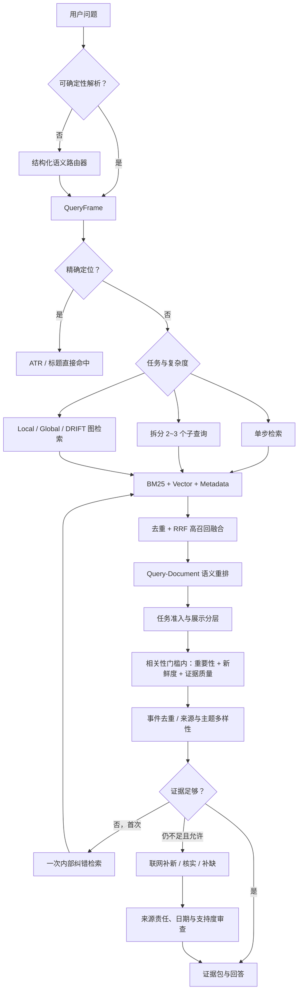

# AI Trend Radar 新闻 / 趋势查询路由与多阶段检索排序：行业方案复盘

> 日期：2026-08-13
> 范围：只研究查询理解、检索路由、候选召回、重排、GraphRAG 边界、新闻价值排序、证据充分性与联网升级；不修改业务代码。
> 来源规则：仅使用官方文档、官方源码 / 博客和原始论文。文中的“来源结论”与“本项目推论”刻意分开。

## 一、执行摘要

当前问题不适合继续靠“补关键词 + 调一个总分公式”解决。更成熟、也更适合 AI Trend Radar 的体系是：

1. **先理解用户任务，而不只是识别几个关键词**：把查询解析成主体、主题、时间要求、任务类型、新闻价值要求、证据要求和复杂度。
2. **先高召回找候选，再高精度重排**：BM25、向量检索、精确 ID / 标题和必要的图检索并行召回；用 RRF 合并；然后只对 Top-N 做语义重排。
3. **相关性是准入门槛，重要性与新鲜度是门内排序因素**：不允许“很新但不相关”或“热度高但不是用户要的新闻”越过强相关候选。
4. **GraphRAG 按问题类型启用**：实体关系、跨日演进、全库主题适合图检索；精确条目、单条事实和普通新闻列表不应默认走图。
5. **证据评估发生在回答之前**：先判断内部证据是否相关、充分、及时、可引用；不足时最多做一次内部纠错检索，再按策略升级联网。
6. **联网不是内部失败的遮羞布**：联网结果要独立标注和审查，优先承担“补新、核实、补缺”的职责；内部系统错误则应被明确暴露。

这套体系可以吸收 Adaptive-RAG、CRAG、GraphRAG 和多阶段搜索的成熟思想，但**不建议原样引入一个“大一统 Agentic RAG 框架”**。本项目语料规模有限、产品任务明确，最划算的路线是保留现有存储，重建中间的 `QueryFrame → CandidateSet → RankedEvidenceSet` 三个稳定契约。

## 二、成熟方法到底解决什么

### 2.1 多阶段检索：召回与排序必须分工

Vespa 的官方 phased ranking 将搜索明确拆为候选检索、廉价首轮排序和昂贵的二 / 全局重排；昂贵模型只处理有限 Top-N，从而给成本和延迟设上限。Azure AI Search 同样先并行执行全文与向量检索，用 RRF 合并，再由 semantic ranker 做二次语义排序。Anthropic 的 Contextual Retrieval 实验则采用“先取 150 条候选、重排后留 20 条”的流程，并报告 BM25 + embedding + rerank 相比基础检索显著降低检索失败率。

来源：

- [Vespa：Phased Ranking](https://docs.vespa.ai/en/ranking/phased-ranking.html)
- [Azure AI Search：Hybrid Search Scoring / RRF](https://learn.microsoft.com/en-us/azure/search/hybrid-search-ranking)
- [Azure AI Search：Semantic Ranking](https://learn.microsoft.com/en-us/azure/search/semantic-search-overview)
- [Anthropic：Contextual Retrieval](https://www.anthropic.com/engineering/contextual-retrieval)

**本项目适配判断：高度适合。** 当前混合检索虽然已有 lexical / vector / graph 和 RRF，但 RRF 合并后立即截断到 `k`，再乘以来源、新鲜度和一个基于空格分词的关键词比例。对中文查询，这个“相关性”常退化为整句匹配，且昂贵 / 精确的语义重排并不存在。更合理的顺序是：

```text
多路高召回候选（例如各 30~50）
→ 去重与 RRF 融合
→ 语义相关性重排 Top 30~50
→ 任务门槛与新闻价值重排 Top 10~20
→ 多样性控制与证据打包 Top 5~10
```

RRF 只适合融合不同检索器的“排名”，不应被当作最终新闻价值分；Azure 官方也将 RRF 分与 semantic reranker 分作为两个独立分数返回。

### 2.2 Query / Task Routing：路由目标是选择处理策略

Adaptive-RAG 的核心不是某套固定关键词，而是按问题复杂度选择“不检索、单步检索、多步检索”，在质量与成本之间动态取舍。Azure 的 agentic retrieval 则进一步把查询分解为子查询、选择知识源、并行检索和语义重排；其 `minimal / low / medium` 三档明确承认并非所有查询都值得付出 LLM 规划成本。LlamaIndex 的 Router Query Engine 也采用“为每个查询引擎写清用途，由选择器路由到一个或多个引擎”的模式。

来源：

- [Adaptive-RAG 原始论文](https://arxiv.org/abs/2403.14403)
- [Azure AI Search：Agentic Retrieval Overview](https://learn.microsoft.com/en-us/azure/search/search-agentic-retrieval-concept)
- [Azure AI Search：Retrieval Reasoning Effort](https://learn.microsoft.com/en-us/azure/search/agentic-retrieval-how-to-set-retrieval-reasoning-effort)
- [LlamaIndex：Router Query Engine](https://docs.llamaindex.ai/en/v0.10.19/examples/query_engine/RouterQueryEngine.html)

**本项目适配判断：采用思想，不直接照搬。** 本项目不需要先训练一个 Adaptive-RAG 查询复杂度分类器，也不需要把所有请求交给 LLM Router。推荐双层路由：

- **确定性快路由**：ATR 编号、精确标题、明确日期、明确“仅内部 / 必须联网”等可无模型处理。
- **结构化语义路由**：模糊或复合问题才调用小模型，输出严格 `QueryFrame`；低置信度时允许多路召回，而不是强行选一个类别。

路由类别应按稳定的用户任务定义，而不是按公司名或关键词定义：

| 任务 | 推荐策略 |
|---|---|
| `item_navigation` | 精确 ID / 标题索引，直接返回可跳转条目；通常不生成长回答 |
| `news_discovery` | 原子新闻候选 + 语义重排 + 新闻价值排序 |
| `trend_synthesis` | 跨日期主题 / 事件聚类，必要时使用 GraphRAG Global / DRIFT |
| `timeline` | 时间约束 + 同事件观察序列 + GraphRAG Local / 图遍历 |
| `relation_exploration` | 实体 / 事件关系图；文本证据回填 |
| `claim_verification` | 结论—证据配对，强调原始来源与反证，不以热度排序 |
| `evidence_research` | 普通混合检索 + rerank；复杂问题允许分解子查询 |

### 2.3 Adaptive-RAG、CRAG、Self-RAG：适合程度不同

#### Adaptive-RAG

它证明了“按复杂度选择检索深度”比所有问题都走固定链路更有效、更省成本。其原论文同时显示分类器并不完美，因此不能把错误路由当成没有代价的前置步骤。

**适合本项目的部分**：轻 / 中 / 深三档策略；复杂问题才分解和迭代。
**不适合直接采用的部分**：为当前小规模、特定新闻域重新训练复杂度分类器，投入产出比不足。

#### Corrective RAG（CRAG）

CRAG 在初次检索后增加检索质量评估器；若证据质量不足，则触发纠错动作和外部搜索，并从结果中提炼相关信息。

来源：[Corrective Retrieval Augmented Generation 原始论文](https://arxiv.org/abs/2401.15884)

**适合本项目的部分：非常适合。** 项目已经有联网能力和内部优先原则，缺的是一个真正判断“这些文档是否支持这个问题”的检索评估器。目前的证据检查主要看字段是否齐全、实体是否覆盖和日期是否过期，尚不能判断语义支持度、新闻类型匹配和证据是否足以支撑结论。

#### Self-RAG

Self-RAG 通过训练模型生成特殊 reflection tokens，在生成过程中决定是否检索、评价检索段落并批评自己的回答。它是一套训练与推理联合设计，不是给现有 DeepSeek API 外挂几个 Prompt 就能等价复现的工作流。

来源：[Self-RAG 官方项目 / 原始论文入口](https://selfrag.github.io/)

**当前不适合直接采用。** 本项目没有训练专用生成模型的预算和数据；强行模拟多轮自我反思会显著增加延迟和成本。可以借用“检索前判断、证据后校验”的原则，但应由外部可测试模块实现，而不是让同一个模型无限自评。

### 2.4 GraphRAG 的正确边界

Microsoft GraphRAG 官方定义了不同查询模式：Local Search 面向具体实体，Global Search 面向整个语料的全局主题，DRIFT 在实体局部搜索中引入社区信息并生成后续问题，Basic Search 则保留普通向量 RAG。Global Search 是资源密集型方法，不应默认用于所有问题。

来源：

- [Microsoft GraphRAG 查询模式官方源码文档](https://github.com/microsoft/graphrag/blob/main/docs/query/overview.md)
- [GraphRAG 原始论文：From Local to Global](https://www.microsoft.com/en-us/research/publication/from-local-to-global-a-graph-rag-approach-to-query-focused-summarization/)
- [Microsoft Research：DRIFT Search](https://www.microsoft.com/en-us/research/blog/introducing-drift-search-combining-global-and-local-search-methods-to-improve-quality-and-efficiency/)

**本项目适用边界：**

- 适合：同一事件热度随日期变化、某类趋势跨日扩散、公司—产品—事件关系、全库主题归纳。
- 不适合：ATR 精确定位、单条新闻事实、普通关键词检索、仅按日期筛选。
- 关键约束：图上的“共同出现”只能作为关联线索，不能自动解释为因果或影响；最终结论仍要回到原子新闻证据。

GraphRAG 应是任务路由后的专用检索器，而不是与 lexical / vector 无条件并列后用一个 RRF 混合所有问题。

### 2.5 新闻排序：相关性、新鲜度、重要性不能混为一个标签

Microsoft 关于 freshness / relevance 的研究指出：二者在新闻查询中可能相关，但在其他查询中相对独立；只优化其中一个可能损害另一个。PP-Rec 把用户兴趣匹配分与基于内容、时效和实时反馈的 time-aware popularity 分开建模。Microsoft MIND 数据集也把 title、abstract、category、entities 与用户行为分开保存，说明内容理解、实体与排序反馈应是不同层次的信号。

来源：

- [Microsoft Research：Learning to Rank for Freshness and Relevance](https://www.microsoft.com/en-us/research/publication/learning-to-rank-for-freshness-and-relevance/)
- [PP-Rec 原始论文（ACL Anthology）](https://aclanthology.org/2021.acl-long.424/)
- [Microsoft Research：MIND 数据集论文](https://www.microsoft.com/en-us/research/publication/mind-a-large-scale-dataset-for-news-recommendation/)

**本项目推论：不要写一个永久的 `is_important_news` 真值。** 应分成两类信息：

1. **入库时稳定事实**：内容类型、事件类型、主体 / 被提及实体、发生 / 发布日期、来源角色、事件组、原始热度切片、证据完整度。
2. **查询时动态判断**：对当前问题的相关性、当前时间下的新鲜度、对当前任务的重要性、展示层级。

“重要性”也不应只有一个布尔值。建议保存可解释的原始信号，再按查询组合：

- 影响范围：个别用户 / 产品线 / 公司 / 行业 / 社会；
- 影响深度：普通配置、产品决策、组织 / 商业 / 监管 / 安全层变化；
- 主体显著性：行业核心公司、多方巨头事件；
- 新颖性：新事件、旧事件后续、重复报道；
- 外部验证：单一来源、多来源、官方 + 独立来源；
- 关注信号：录入时固化的热度切片，不把它伪装成实时热度。

### 2.6 证据充分性与联网升级

CRAG 的重要启发是：联网升级由“初次检索质量不足”触发，而不是由一个静态关键词决定。Azure 的 medium agentic retrieval 同样先评估首轮文档相关性，只有不足时才进行一次修订查询、拓展词或增加 Web 等知识源；官方明确限制为一次迭代，以控制延迟和成本。OpenAI Web Search API 支持限定允许域名，并返回实际搜索 / 打开页面及来源记录，说明来源约束和检索轨迹应是可审计数据，而非只写在 Prompt 里的愿望。

来源：

- [Azure AI Search：Retrieval Reasoning Effort 与单次纠错迭代](https://learn.microsoft.com/en-us/azure/search/agentic-retrieval-how-to-set-retrieval-reasoning-effort)
- [OpenAI API：Web Search 工具定义与 allowed_domains](https://platform.openai.com/docs/api-reference/responses/create)
- [OpenAI API：Web Search streaming / source actions](https://platform.openai.com/docs/api-reference/responses-streaming/response/refusal/delta)

**推荐联网升级顺序：**

```text
内部召回
→ 证据评估（相关、类型匹配、时效、支持度、来源质量）
→ 若不足：只做一次内部 query rewrite / decomposition
→ 再评估
→ 明确最新 / 用户强制 / 内部确实缺口：联网
→ 来源责任审查与日期核验
→ 内外证据分栏，不覆盖内部失败状态
```

来源责任应按 claim 类型分配：产品发布优先官方；市场领先 / 广泛采用需要独立证据；诉讼优先当事方、法院或可靠独立来源；学术结论优先原论文。搜索摘要或导航页只能作为发现线索，不能直接作为最终证据。

## 三、推荐给本项目的目标路由链



### 3.1 `QueryFrame` 推荐字段

```text
task_family: item_navigation | news_discovery | trend_synthesis |
             timeline | relation_exploration | claim_verification |
             evidence_research
subjects: 规范化主体实体
topics: 主题
time_intent: publication | event | source_update | report
time_window: 明确范围或动态窗口
news_requirement: none | news_only | important_news
evidence_requirement: internal_only | internal_first | primary_required |
                      independent_required
complexity: direct | single_hop | multi_hop
graph_mode: disabled | local | global | drift
web_mode: never | auto | always
confidence: 路由置信度
```

### 3.2 推荐排序不是“一次性大公式”，而是分层再排序

第一步是准入分层：

1. `primary`：主体 / 主题 / 任务类型直接匹配；
2. `supplementary`：主题相关，但新闻价值或主体角色较弱；
3. `background`：相关但超出时间窗，用于解释历史；
4. `unverified`：可能相关，但日期或证据不足；
5. `excluded`：任务类型不匹配或无关。

第二步只在同一层内排序。首版可把下面权重作为**待校准假设**，不能写成永久业务真理：

```text
utility = 0.45 * semantic_relevance
        + 0.25 * materiality
        + 0.20 * freshness_for_this_query
        + 0.10 * evidence_quality
```

最后再做事件去重和来源 / 主题多样性。这样能满足已确认的产品原则：“先匹配用户意图，再在匹配结果中看重要与新”。例如，Anthropic 生物安全回退机制对“Anthropic 最近最重要新闻”可进入补充层，但对“Anthropic 安全机制有什么动向”应进入主层；同一条内容的稳定事实没有改变，改变的是它与当前查询的效用。

## 四、当前实现与目标体系的关键差距

### 4.1 路由仍以关键词覆盖为主

`rag/query_understanding.py` 直接用公司名、动词和少量固定短语覆盖 `intent`。一个查询可能同时包含公司、趋势、比较、时间与证据要求，但当前结构主要保留单一 intent，后触发规则还会覆盖前面的结果。缺少路由置信度、歧义、多标签任务和子查询计划。

### 4.2 趋势检索绕开了用户—候选语义相关性

`rag/retrieval_gateway.py` 的通用趋势路径直接读取最近候选，按上游分数 65%、新鲜度 25%、完整度 10% 排序；代码注释甚至明确“不使用用户宽泛问题作为语义相似查询”。这能回答“最近总体热门”，却无法稳定回答带主题约束的模糊趋势问题。

### 4.3 “重要新闻”存在契约漂移和静态规则过载

事件契约 v2 定义 `content_kind="news"`，但重要新闻门仍检查 `content_kind != "news_event"`；这会把新契约中的合法新闻排除。随后系统又用固定词表判断 ordinary adjustment / major adjustment，并用 `50% freshness + 30% materiality + 20% upstream score` 排序，却没有真正的 query-candidate 语义相关分。这既是实现缺陷，也是架构职责混合。

### 4.4 混合检索有 RRF，但没有真正的语义 reranker

`rag/retriever/hybrid.py` 在融合后先截取 `[:k]`，再做确定性乘法排序。相关性函数用 `query.lower().split()` 与文本词集合求交；中文句子通常没有空格，容易得到 0，并把整个融合分数乘成 0。来源、新鲜度、相关性全部相乘也会让任一粗糙信号“一票否决”。

### 4.5 证据充分性评估仍偏结构校验

`rag/web_search_policy.py` 已经具备内部优先、显式联网、时效缺口和字段完整度判断，这是正确的基础；但它没有 query-document 支持度评估，也没有判断“用户要新闻，而结果是教程 / 定价机制”“用户要重要动态，而证据只证明小范围配置变化”。因此可能把字段齐全但语义不适配的证据判断为 READY。

### 4.6 GraphRAG 方向基本正确，但需从融合通道升级为任务能力

项目已把 timeline 和显式关系问题设为 required graph，这是对的；但普通 hybrid 路径仍可把 graph 作为一个与文本检索并列的 RRF 通道。目标架构应让图检索返回“关系 / 聚类 / 观察序列”，再用原子文本证据落地，而不是让图命中与文本命中用同一含义的名次竞争。

## 五、哪些方案适合，哪些不适合

| 方案 | 适配结论 | 原因 |
|---|---|---|
| BM25 + vector + RRF 候选融合 | 立即保留并修正 | 成熟、成本低，解决精确词与语义召回互补 |
| Cross-encoder / LLM rerank Top-N | 优先引入 | 当前最缺的是 query-document 语义排序；只处理少量候选可控 |
| 确定性快路由 + 结构化 LLM 兜底 | 优先引入 | 同时兼顾可控性、模糊查询理解与成本 |
| CRAG 式证据评估与一次纠错 | 优先引入 | 与现有内部优先 + 联网补缺直接兼容 |
| GraphRAG Local / Global / DRIFT 路由 | 分阶段引入 | 只用于关系、时间线和全局主题，避免每题图检索 |
| Adaptive-RAG 原样训练分类器 | 暂不采用 | 当前训练数据和查询量不足；先用规则 + 结构化模型更经济 |
| Self-RAG 原样部署 | 不采用 | 需要专用模型训练与反思 token，不适合现有 API 模式 |
| 全部查询都 Agent 化、多轮反思 | 不采用 | 延迟、成本、不可预测性高，简单问题没有收益 |
| 一个固定“重要新闻总分”处理所有问题 | 不采用 | 相关性、时效和重要性随查询变化，固定总分会错排 |
| 用 GraphRAG 替换全文 / 向量检索 | 不采用 | GraphRAG 官方本身也保留 Basic Search；图不是精确事实召回替代品 |

## 六、推荐落地顺序与小样 Gate

### Stage A：先修合同，不换基础设施

- 固定 `QueryFrame`、`CandidateRecord`、`RankedEvidenceRecord`。
- 修正 `news` / `news_event` 契约漂移。
- 把稳定事实与查询时动态分数分开。
- 用 12~20 条人工查询验证路由字段，不调用生成模型回答。

通过标准：任务类型、主体、时间、新闻要求、图模式、联网策略均可审计；路由歧义不被静默吞掉。

### Stage B：建立真正的 retrieve → rerank

- lexical / vector 各取较宽候选并 RRF 融合。
- 用现成 reranker 或一次结构化 LLM 对 Top 30 左右做语义相关性评分。
- 先准入分层，再排序；不再乘法混合粗糙信号。

通过标准：独立测试集 Recall@20 不下降，NDCG@5 / MRR 明显高于当前；中文模糊词和实体查询不再因空格分词归零。

### Stage C：新闻价值层

- 从事件合同提取影响范围、影响深度、主体显著性、事件新颖性和验证强度。
- 保留“相关性优先”的层级；在同层内校准 materiality / freshness。
- 加事件去重与来源 / 主题多样性。

通过标准：使用成对排序样本验证“正确结果 > 补充结果 > 无关结果”，同时单列时效与重要性错误，不只看一个 F1。

### Stage D：证据评估与联网纠错

- 增加语义支持度、任务类型匹配和来源责任检查。
- 只允许一次内部纠错检索。
- 仍不足时按 `web_mode` 与 claim 类型联网，明确标记外部证据。

通过标准：已知内部充分问题不误联网；最新 / 缺口问题能联网；外部搜索摘要和导航页不进入正式引用。

### Stage E：GraphRAG 专用路径

- Local：具体实体及邻域；Global：全库主题；DRIFT：局部问题但需要社区扩展。
- 纵向趋势使用同事件 `Observation` 时间序列；横向趋势使用主题 / 实体社区。
- 图结论必须回链到 ATR 原子条目。

通过标准：关系 / 时间线问题改善，精确条目和普通新闻查询的延迟不受影响。

## 七、最终建议

最优解不是引入一个更大的“RAG 中间路由项目”，而是建立一个可审计的多阶段控制面：

```text
QueryFrame（用户到底要什么）
→ CandidateSet（尽量不漏）
→ SemanticRank（先保证相关）
→ ProductRank（再保证重要、新、可信且不重复）
→ EvidenceGrade（是否足以回答）
→ Correct / Web Escalation（只在确有缺口时升级）
→ Prompt Registry（按任务生成，而不是按公司名生成）
```

现有项目不是全部推倒重来：原子 ATR 身份、结构化日报、lexical / vector / graph 存储、证据台账、联网来源审查都可以保留。真正需要替换的是中间的“关键词覆盖式路由 + 过早截断 + 粗糙乘法评分 + 字段型证据 READY 判断”。这既比全量迁移到外部框架风险低，也更贴合 AI Trend Radar 的产品语义。

## 来源清单

1. Anthropic, [Contextual Retrieval](https://www.anthropic.com/engineering/contextual-retrieval)
2. Vespa, [Phased Ranking](https://docs.vespa.ai/en/ranking/phased-ranking.html)
3. Microsoft, [Azure AI Search Hybrid Search Scoring / RRF](https://learn.microsoft.com/en-us/azure/search/hybrid-search-ranking)
4. Microsoft, [Azure AI Search Semantic Ranking](https://learn.microsoft.com/en-us/azure/search/semantic-search-overview)
5. Microsoft, [Agentic Retrieval Overview](https://learn.microsoft.com/en-us/azure/search/search-agentic-retrieval-concept)
6. Microsoft, [Retrieval Reasoning Effort](https://learn.microsoft.com/en-us/azure/search/agentic-retrieval-how-to-set-retrieval-reasoning-effort)
7. Jeong et al., [Adaptive-RAG](https://arxiv.org/abs/2403.14403)
8. Yan et al., [Corrective Retrieval Augmented Generation](https://arxiv.org/abs/2401.15884)
9. Asai et al., [Self-RAG](https://selfrag.github.io/)
10. Microsoft GraphRAG, [Query Overview](https://github.com/microsoft/graphrag/blob/main/docs/query/overview.md)
11. Edge et al., [From Local to Global: A Graph RAG Approach](https://www.microsoft.com/en-us/research/publication/from-local-to-global-a-graph-rag-approach-to-query-focused-summarization/)
12. Microsoft Research, [DRIFT Search](https://www.microsoft.com/en-us/research/blog/introducing-drift-search-combining-global-and-local-search-methods-to-improve-quality-and-efficiency/)
13. Dai et al., [Learning to Rank for Freshness and Relevance](https://www.microsoft.com/en-us/research/publication/learning-to-rank-for-freshness-and-relevance/)
14. Qi et al., [PP-Rec](https://aclanthology.org/2021.acl-long.424/)
15. Wu et al., [MIND](https://www.microsoft.com/en-us/research/publication/mind-a-large-scale-dataset-for-news-recommendation/)
16. LlamaIndex, [Router Query Engine](https://docs.llamaindex.ai/en/v0.10.19/examples/query_engine/RouterQueryEngine.html)
17. OpenAI API, [Web Search Tool / Response API](https://platform.openai.com/docs/api-reference/responses/create)
18. OpenAI API, [Web Search actions and sources](https://platform.openai.com/docs/api-reference/responses-streaming/response/refusal/delta)
