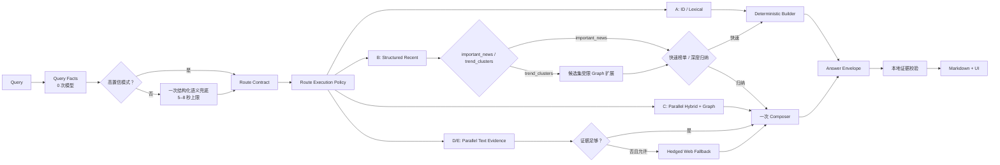

# 2026-08-25 后端关键路径、成熟方案与适配架构复盘

## 0. 文档目的

本文回答的不是“怎样把某个函数再快一点”，而是三个更高层问题：

1. 一次用户请求从进入系统到显示答案，究竟被哪些阶段拖慢；
2. 哪些问题应复用成熟方案，哪些仍属于本项目独有的产品语义；
3. 如何用最少的新依赖，把当前系统收敛成可维护、可测量、可降级的请求管线。

本轮只做架构诊断和方案冻结，不重建 Docker、不重建索引、不继续扩大超时。

配套的一手资料摘录见
[2026-08-25-primary-source-solution-notes.md](./2026-08-25-primary-source-solution-notes.md)。

## 1. 先纠正一个容易误判的方向

“建立机制数据集合和问题集合，命中后直接分类”可以作为系统的一部分，但不能成为主架构。

更准确的产品定义是：

> 建立一个版本化的 Route Pattern & Evaluation Set（路由模式与评估集），保存任务原型、
> 正例、反例、歧义例和期望路线；运行时只让高置信模式直接通过，其余交给一次受限的语义兜底。

它不能是无限增长的固定问句表，原因有三点：

- 用户表达是开放集合，同一意图有大量改写；
- 硬匹配无法稳定处理指代、复合任务与新实体；
- 历史盲测已经证明，仅靠不断增加关键词会在可见样本上变好，却不能稳定泛化。

因此该集合有两个用途：

1. **运行时高置信通道**：ATR 编号、精确标题、明确“最近热门趋势”等模式可零模型路由；
2. **离线质量合同**：每次调整规则、模型或 Prompt，都用同一组正例/反例/歧义例回归。

它解决的是“是否需要调用路由模型”，不解决后续检索、图查询、联网、生成和证据校验的延迟。

## 2. 当前真实关键路径

```mermaid
flowchart LR
    Q["用户 Query"] --> OLD["旧 analyze_query"]
    OLD --> ROUTER["DeepSeek Ordered Route\n多数请求前置"]
    ROUTER --> GATEWAY["Retrieval Gateway"]
    GATEWAY --> HYBRID["Lexical → Vector → Graph"]
    HYBRID --> GRAPH2["关系类再次构建图证据"]
    GRAPH2 --> WEB{"是否联网"}
    WEB -->|是| PROVIDERS["最多 5 个 Provider 串行尝试"]
    PROVIDERS --> FETCH["最多 2 个页面深抓"]
    WEB -->|否| POLICY["证据与工具策略"]
    FETCH --> POLICY
    POLICY --> GENERATE["Direct LLM 或 ReAct 多轮"]
    GENERATE --> CHECK["本地引用校验"]
    CHECK -->|失败| REPAIR["第二次模型修复，最多 15 秒"]
    CHECK -->|通过| BUFFER["完整答案完成后切块"]
    REPAIR --> BUFFER
    BUFFER --> UI["用户看到正文"]
```



总耗时可近似表示为：

```text
T_total = T_route
        + T_internal_retrieval
        + I_web × (T_search + T_deep_fetch)
        + T_generation
        + I_repair × T_repair
        + T_buffer_to_UI
```

这些阶段当前大多是串行关系。单点优化 2 秒，如果前后仍有 30 秒模型调用和 20 秒检索，
用户几乎感知不到改善。

## 3. 延迟与复杂度排序

### 3.1 排序口径

- **实测**：仓库执行记录或本轮真实请求已有耗时；
- **代码上限**：由 timeout、循环次数和 Provider 数量直接推导；
- **架构推断**：代码显示为串行或重复，但还缺少逐阶段生产样本。

### 3.2 排名

| 排名 | 阶段 | 证据 | 延迟风险 | 复杂度 | 判断 |
|---:|---|---|---:|---:|---|
| 1 | 回答生成 / ReAct Agent | DeepSeek 生成曾实测约 32.58 秒；另有 51.50 秒旧基线；预算为 75 / 150 / 180 秒 | 极高 | 极高 | 最大单阶段成本；普通问题不应默认进入多轮 Agent |
| 2 | 全链路串行编排 | 简单问题最终触发 195 秒总超时 | 极高 | 极高 | 这是总根因；路由、检索、联网、生成、修复相加而非竞争或分支 |
| 3 | 前置 DeepSeek 路由 | 离线通常约 1.5–2.2 秒，但真实复现约 31 秒才返回 | 高且波动大 | 中 | 分类本身不难，错误在于它成为多数请求必经的远程依赖 |
| 4 | 内部混合检索 / 图扩展 | 历史记录约 20.96 秒，混合检索曾达 37 秒 | 高 | 高 | Vector、Lexical、Graph 当前未真正并行；关系路线还有额外图查询 |
| 5 | 外部搜索与深抓 | Provider 最多 5 个串行，每个传输层可等 20 秒；深抓最多 2 个 | 条件性极高 | 高 | 只影响联网路线，但失败或来源筛选时可能放大尾延迟 |
| 6 | 引用修复模型 | 校验失败后再调用一次模型，硬上限 15 秒 | 中 | 中 | 为格式问题支付第二次生成成本，不划算 |
| 7 | 流式输出层 | 当前完整回答和证据校验结束后才切 800 字符块 | 不增加计算，但放大体感 | 低 | 用户直到所有后端工作完成才看到正文，属于“伪流式” |
| 8 | Markdown 渲染 / UI | 本地确定性处理 | 低 | 低 | 不是两分钟超时的根因 |

### 3.3 两个需要单独指出的代码问题

#### 检索并没有真正并行

`HybridRetriever.search_with_status()` 依次执行同步 Vector、同步 Lexical，再等待 Graph。
关系/时间类请求完成初次 Hybrid 后，`EvidenceRetrievalGateway._append_graph_evidence()` 又按实体逐个查询，
再按实体组合逐个查询关系；实体增多时关系查询接近组合增长。

#### “异步深抓”对同步 fetcher 仍会阻塞

生产 `fetch_url` 是同步函数。当前异步包装在协程内直接调用它，没有放入线程池；即使使用
`asyncio.gather()`，同步网络 I/O 仍会阻塞事件循环。代码看起来并发，生产行为不一定并发。

## 4. 当前一次请求可能调用多少次 AI

| 请求类型 | 路由模型 | 回答模型 | ReAct 追加轮次 | 引用修复 | 合计风险 |
|---|---:|---:|---:|---:|---:|
| 精确条目导航 | 0–1 | 0 | 0 | 0 | 0–1 |
| 普通近期趋势 | 0–1 | 1 | 0 | 0–1 | 1–3 |
| 普通证据研究 | 1 | 1 | 可能多轮 | 0–1 | 2–多轮 |
| 关系 / 时间线 | 1 | 1 | 可能多轮 | 0–1 | 2–多轮 |
| 联网研究 | 1 | 1 | 可能多轮 | 0–1 | 2–多轮，另加网络搜索 |

这里还没有把 Chroma 查询向量的本地 embedding 计算计为付费 AI 调用。

目标不应是“彻底去掉 AI”，而是：

- A 精确导航：0 次；
- B 明确趋势：0 次路由 + 0–1 次生成；
- C/D/E：只有歧义时 1 次路由，通常 1 次生成；
- 普通请求不允许因工具规划自然膨胀为多轮 ReAct；
- 格式错误不再默认支付第二次模型费用。

## 5. 成熟方案调研后的取舍框架

### 5.1 值得直接采用的机制

#### A. Workflow-first，Agent-on-demand

把可预测步骤写成确定性工作流；只有无法预先确定步骤的复杂补证任务才进入 Agent loop。
[LangGraph 官方文档](https://docs.langchain.com/oss/python/langgraph/workflows-agents)也明确区分预定路径的
workflow 与动态决定工具和流程的 agent。

适配方式：

- A/B 使用工作流；
- C/D/E 先走工作流检索和证据门；
- 只有证据缺口无法通过固定策略解决时，才允许一次受限 Agent 补证。

这不是移除 Agent，而是把 Agent 从“所有请求的总控”降为“少数复杂请求的受控工具”。

#### B. Cascaded routing（级联路由）

```text
硬约束 / 精确模式
  → 高置信确定性路由
  → 可选本地轻量语义路由
  → 只有低置信或冲突时调用一次远程结构化模型
```

当前阶段先实施第一层和第三层。本地语义路由只有在积累足够真实 Query 和人工标签后再评估，
避免为了省一次 API 调用引入另一个未经验证的分类器。
[Azure AI Search 的 reasoning effort](https://learn.microsoft.com/en-us/azure/search/agentic-retrieval-how-to-set-retrieval-reasoning-effort)
同样允许简单检索跳过 LLM query planning，只给复杂请求增加一轮或一次纠错迭代。

#### C. Parallel retrieval + phased ranking（并行召回 + 分阶段排序）

先用廉价通道扩大候选，再只对少量候选做昂贵排序：

```text
Lexical ─┐
Vector  ─┼─ 并行候选 → RRF / 去重 → 任务约束过滤 → Top N → 可选本地 reranker → Top K
Graph   ─┘                 （仅 C 或明确关系问题）
```

不是所有路线都开三通道：

- A：Lexical / ATR ID；
- B：先走 Structured recent view；`important_news` 不查图，`trend_clusters` 再对候选集做受限 Graph 扩展；
- C：Lexical + Vector + Graph；
- D：Lexical + Vector，Graph 仅作线索；
- E：Lexical + Vector，证据不足再 Web。

这一组合分别对应 [Anthropic 的 BM25 + embedding + rank fusion 流程](https://www.anthropic.com/engineering/contextual-retrieval)
和 [Vespa 的廉价 first phase + 受限 Top-N 重排](https://docs.vespa.ai/en/ranking/phased-ranking.html)；
本项目只借机制，不迁移存储引擎。

#### D. Corrective / conditional retrieval（纠错式条件检索）

先检查内部证据是否足够，再决定是否联网。联网不是一个全局开关后的必经步骤，而是证据门控：

- 用户明确要求最新外部信息；
- 本地语料超过任务允许的新鲜度；
- 内部结果为空、冲突或来源等级不足；
- 核验任务缺少主张原始来源。

[CRAG 原始论文](https://arxiv.org/abs/2401.15884)同样先评估内部检索质量，再按置信度触发 Web 纠错；
本项目应优先使用确定性证据门，而不是再增加一个远程 LLM evaluator。

#### E. Structured answer + deterministic validator

模型一次输出结构化 Answer Envelope，包括段落、结论和 evidence IDs；本地只做：

- Schema 校验；
- evidence ID 是否属于账本；
- 必填证据数量；
- 路线专属约束。

若失败，优先删除未知引用并明确降级；只有高风险核验任务才考虑一次极短修复。普通回答不再调用
第二个模型只为补 `[E1]` 之类的格式。
[DeepSeek strict tool calling](https://api-docs.deepseek.com/guides/tool_calls)可以帮助约束 JSON Schema，
但本地仍必须校验证据 ID 与任务合同。

### 5.2 值得借鉴但暂不直接引入的组件

| 候选 | 可借鉴点 | 暂不整套引入的原因 |
|---|---|---|
| LangGraph workflow | 条件分支、状态、阶段事件、受控 Agent loop | 项目已经依赖 LangGraph；应改用 workflow 思路，而不是再加一层框架 |
| [Semantic Router](https://github.com/aurelio-labs/semantic-router) | 本地 embedding 路由、置信阈值 | 需要稳定 route utterance 与阈值校准；当前数据量和 Gold 漂移尚不足 |
| Haystack ConditionalRouter | 声明式条件路由 | 能承载规则，不能替项目定义 A–E 产品语义；迁移收益小于成本 |
| FlashRank / cross-encoder reranker | 本地轻量 Top-N 重排 | 应先解决串行和通道误开；之后再以检索指标决定是否引入 |
| Azure agentic retrieval | 并行子查询、检索计划与预算的产品思想 | 是托管云能力，不应为了模仿它重构成本项目云依赖 |
| [DeepSeek Context Cache](https://api-docs.deepseek.com/guides/kv_cache/) | 重复 Prompt 前缀可降低成本和首 token 延迟 | 默认已开启且不保证命中；只能锦上添花，不能消除不必要的模型调用 |
| 全量通用 RAG 框架替换 | 可快速获得标准组件 | 会丢失 ATR ID、日报时间语义、A–E 路线与证据深链等产品特性 |

### 5.3 明确拒绝的解法

- 继续把总超时从 195 秒往上加；
- 每个用户问题先调用一次远程 AI 做分类；
- 把所有 Route 示例训练成小模型后立即替换生产；
- 每个请求默认同时跑 Vector、Lexical、Graph、Web；
- 并行调用全部 5 个搜索 Provider，只为“更快”；这会直接放大费用和限流；
- 直接引入大型框架并期待它自动理解本项目的“重要新闻”“近期趋势”和引用规则。

## 6. 最适配当前项目的组合解法



### 6.1 路由模式集的数据结构

```yaml
pattern_id: route-pattern/B/generic-recent-trend/v1
task_family: trend_discovery
positive_examples:
  - 最近有什么热门趋势？
  - 最近有哪些值得关注的 AI 动态？
negative_examples:
  - OpenAI 最近的产品方向为什么变化？
  - 核实“某公司已经实现商业成功”是否属实
required_signals:
  news_discovery: true
forbidden_signals:
  verification_request: true
  relation_structure: true
confidence_floor: 0.90
execution_policy_id: trend_discovery/fast-v1
```

运行时不是逐句查表，而是抽取信号后匹配合同；例句主要用于测试和未来本地语义路由校准。

### 6.2 联网搜索采用 hedged fallback，而不是全并发

推荐策略：

1. 先调用与任务匹配度最高的 Provider；
2. 在短阈值内没有合格证据，再启动第二 Provider；
3. 一旦达到来源质量、时间和数量门槛，取消剩余请求；
4. 官方核验优先定向官方域名，而不是在普通新闻 Provider 间盲试；
5. 深抓同步 fetcher 必须进入线程池，并设置单 URL 预算。

这比“5 个 Provider 全串行”快，也比“5 个 Provider 全并行”省钱。

### 6.3 流式体验不展示思维链

系统应展示可核验的执行阶段，而不是模型隐藏思维：

```text
已识别任务 → 正在检索内部语料 → 找到 8 条候选 →
正在核验 5 条证据 → 正在组织答案 → 完成
```

正文策略分两级：

- A/B 快速结果先返回确定性条目卡片；
- 需要模型归纳时，优先实现 provider token streaming，但引用在最终校验后再解锁；
- D 核验类在完整证据校验前不展示未经验证的结论。

[LangGraph streaming](https://docs.langchain.com/oss/python/langgraph/streaming)原生支持 token、状态更新和自定义事件；
当前“完成后切块”无需保留。

## 7. 预计收益与实施优先级

| 顺序 | 改动 | 预期收益 | 成本 | 是否先做小测 |
|---:|---|---|---|---|
| 1 | 删除多数请求的前置远程路由；Route Contract 只生成一次 | 简单请求直接减少一次不稳定网络模型等待 | 低–中 | 是，A–E 20 条路由矩阵 |
| 2 | A/B 建立确定性首轮路径；普通路线不进 ReAct | 最大幅度降低模型轮次和尾延迟 | 中 | 是，A/B 各 3 条 |
| 3 | 每路线只开启必要检索通道 | 新闻榜单不查图；趋势聚类只扩展已入选候选，不做全图漫游 | 中 | 是，逐通道计时 |
| 4 | 修复 Vector/Lexical/Graph 并行边界和重复图查询 | 降低 20–37 秒检索波动 | 中–高 | 是，固定 10 Query |
| 5 | 结构化一次生成 + 本地证据校验 | 删除普通路线 15 秒修复调用 | 中 | 是，正确/缺失/伪造三组 Envelope |
| 6 | Web hedged fallback + 真正异步 deep fetch | 降低联网路线尾延迟与费用 | 中 | 是，脚本 Provider 延迟注入 |
| 7 | 阶段计时、取消记录和流事件 | 可定位慢点并显著改善等待感 | 中 | 是，慢路由/慢检索/慢生成注入 |
| 8 | 可选本地 reranker / semantic router | 在数据充分时继续提升质量或省路由调用 | 中–高 | 必须离线 bake-off 后再决定 |

## 8. 修改后的 Stage Gates

### Gate 1：路由与调用次数

- A/B 明确问题不调用远程路由；
- 歧义问题最多一次路由模型；
- Route Contract 生成后，后续模块不得再次猜任务类型；
- 20 条路由矩阵不低于当前基线。

### Gate 2：执行路径

- A 为 0 模型；
- B 快速榜单为 0 模型，深度归纳为 1 模型；
- C/D/E 普通路径最多 1 次 Composer；
- ReAct 只在测试明确允许的复杂补证路径出现。

### Gate 3：检索性能

- 输出 Lexical / Vector / Graph 分通道耗时；
- B 的 `important_news` 不开启 Graph；`trend_clusters` 只对首轮候选做受限 Graph 扩展；
- Graph 进入执行计划前必须通过主动就绪检验：连接、最小查询和关键索引可用；深度一致性检查留给 ingestion 后与 Stage Gate，不能按请求重复执行；
- 关系路线不重复执行等价图查询；
- 10 条固定 Query 的 P50/P95 相比旧管线有实质改善，且检索质量不降。

### Gate 4：端到端体验

- `accepted` 后 500ms 内出现本地 `route_ready`；
- 后端每个阶段都有明确事件和耗时；
- 超时/取消也写指标；
- 不以“延长超时”作为通过条件。

### Gate 5：一次部署验收

- 后端代码全量收敛后才重建一次 app 容器；
- 不重建 Neo4j / Chroma 数据卷；
- A–E 各 1 条真实 DeepSeek Canary；
- 记录端到端 P50/P95、模型调用次数、检索耗时、证据完整性。

## 9. 最终架构判断

当前最适合的不是“购买或嵌入一个完整开源 RAG 路由项目”，而是组合成熟机制：

1. 用本项目已有 A–E Route Contract 保存独有产品语义；
2. 用确定性 workflow 承载大多数请求；
3. 用远程模型只处理真实语义歧义和最终归纳；
4. 用并行混合检索、分阶段排序和条件联网降低工具成本；
5. 用结构化输出与本地验证替代二次修复模型；
6. 用阶段事件和真流式改善等待体验。

这条路线复用行业成熟设计，但不把本项目最有价值的 ATR 身份、日报时间语义、重要新闻排序、
证据深链和 A–E 用户任务交给通用框架重新猜测。
