# AI Trend Radar 端到端 RAG 策略中心

- 版本：`strategy/1.0`
- 日期：2026-08-13
- 状态：产品与架构策略已确认；尚未接入正式回答链
- 上位决策：ADR-0004、ADR-0005、ADR-0006

本目录把“用户问题进入—五路处理—统一回答”的总—分—总体系拆成可独立维护的策略模块。字母 A–E 只用于图示和沟通，正式接口始终使用语义化任务名。

## 可点击总图

> 支持 Mermaid `click` 的渲染器可直接点击节点；不支持时使用图下方的普通链接索引。

```mermaid
flowchart LR
    USER(["用户原始 Query"])
    INTAKE["M1 输入保真与意图信号"]
    ROUTE{"M2 五类任务路由"}
    A["A 精确条目导航"]
    B["B 趋势与动态发现"]
    C["C 时间与关系探索"]
    D["D 主张核验"]
    E["E 证据研究"]

    REWRITE["M3 按 Route Contract 改写 / 拆解"]

    RETRIEVE["M4 Agentic GraphRAG 检索编排"]
    RANK["M5 相关性分层与层内重排"]
    NAV["A：确定性检索 / 消歧"]
    NAV_LEDGER["导航命中准入 Evidence Ledger"]
    NAV_ANSWER["服务端 NavigationAnswer"]
    PROMPT["M6 Prompt Package 注册表"]
    AGENT["Agent / DeepSeek"]
    JSON["M7 Answer Envelope 与校验"]
    RENDER["M8 Markdown / UI 与引用渲染"]
    HUMAN(["用户可读结果"])

    USER --> INTAKE --> ROUTE
    ROUTE --> A
    ROUTE --> B
    ROUTE --> C
    ROUTE --> D
    ROUTE --> E
    A --> REWRITE
    B --> REWRITE
    C --> REWRITE
    D --> REWRITE
    E --> REWRITE
    REWRITE -->|A| NAV --> NAV_LEDGER --> NAV_ANSWER --> JSON
    REWRITE -->|B-E| RETRIEVE --> RANK --> PROMPT --> AGENT --> JSON --> RENDER --> HUMAN

    click INTAKE "./modules/01-query-intake-and-intent.md" "查看 M1 策略"
    click ROUTE "./modules/02-five-task-routing.md" "查看 M2 策略"
    click A "./modules/02-five-task-routing.md" "查看 A 路由边界"
    click B "./modules/02-five-task-routing.md" "查看 B 路由边界"
    click C "./modules/02-five-task-routing.md" "查看 C 路由边界"
    click D "./modules/02-five-task-routing.md" "查看 D 路由边界"
    click E "./modules/02-five-task-routing.md" "查看 E 路由边界"
    click REWRITE "./modules/03-query-rewrite-and-decomposition.md" "查看 M3 策略"
    click RETRIEVE "./modules/04-agentic-graphrag-retrieval.md" "查看 M4 策略"
    click RANK "./modules/05-evidence-tiering-ranking-topk.md" "查看 M5 策略"
    click PROMPT "./modules/06-prompt-package-registry.md" "查看 M6 策略"
    click JSON "./modules/07-structured-answer-contract.md" "查看 M7 策略"
    click RENDER "./modules/08-answer-rendering-and-citations.md" "查看 M8 策略"
```

## 普通链接索引

| 模块 | 策略文档 | 核心责任 |
|---|---|---|
| M1 | [输入保真与意图信号](./modules/01-query-intake-and-intent.md) | 保留原问题并提取可共存的意图信号 |
| M2 | [五类任务路由](./modules/02-five-task-routing.md) | 只裁决一次主路线和可选辅助路线 |
| M3 | [Query Rewrite / Decomposition](./modules/03-query-rewrite-and-decomposition.md) | 为不同检索通道生成保真的查询变体 |
| M4 | [Agentic GraphRAG 检索编排](./modules/04-agentic-graphrag-retrieval.md) | 按任务调用关键词、向量、Neo4j 与 Web |
| M5 | [分层、排序与 Top K](./modules/05-evidence-tiering-ranking-topk.md) | 先相关性分层，再层内重排与多样化 |
| M6 | [Prompt Package 注册表](./modules/06-prompt-package-registry.md) | 按同一 Route Contract 编译任务提示包 |
| M7 | [结构化回答合同](./modules/07-structured-answer-contract.md) | 生成并校验机器可读 Answer Envelope |
| M8 | [渲染与引用跳转](./modules/08-answer-rendering-and-citations.md) | 确定性生成 Markdown/UI 和精确链接 |

完整串联见[总策略](./end-to-end-strategy.md)，策略变更见[CHANGELOG](./CHANGELOG.md)。研究证据见[端到端路由行业研究](../research/2026-08-13-end-to-end-query-routing-strategy-research.md)。
