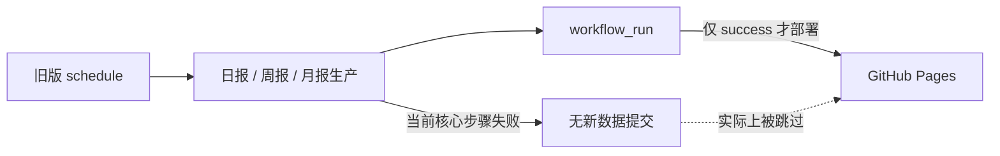
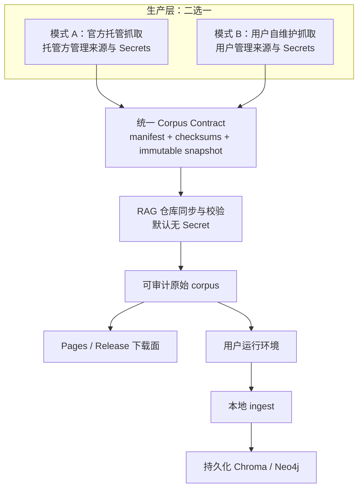

# AI-TREND-RADAR-RAG GitHub Actions 自动抓取/同步链路可靠性研究

> 日期：2026-08-10
> 审计对象：工作区提交 `be0c8f77b6e9cb910684b71b758fa65dd7009bbb` 及其未提交工作树；远端默认分支 `origin/main` 为 `2102f390ec859e942b41dc747f48bf42b6b14127`
> 证据范围：本仓库 workflow/source code、GitHub 官方文档、GitHub 官方 Actions 源码/规范、该仓库 GitHub Actions 的公开运行记录。未采用博客、论坛或第三方教程。
> 变更边界：本研究只读检查，不修改 workflow 或业务代码。

## 结论先行

当前问题不是“再补一个 cron”就能解决，而是三条责任链被混在了一起：

1. **生产数据**：从外部来源抓取、调用 LLM、生成日报/周报/月报；
2. **发布语料**：把一批已经生成且可验证的数据发布为稳定、版本化的 corpus；
3. **消费与索引**：RAG 应用同步 corpus，再在自己的持久化环境中构建 Chroma/Neo4j 等派生索引。

建议将它们明确拆开。默认模式只做“无 Secret 的已发布语料同步”；高级用户选择自维护模式时，才启用带 Secrets 的生产抓取 workflow。两种模式最终都输出同一份 corpus contract，RAG 的同步与索引层不需要知道数据由谁抓取。

本次审计得到的最高优先级事实是：

- **`RAG Corpus Sync` 目前不在远端默认分支，因此 GitHub 不会执行它的定时触发，手动运行入口也不会生效。** GitHub 官方规定，`schedule` 和 `workflow_dispatch` 的 workflow 文件都必须存在于默认分支；公开 Actions 列表也没有注册这个 workflow。[[GitHub：schedule / workflow_dispatch 触发规则]](https://docs.github.com/en/actions/reference/workflows-and-actions/events-that-trigger-workflows) [[仓库 Actions 列表]](https://github.com/Conradgui/AI-TREND-RADAR-RAG/actions)
- **线上旧版日报、周报、月报 workflow 正在持续失败，Pages 因上游结论不是 success 而被跳过。** 日报最近一次公开运行明确失败在 `Run daily digest`，但未登录状态无法读取完整日志；因此可以确认失败步骤，不能把具体 Secret 状态冒充成已确认事实。[[Daily #73]](https://github.com/Conradgui/AI-TREND-RADAR-RAG/actions/runs/31348105733)
- **缺少或为空的 `DEEPSEEK_API_KEY` 是高置信推断，不是日志已证实结论。** 默认分支 workflow 把 `LLM_PROVIDER` 固定为 `deepseek`，而 provider 构造函数会在 key 缺失时立即抛错；公开运行又在核心步骤开始后约一秒退出。应通过显式 Secret preflight 把这个推断变成可行动、无歧义的错误信息，而不是继续依赖模块加载期异常。
- **当前分支 CI 的 Python P0 套件没有安装 Python 依赖。** workflow 只安装了 Python 解释器和 Node 包，随后直接执行包含 `pytest`、FastAPI/httpx 测试的 `pnpm rag:check:p0`；`rag/requirements.txt` 本身也没有列出 pytest/httpx 等测试依赖。这是干净 runner 上可直接从配置验证的缺口。公开 CI #14 也确实只在 `RAG P0 focused suite` 失败。[[CI #14]](https://github.com/Conradgui/AI-TREND-RADAR-RAG/actions/runs/31141528461)
- **现有同步代码的失败保护是好的基线。** 本次离线运行 `python3 -m unittest rag.tests.test_sync_corpus -v`，11 项全部通过；包括网络重试、非法 JSON 不覆盖本地、失败保留最后完整 corpus、历史断档补抓和 dry-run 不写盘。

## 1. 证据边界与判断标签

为了不把猜测写成事实，本文使用三类标签：

- **已证实**：可由仓库代码、默认分支内容、官方运行结果或本地可重复测试直接证明。
- **高置信推断**：多个证据一致，但由于 Secrets 和完整 Actions 日志不可见，不能完成最后一跳验证。
- **条件风险**：只有当仓库启用了某项设置（例如分支保护）时才发生；当前没有仓库设置读取权限，不能声称已经发生。

本文没有读取或输出任何 Secret 值，也没有测试上游站点的数据内容。后者是为了遵守本研究“仅使用指定证据源”的范围。

## 2. 当前实际拓扑：远端运行的不是工作区想象中的版本

### 2.1 远端默认分支的真实链路

远端 `origin/main` 仍然注册并定时运行：

- `Daily AI Topic Radar`：每天 00:00 UTC；
- `Weekly AI Topic Radar`：每周一 01:00 UTC；
- `Monthly AI Topic Radar`：每月 1 日 02:00 UTC；
- `Deploy GitHub Pages`：监听上述 workflow 的 `workflow_run`。

默认分支版本可在固定提交中复核：[[daily-digest.yml]](https://github.com/Conradgui/AI-TREND-RADAR-RAG/blob/2102f390ec859e942b41dc747f48bf42b6b14127/.github/workflows/daily-digest.yml) [[weekly-digest.yml]](https://github.com/Conradgui/AI-TREND-RADAR-RAG/blob/2102f390ec859e942b41dc747f48bf42b6b14127/.github/workflows/weekly-digest.yml) [[monthly-digest.yml]](https://github.com/Conradgui/AI-TREND-RADAR-RAG/blob/2102f390ec859e942b41dc747f48bf42b6b14127/.github/workflows/monthly-digest.yml) [[deploy-pages.yml]](https://github.com/Conradgui/AI-TREND-RADAR-RAG/blob/2102f390ec859e942b41dc747f48bf42b6b14127/.github/workflows/deploy-pages.yml)



公开运行记录显示，2026-08-02 至 2026-08-10 的多次日报均失败，周报 #10、月报 #3 也失败；对应 Pages 运行被跳过。这里能确认的是失败位置与退出码，不能确认 Secret 后台配置。

### 2.2 工作区正在设计但尚未进入默认分支的链路

工作区新增了 [`rag-corpus-sync.yml`](../../.github/workflows/rag-corpus-sync.yml)：每天 00:17 UTC 从静态上游同步，运行同步单测，再提交 `digests/` 与 `manifest.json`。同时，工作区把旧生产 workflow 改为仅手动运行，并把 Pages 的 `workflow_run` 上游改成 `RAG Corpus Sync`。

问题是：`origin/main` 的 tree 中没有 `.github/workflows/rag-corpus-sync.yml`。GitHub 官方规定：

- scheduled workflow 只有在 workflow 文件存在于默认分支时才运行，而且运行默认分支的最新提交；
- `workflow_dispatch` 也要求 workflow 文件存在于默认分支；
- 公共仓库 60 天无活动可能自动禁用 schedule；公共 fork 的 scheduled workflow 默认禁用。[[触发规则]](https://docs.github.com/en/actions/reference/workflows-and-actions/events-that-trigger-workflows) [[手动运行 workflow]](https://docs.github.com/en/actions/how-tos/manage-workflow-runs/manually-run-a-workflow) [[启用/禁用 workflow]](https://docs.github.com/en/enterprise-cloud@latest/actions/how-tos/manage-workflow-runs/disable-and-enable-workflows?tool=webui)

因此，“YAML 在本地存在”不等于“GitHub 已经注册并执行”。这是当前 RAG sync 没有运行记录的直接原因，不是 cron 表达式问题。

## 3. 可验证失败与配置缺口

### 3.1 失败/风险清单

| ID | 判断 | 证据 | 原因与影响 |
|---|---|---|---|
| F1 | **已证实** | `rag-corpus-sync.yml` 只存在于工作区分支；默认分支 tree 与公开 Actions 列表均无该 workflow | `schedule` 不会触发，`workflow_dispatch` 也不会提供有效入口。 |
| F2 | **已证实** | Daily #73 的 `Run daily digest` 退出码为 1；连续日报、周报、月报同类失败 | 旧生产链路当前不能稳定产出，Pages 因 `if: conclusion == success` 被跳过。 |
| F3 | **高置信推断** | 默认分支将 provider 固定为 DeepSeek；provider 在 key 缺失时立即 throw；公开运行约一秒失败 | 很像 `DEEPSEEK_API_KEY` 缺失/为空，但完整日志与 Secret 后台不可见。必须加 preflight 后再定案。 |
| F4 | **已证实** | [`ci.yml`](../../.github/workflows/ci.yml) 只 setup Python，不 `pip install`；[`package.json`](../../package.json) 的 P0 命令调用 pytest；[`rag/requirements.txt`](../../rag/requirements.txt) 也缺少测试依赖 | 干净 runner 无法被仓库声明完整复现；CI #14 的其余 Node 步骤通过，P0 步骤失败。 |
| F5 | **已证实** | 公开 run annotation 指出 `checkout@v4`、`setup-node@v4`、`setup-python@v5`、`pnpm/action-setup@v4` 的 Node 20 runtime 已弃用并被强制到 Node 24 | 目前是维护告警，不一定是本次退出码 1 的根因；继续滞后会形成未来硬失败。 |
| F6 | **条件风险** | 同步 workflow 直接 `git push` 到当前 checkout 分支 | 若 `main` 有保护规则、要求 PR/状态检查或限制 bot push，会失败；当前无法读取仓库规则设置。[[GitHub：受保护分支]](https://docs.github.com/en/repositories/configuring-branches-and-merges-in-your-repository/managing-protected-branches/about-protected-branches) |
| F7 | **已证实的设计缺口** | concurrency group 包含 `${{ github.ref }}`，并设置 `cancel-in-progress: true` | 不同 ref 的手动运行可以同时写仓库；正在提交/发布的运行也可能被新运行取消。对于有副作用的 publish，不应默认中断。 |
| F8 | **已证实的设计缺口** | 同步 manifest 没有 schema version、每文件 SHA-256/size、批次完成标志 | 已有 JSON/Markdown 基础校验，但不能证明“这一批文件来自同一个完整发布版本”，也无法检测静默截断或上游回滚。 |

### 3.2 Secrets

现状与判断：

- 默认分支的生产 workflow 把 `LLM_PROVIDER=deepseek` 写死，并把多个 secrets 注入同一生产步骤；缺少“哪些是必需、哪些是可选、当前选择了哪个 provider”的启动前检查。
- GitHub 不会把 Secrets 传给 fork 发起的 PR；fork PR 的 `GITHUB_TOKEN` 通常是只读。不能把 PR 验证设计成依赖生产 Secrets。[[GitHub：Secret 类型与 fork 行为]](https://docs.github.com/en/code-security/reference/secret-security/secret-types)
- 非敏感开关（模式、语言、上游 URL、回看天数）应使用 repository/environment variables；凭证才使用 Secrets。[[GitHub：Variables]](https://docs.github.com/en/actions/concepts/workflows-and-actions/variables)

建议：

1. 默认托管模式不需要外部源或 LLM Secret；它只消费公开、已发布的 corpus。
2. 自维护模式在第一步执行 preflight，只输出缺失的 **Secret 名称**，绝不输出值；provider 必须由变量显式选择。
3. 把来源分为 required 和 optional。必需来源缺失则发布前失败；可选来源失败则标记 degraded，但只有达到最低质量门槛才允许 promote。
4. 不使用宽泛的 `secrets: inherit` 跨 reusable workflow 传递全部 Secret；按名称传递最小集合。

### 3.3 Permissions

[`rag-corpus-sync.yml`](../../.github/workflows/rag-corpus-sync.yml) 的 `contents: write` 对“提交 corpus”功能上是必要的，但它放在 workflow 顶层，导致测试、下载、校验阶段也继承写权限。GitHub 建议给 `GITHUB_TOKEN` 最小权限；一旦声明 `permissions`，未列出的权限会变为 `none`。[[GITHUB_TOKEN]](https://docs.github.com/en/actions/concepts/security/github_token) [[Workflow syntax：permissions]](https://docs.github.com/en/actions/reference/workflows-and-actions/workflow-syntax) [[仓库 Actions 权限设置]](https://docs.github.com/en/repositories/managing-your-repositorys-settings-and-features/enabling-features-for-your-repository/managing-github-actions-settings-for-a-repository)

建议拆成：

- `validate/sync-plan` job：`contents: read`；
- `publish` job：仅它拥有 `contents: write`，且只在校验成功、目标分支正确时执行；
- `deploy-pages`：`contents: read`、`pages: write`、`id-token: write`，保持 GitHub Pages 官方要求；
- PR 验证：始终只读，不接触生产 Secrets，不发布。

另一个容易误判的点：由 `GITHUB_TOKEN` 推送的 commit 通常不会再触发新的 workflow run，也不会自动触发 Pages build；这是 GitHub 防止递归执行的设计。因此当前用 `workflow_run` 串接 Pages 的方向是正确的，不能简单改成“等 bot push 再触发 Pages”。也可以把 deploy 变成同一 workflow 中 `needs: publish` 的后继 job。[[GitHub：由 GITHUB_TOKEN 触发的事件]](https://docs.github.com/en/actions/concepts/security/github_token)

### 3.4 Cache

“没有 cache”不总是缺口：

- 当前 `rag.sync_corpus` 只使用 Python 标准库，给它加 pip cache 没有收益。
- Node producer/CI 已经通过 `setup-node` 缓存 pnpm 的全局包数据；官方说明该 cache 不等于缓存 `node_modules`。[[actions/setup-node]](https://github.com/actions/setup-node)
- CI 若补齐 Python 依赖，可以对固定 requirements/lock 文件使用 `setup-python` 的 dependency cache，但应先把运行依赖与测试依赖声明完整。[[actions/setup-python]](https://github.com/actions/setup-python)
- GitHub cache 是按 key 管理、命中后不可变的加速层，不是数据库或 corpus 的可靠持久层；官方还明确提醒不要把 Secret 放入 cache，因为 fork/PR 可能访问基础分支 cache。[[GitHub：Dependency caching]](https://docs.github.com/en/actions/reference/workflows-and-actions/dependency-caching)

因此，**不要用 Actions cache 保存 Chroma/Neo4j，也不要把它当 corpus 的事实源**。

### 3.5 Artifact 与 Pages

Artifact 适合保存诊断证据，不适合当长期系统记录：

- 失败时上传 `sync-result.json`、变更清单、校验摘要和脱敏日志，设置较短 retention；
- dry-run 可上传候选 corpus snapshot 供人工检查；
- canonical corpus 仍应位于版本化发布端或 Git 仓库中。

GitHub artifact 有保留期，默认通常为 90 天且可配置；新版本 artifact 具有不可变归档语义。[[GitHub：删除与保留 workflow artifacts]](https://docs.github.com/en/actions/how-tos/manage-workflow-runs/remove-workflow-artifacts) [[actions/upload-artifact]](https://github.com/actions/upload-artifact)

当前 Pages workflow 将仓库根目录 `.` 作为上传路径。它未必直接导致失败，但会让“哪些文件被公开”依赖 action 的排除规则和仓库未来内容，边界过宽。更可靠的做法是先生成一个 allowlist 的 `_site/`，只放网页、manifest、search index 和允许公开的 reports，再上传该目录。GitHub 官方自定义 Pages workflow 也使用单独的 Pages artifact。[[GitHub Pages 自定义 workflow]](https://docs.github.com/en/pages/getting-started-with-github-pages/using-custom-workflows-with-github-pages) [[actions/upload-pages-artifact]](https://github.com/actions/upload-pages-artifact) [[actions/deploy-pages]](https://github.com/actions/deploy-pages)

### 3.6 Concurrency 与 Git 写入

GitHub concurrency 的默认语义是每个 group 最多一个 running 和一个 pending；新的 pending 会替换旧 pending，`cancel-in-progress: true` 还会取消正在运行的任务。[[GitHub：Concurrency]](https://docs.github.com/en/actions/concepts/workflows-and-actions/concurrency)

对会提交/发布的 workflow，建议：

- 使用固定 group，例如 `rag-corpus-publish`，而不是按 ref 分组；所有可能写同一目标的入口必须互斥；
- `cancel-in-progress: false`，让已经进入 publish 的运行完成；只读 dry-run 可以单独使用可取消 group；
- checkout 明确指定目标分支和完整 history 需求，并在 publish 前确认 `github.ref`/目标分支；
- push 前重新同步远端，并对 non-fast-forward 做有限次数重试；冲突时安全失败并保留诊断 artifact，而不是 force push；
- 如果主分支要求 PR，改为专用 automation branch + PR，或使用经过批准的 GitHub App；不要为了绕过保护规则降低仓库安全性。

### 3.7 Schedule

当前选择 `00:17 UTC` 比整点好：GitHub 官方说明整点附近负载高，schedule 可能延迟，极端情况下 queued job 可能被丢弃；cron 也不是严格定时器。[[GitHub：schedule]](https://docs.github.com/en/actions/reference/workflows-and-actions/events-that-trigger-workflows)

但还缺少：

- “上游本次发布完成”的明确标志，而不是只靠固定延迟猜测；
- freshness SLO，例如“上游 latest 超过 36 小时未前进则告警”；
- 手动 reconciliation 入口；
- 连续失败计数与去重通知，避免每日创建重复 issue；
- 自维护 fork 的启用说明——公共 fork 的 schedule 默认关闭，Secrets 也不会随 fork 复制。

推荐触发策略是：**每日 schedule 作为最终对账机制 + 可选 `repository_dispatch` 作为低延迟加速**。跨仓库 dispatch 需要额外 token/GitHub App 权限，因此不能成为唯一可靠路径；即使事件丢失，每日 reconciliation 仍能恢复。

### 3.8 官方 Actions 版本与供应链

公开 run 已给出 Node 20 deprecation warning。当前 workflow 使用的旧 major 应升级到官方当前支持 Node 24 的 major，并在生产仓库中固定到完整 commit SHA；GitHub 官方安全指南明确指出，完整 SHA 是唯一不可变的第三方 action 引用。[[GitHub：Secure use reference]](https://docs.github.com/en/actions/reference/security/secure-use) [[actions/checkout]](https://github.com/actions/checkout) [[actions/setup-node]](https://github.com/actions/setup-node) [[actions/setup-python releases]](https://github.com/actions/setup-python/releases) [[pnpm/action-setup releases]](https://github.com/pnpm/action-setup/releases)

这里不建议在研究文档里硬编码未来会过期的 SHA；实现时应在升级 PR 中逐个从官方仓库核验 tag 对应 commit，并记录升级依据。

## 4. 现有同步/索引代码：应该保留什么，应该补什么

### 4.1 已有优点

[`rag/sync_corpus.py`](../../rag/sync_corpus.py) 已经具备值得保留的可靠性设计：

- URL 读取有 3 次尝试和短退避；
- JSON 要求根节点为 object/list，Markdown 不能为空；
- 先完成整个拉取计划，再开始写盘；中途下载失败不会覆盖上一份完整 corpus；
- 每个文件通过临时文件 + replace 原子替换；
- 不只回看最近 30 天，还会补齐本地 latest 之后的全部日期；
- dry-run 能报告变更但不写盘；
- 非空本地摘要不会被空上游摘要覆盖。

本次离线执行 11 项 `rag.tests.test_sync_corpus`，全部通过。这证明实现与测试在当前工作树快照中一致。

[`rag/corpus_update.py`](../../rag/corpus_update.py) 和 [`scripts/docker-entrypoint.sh`](../../scripts/docker-entrypoint.sh) 也体现了正确边界：应用启动后在后台同步/增量 ingest，失败时继续服务最后一次成功索引。[`rag/ingest.py`](../../rag/ingest.py) 则把本地报告转换为 vector/graph 派生数据。

### 4.2 不应搬进 Actions 的部分

GitHub-hosted runner 的每个 job 都是新的 VM。[[GitHub-hosted runners]](https://docs.github.com/en/actions/reference/runners/github-hosted-runners) 因此：

- 不要在每日 Action 内把 Chroma/Neo4j 构建成“唯一生产索引”；job 结束后本地状态消失；
- 不要用 cache/artifact 伪装数据库持久化；一致性、并发写、恢复语义都不匹配；
- GitHub Actions 只发布可审计的原始 corpus；每个 RAG 部署在自己的持久卷/数据库中 ingest。

这不仅是工程选择，也是一项产品边界：托管方承诺“可下载、可验证的内容数据”，用户环境负责“根据自己的模型、embedding 和图数据库版本构建索引”。二者升级节奏可以独立。

### 4.3 仍需补强的数据合同

现有 manifest 能列出报告，但还不足以作为一次发布的完整性证明。建议最小 contract 包含：

```json
{
  "schema_version": 1,
  "corpus_revision": "opaque-monotonic-id",
  "generated_at": "2026-08-10T00:12:00Z",
  "source_mode": "hosted|self_managed",
  "complete": true,
  "files": [
    {
      "path": "digests/2026-08-10/ai-topic-radar.md",
      "sha256": "...",
      "size": 12345,
      "content_type": "text/markdown"
    }
  ],
  "tombstones": []
}
```

消费者流程应是：先拉 manifest → 检查 schema/freshness/大小上限 → 下载到 staging → 校验每个 checksum → 原子切换本地 snapshot pointer。上游最后发布 `complete: true` 的 manifest；这样消费者不会看见半批文件。当前的“逐文件原子替换”应进一步升级为“整批 snapshot 原子切换”。

还应限制单文件和总批次大小、拒绝路径穿越、定义旧 schema 的兼容窗口，并明确删除语义（tombstone），否则上游删除的报告会在本地永久残留。

## 5. 推荐双模式架构



### 5.1 模式 A：默认托管上游数据

目标用户是“只想使用趋势语料和 RAG，不想维护爬虫、API key 与来源波动”的多数用户。

责任分配：

- 托管生产仓库负责抓取、去重、LLM 生成、来源合规、Secret 轮换和发布；
- RAG 仓库的 sync workflow 只消费稳定 HTTPS endpoint，不持有来源 Secret；
- RAG 应用在本地/部署环境 ingest，索引是可重建派生物。

推荐 workflow 阶段：

1. `preflight`：确认运行在允许分支，读取非敏感 `UPSTREAM_CORPUS_URL` 变量；
2. `plan-and-validate`（只读权限）：下载 manifest，比较 revision/freshness，生成计划，执行 dry-run；
3. `stage`：下载完整 snapshot，校验 schema/checksum/大小；
4. `publish`（唯一写权限）：原子更新 corpus，提交或发布 snapshot；无变更则成功退出；
5. `deploy`：从 allowlist `_site/` 生成 Pages artifact；
6. `observe`：写 `$GITHUB_STEP_SUMMARY`；失败上传诊断 artifact，连续失败才告警。

产品收益是 onboarding 简单、Secret 风险低、结果一致；代价是用户依赖托管方的来源选择和更新节奏。应在 UI/README 明示 latest revision、最后成功时间和数据新鲜度，避免用户把“workflow 绿色”误解为“今天一定有新内容”。

### 5.2 模式 B：用户自维护抓取源

目标用户是需要私有来源、自有 key、不同地区/语言或独立数据主权的高级用户。

建议使用独立 workflow，而不是在默认 workflow 中塞大量条件分支。原因是两者的权限与故障面根本不同：

- schedule 默认不自动启用；用户完成 Secret/Variables onboarding 后再显式启用；
- `workflow_dispatch` 提供 `dry_run`、日期范围、是否 publish 等受控输入；
- Variables 声明 provider、语言、来源开关；Secrets 仅保存凭证；
- preflight 在任何外部请求前检查配置，并区分 required/optional sources；
- 抓取结果先进入 staging，经过 schema、最小来源数、重复率、空内容率、freshness 等质量门；
- 只有通过门槛才输出与托管模式相同的 corpus contract；失败/降级不得静默覆盖最后一版好数据；
- production environment 可增加审批、分支限制与 Secret 边界。

产品收益是控制权和数据主权；代价是用户要承担 key 成本、来源反爬、限流、条款变化和故障排查。应把它标为“高级/自维护”，不能让新用户误以为这是使用 RAG 的必经步骤。

### 5.3 两种模式共享什么

共享的是 **发布合同和校验命令**，不是 Secrets：

- 同一 schema、checksum、snapshot 语义；
- 同一 sync dry-run、validate、publish 命令；
- 同一可观测字段和 freshness SLO；
- 同一本地 ingest 入口。

这样“换数据生产者”不会迫使 RAG 重写。若以后使用 reusable workflow，其 token 权限只能保持或收窄，不能在调用链中提升；官方也建议明确传递 inputs/secrets。[[GitHub：Reusable workflows]](https://docs.github.com/en/actions/how-tos/reuse-automations/reuse-workflows)

## 6. 建议的 workflow 边界

不建议建一个包含抓取、同步、索引、部署、通知的巨型 workflow。推荐四个清晰入口：

| Workflow | 触发 | 权限 | 责任 |
|---|---|---|---|
| `ci.yml` | PR / push | `contents: read` | Node + Python 可重复测试；不接触生产 Secrets，不发布。 |
| `corpus-sync.yml` | schedule / manual / optional dispatch | 验证 job 只读；publish job `contents: write` | 默认托管模式：拉取、完整性校验、提交可审计 corpus。 |
| `corpus-producer-self-managed.yml` | 默认手动；用户启用后 schedule | 按需读取命名 Secrets；发布 job 最小写权限 | 自维护模式：抓取并发布同一 corpus contract。 |
| `deploy-pages.yml` | `workflow_run` success 或同 workflow `needs` | `contents: read`, `pages: write`, `id-token: write` | 只部署 allowlist 的静态站点内容。 |

`scripts/sync-from-github.sh` 是另一条旧同步实现：硬编码仓库、使用未认证 Contents API、缺少 HTTP 状态/内容校验，fallback clone 也不具备整批原子语义。目前没有 workflow 调用它。建议将 `rag.sync_corpus` 作为唯一同步入口；旧脚本只应在完成迁移确认后单独处理，不能在本研究范围内顺手删除。

## 7. 分阶段路线图

### P0：先让系统“真实运行且错误可解释”

1. **把 workflow 注册问题当成发布问题处理**：合并前验证 `rag-corpus-sync.yml`、旧 schedule 移除、Pages 上游名称变更必须在同一原子变更中进入默认分支，避免双生产者或无部署窗口。
2. **在旧/自维护 producer 增加 Secret preflight**：明确 provider 和缺失项；在拿到完整日志前，不把 DeepSeek key 推断写成既定事实。
3. **补齐 CI 的 Python 依赖合同**：区分 runtime 与 test requirements，并在 CI 显式安装；随后验证 P0 suite 的第一个真实失败，而不是继续猜测。
4. **升级官方 Actions runtime**：使用官方当前 Node 24 major；生产引用固定到完整 SHA。
5. **手动执行一次 dry-run，再执行一次 publish**：核对默认分支、无变更幂等、commit、Pages 串接和公开下载面。

验收标准：

- Actions 列表出现 `RAG Corpus Sync`；
- 手动 dry-run 绿色且不产生 commit；
- publish 有变更时只产生一笔可审计提交，无变更时绿色退出；
- 失败信息指出具体阶段/配置名；
- Pages 只在 publish 成功后部署，且部署内容有 allowlist。

### P1：消除竞态和权限扩散

1. 验证/发布拆 job，权限降到 job 级；
2. 固定 concurrency group，publish 不取消正在运行实例；
3. 明确 checkout/目标分支，处理 non-fast-forward；
4. 增加 step summary、freshness SLO、失败诊断 artifact；
5. Pages 改为构建 `_site/` 后上传，不再上传仓库根目录。

### P2：建立可演进的数据产品合同

1. manifest 增加 schema version、revision、generated_at、checksum、size、complete marker、tombstone；
2. 从逐文件 replace 升级到 snapshot 级原子 promote；
3. 可选 `repository_dispatch` 提速，但保留每日 reconciliation；
4. 上线自维护模式 onboarding、required/optional source 质量门和降级策略；
5. 做一次故障演练：上游 404、坏 JSON、半批文件、checksum 错、Secret 缺失、push 冲突、schedule 漏跑。

## 8. 不建议的方案

- **把所有抓取 Secrets 放进默认 RAG workflow**：扩大泄漏面，也把新用户 onboarding 变成运维项目。
- **把本地向量库/图库上传为 cache**：runner 短命、cache 语义不保证数据库一致性，也无法作为事实源审计。
- **只依赖 cron 精确先后顺序**：GitHub 明确不保证 schedule 准点；应依赖完整发布标志和幂等 reconciliation。
- **用 PAT 仅为触发下游 workflow**：增加长期 Secret 和权限面；现有 `workflow_run` 或同 workflow `needs` 已能解决 bot commit 不触发后续 workflow 的问题。
- **在 push 冲突时 force push**：会覆盖用户提交；应重新同步、有限重试，仍冲突则安全失败。
- **让托管模式与自维护模式共享一组隐式 Secrets/条件分支**：会导致“哪个模式实际在跑”难以观察，也让权限无法最小化。

## 9. 最终架构判断

最可靠、也最适合当前产品阶段的选择是：

> **默认提供“托管 corpus + 无 Secret 镜像同步”，把自维护抓取作为显式高级模式；两者通过同一个可校验、版本化、可原子发布的 corpus contract 汇合；RAG 索引留在用户的持久化运行环境中构建。**

这比“让每个 fork 都自行抓取”更对 Conrad 友好：首次使用不被 Secrets、限流和爬虫故障阻塞；也更对 AI 工具友好：责任边界、输入合同、失败阶段和验收标准都可被机器直接检查。与此同时，自维护模式保留控制权，不把托管上游变成不可替换的架构锁定。

短期真正应该先做的不是增加功能，而是把默认分支与工作区认知对齐、让 CI 依赖可复现、把 Secret 推断变成明确 preflight 证据。完成这三项后，再升级 checksum/snapshot 合同，可靠性投入才不会建立在一条实际上从未被 GitHub 注册的 workflow 上。
