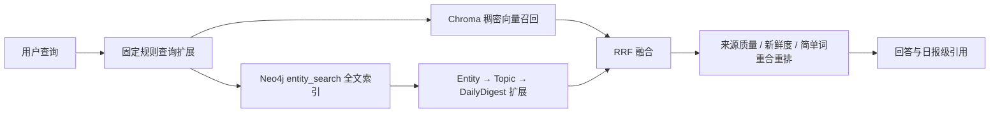
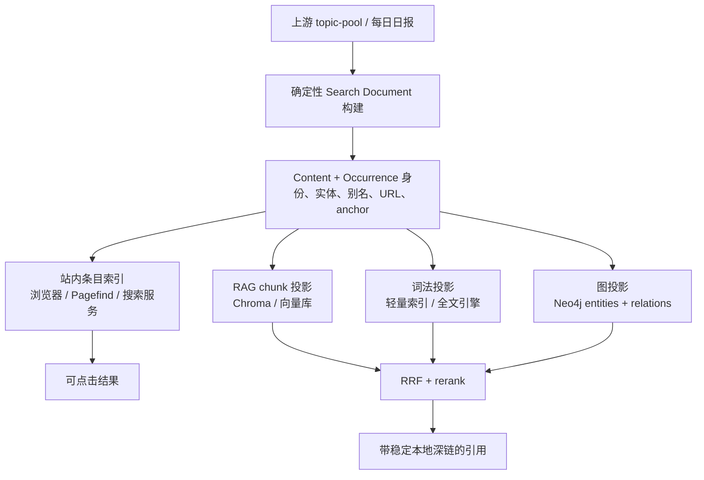
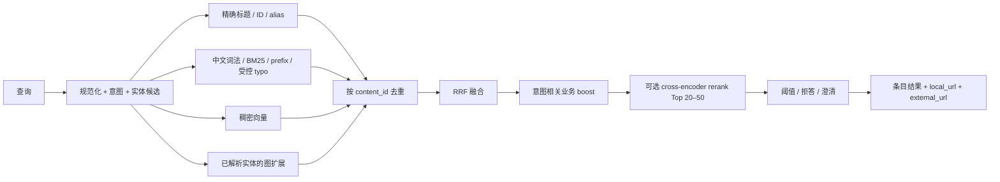

# RAG 检索质量与中文模糊搜索方案研究

日期：2026-08-10
适用仓库：AI-TREND-RADAR-RAG
研究范围：中文模糊查询、实体/同义词解析、混合检索、rerank、搜索结果深链到具体条目

## 结论先行

当前最值得优先解决的并不是“换哪个搜索引擎”，而是缺少一个同时承载**稳定内容身份、条目级字段、实体别名和本地深链**的 Search Document（搜索文档）契约。没有这层数据契约，换成 Elasticsearch、Typesense 或 Qdrant 仍会继续面对“搜到一整天、无法指到具体条目”“同一内容多天重复但身份不稳定”“Anthropic 与 Claude Code 被错误当成同义词”等问题。

建议采用分阶段组合方案：

1. **先建立共享的逻辑 Search Document 层，不先迁移引擎。** 它由上游 `topic-pool.json`/日报构建，区分稳定内容 `content_id` 与某日出现记录 `occurrence_id`，同时生成 `local_url`、`external_url`、`entity_ids`、`aliases` 等字段。
2. **站内搜索先采用构建期生成的条目级轻量索引。** 以当前约 1,523 个去重内容、3,295 个日期出现记录的规模，引入第三个常驻搜索服务并不划算。FlexSearch 的 CJK 配置或 MiniSearch + 明确的中文分词器可作为低运维起点；必须用本仓库查询集实测后才能二选一。
3. **RAG 暂时保留 Chroma + Neo4j，增加来自同一 Search Document 的词法召回通道。** 并行执行精确标题/别名、中文词法、Chroma 稠密向量召回；只在已解析出实体时使用 Neo4j 做关系扩展；用 RRF 融合，随后对小候选集做可选的多语言 cross-encoder rerank。
4. **把 OpenSearch/Elasticsearch 作为达到明确门槛后的演进项。** 当条目规模、复杂过滤、在线服务、多用户并发或相关性治理超出浏览器索引能力时再引入。当前直接引入会在 Chroma、Neo4j 之外增加第三套服务和索引运维，收益尚无基准测试证明。
5. **“共享 Search Document”与“共享一个物理索引”是两回事。** 站内搜索面向条目、低延迟和可点击；RAG 面向 chunk、高召回和上下文拼接。两者应共享身份与字段契约，但可以投影成不同索引和不同排序策略。

> 推荐不是“永远不使用全文引擎”，而是先修复不可由引擎代替的数据层，再用评测结果触发迁移。

## 1. 研究方法与证据边界

本研究使用三类证据，并在下文明确区分：

- **仓库事实**：来自当前源码、数据文件、ADR 和已有检索基线；代表已经实现的行为。
- **外部能力事实**：来自官方文档、官方项目源码或论文；代表产品/方法公开支持的能力，不代表在本仓库上已经达到该效果。
- **架构判断**：基于前两类证据做出的建议；需要通过本仓库中文查询集和延迟测试验证。

本次未部署候选搜索引擎、未运行候选产品横向 benchmark，因此不能仅凭功能表宣布某一引擎“检索质量最好”。不同产品的默认分析器、字段设计、语料和参数会显著改变结果。

## 2. 当前实现：已经拥有什么，真正缺什么

### 2.1 RAG 当前链路

仓库已实现的主要召回链路是：



仓库事实：

- `rag/retriever/vector_store.py` 使用本地 Chroma `PersistentClient` 和 `digest_chunks` collection，按 cosine 距离执行向量召回。
- `rag/retriever/hybrid.py` 将 Chroma 结果与 Neo4j 实体全文查询结果用 RRF 合并；`rrf_k=60` 与经典 RRF 常见设置一致，但当前后处理中的“词重合”依赖 `query.lower().split()`，对没有空格的中文查询几乎无效。
- `rag/graphrag/schema.py` 建立了 `entity_search` 和 `topic_search` 全文索引，但未配置中文 analyzer；当前 hybrid 主要使用 `entity_search`。
- `rag/graphrag/builder.py` 从候选条目的 tags 构造 Entity；没有 canonical entity、alias、缩写、语言、置信度或歧义候选的数据模型。
- `rag/query_understanding.py` 使用固定词表扩展查询；已有基线显示过宽扩展会污染召回，例如组织、产品与相关概念被不加区分地注入。
- `rag/retrieval_planning.py` 能产生来源、日期、内容类型过滤，但解析出的 entity 尚未成为可靠过滤或 boost 条件。
- `rag/ingest.py` 的 topic citation ID 包含数组位置，条目重排后不稳定；chunk 元数据没有稳定 `content_id`、`occurrence_id` 或本地 item anchor。
- `rag/citations.py` 能返回外部 URL 和日报引用，但本地引用只定位到某日整份日报。

已有 2026-08-07 检索基线共 12 个查询，结果为：查询成功率 75%、正确拒答率 0%、macro P@10 11.82%、R@10 37.63%、MRR 40.69%、NDCG@10 31.59%。这说明当前问题不仅是“中文错别字搜不到”，还包括候选召回不足、查询扩展污染、无拒答阈值和排序特征失效。

### 2.2 站内搜索与深链当前链路

`index.html` 当前会抓取所有日报 Markdown，把每一天聚合成一个文本 blob，再按规范化后的字符串判断哪些“天”匹配。结果粒度是日期，不是具体条目。hash 路由只解析 `#date/report`，动态渲染后也没有稳定 item ID，因此即使检索层知道具体标题，点击仍只能打开整份日报。

当前数据审计得到：

| 指标 | 当前值 | 架构含义 |
|---|---:|---|
| manifest 日期数 | 59 | 浏览器需抓取多份 Markdown |
| candidate 出现记录 | 3,295 | 搜索结果应至少细到 occurrence |
| 简单 URL 规范化后的独立内容 | 1,523 | 同一内容跨天复现很常见 |
| 重复出现占比 | 53.78% | 不能把“内容身份”和“某日出现”混成一个 ID |
| 独立标题约数 | 1,525 | 标题不能独自承担稳定主键 |
| 有重复的标题 key | 274 | title slug 会碰撞，也会随改名失效 |

此外，构建脚本虽然生成 `digests/search-index.json`，但 dashboard 没有消费它；生成器读取的 `pool.topics` 与当前 topic pool 的 `candidates` 形状也存在不一致风险。因此不能把“文件存在”当成站内条目索引已打通。

### 2.3 已有边界不能被新方案破坏

- ADR 0002 已规定周报/月报是 browse-only 派生物，RAG 的规范语料是每日日报，不能因为搜索便利重复索引汇总内容。
- 决策 0009 已规定 AI-TREND-RADAR 是 canonical producer，本地 Chroma/Neo4j 等索引应可重建；Search Document 也应由上游内容确定性生成，而不是成为新的手工事实源。
- 决策 0004 采用 official-first、薄自定义 glue；任何新常驻服务都应有可测量收益，而不是用新框架掩盖身份和数据契约缺口。

## 3. “模糊查询”不是一种能力，而是六种不同问题

若把所有模糊情况都交给编辑距离或向量搜索，误召回会很高。应先区分：

| 问题 | 例子 | 合适机制 | 不应主要依赖 |
|---|---|---|---|
| 拼写错误 | `qdrent` → `Qdrant` | Damerau-Levenshtein、受控 typo | LLM 猜测 |
| 前缀/补全 | `llama` → `LlamaIndex` | prefix、edge n-gram | 纯向量 |
| 中文切词 | `图检索增强生成` | CJK analyzer、词典、字符 bigram | 空格 `split()` |
| 别名/缩写 | `小龙虾`、`MCP` | 显式 alias dictionary + entity ID | 无约束同义词扩展 |
| 语义改写 | “能在本地跑的向量库” | 稠密向量召回 | 只做 edit distance |
| 实体消歧 | `Claude` 指模型还是产品族 | 候选实体 + 上下文/关系消歧 | 把相关实体当同义词 |

Elasticsearch 的 fuzzy query 使用 Damerau-Levenshtein，并限制最大编辑距离；文档也指出 fuzzy 属于可能昂贵的查询。它解决的是字符编辑，不会自动解决“组织—产品—模型”的语义关系。[Elasticsearch fuzzy query](https://www.elastic.co/guide/en/elasticsearch/reference/current/query-dsl-fuzzy-query.html)

Meilisearch 的默认 typo 阈值也体现了短词风险：1–4 个字符默认不容错，5–8 个字符容许一次，9 个以上容许两次；精确匹配会通过排序规则优先于 typo。这种保守策略尤其适合中文短实体，不应为了“更模糊”而对两字、三字中文名普遍开放编辑距离。[Meilisearch typo tolerance](https://www.meilisearch.com/docs/capabilities/full_text_search/relevancy/typo_tolerance_settings)

## 4. 模糊词映射到具体条目的成熟链路

### 4.1 先建立规范实体与别名，而不是不断加查询扩展词

建议将实体建模为：

```text
Entity
  entity_id             稳定 ID，例如 product:claude-code
  canonical_name        Claude Code
  entity_type           product / company / model / protocol / person ...
  aliases[]             [{text, normalized, language, source, confidence}]
  relations[]           product_of / developed_by / successor_of ...
```

关键约束：**别名表示“同一个实体的不同叫法”，关系表示“两个不同实体之间的联系”。** `Claude Code` 是 Anthropic 的产品，不是 `Anthropic` 的同义词。把二者放进同义词表会让“Anthropic 融资”和“Claude Code 插件”互相污染；正确做法是先链接不同 entity ID，再在确有需要时沿 `product_of` 做图扩展。

Elasticsearch 的 `synonym_graph` 能正确表达多词同义词图，适合放在 search analyzer；`expand:false` 还可把多种形式归一到 canonical form，但 filter 顺序会影响同义词解析。[Elasticsearch synonym graph](https://www.elastic.co/docs/reference/text-analysis/analysis-synonym-graph-tokenfilter) 这是一种成熟的**词法归一机制**，仍不能替代实体关系和上下文消歧。

### 4.2 分层候选生成与消歧

建议按以下顺序解析；越靠前的证据越确定：

1. **规范化**：Unicode NFKC、大小写、常见全半角/标点；简繁转换必须单独评测，不能默认认为所有专名可安全转换。
2. **精确匹配**：`entity_id`、产品代码、规范名、精确标题。
3. **精确别名匹配**：命中带来源和置信度的 alias。
4. **词法模糊候选**：中文分词/字符 bigram、前缀、拉丁名 typo；对短中文词限制编辑距离。
5. **语义候选**：仅在前几层没有高置信命中时，用向量召回处理描述性表达。
6. **上下文消歧**：结合查询其余词、来源、类别、日期和 Neo4j 关系；高歧义、低置信时才使用 cross-encoder 或 LLM。
7. **保守决策**：低置信时把候选当 boost，不做 hard filter；候选接近时向用户澄清，完全无证据时不强行映射。

实体解析输出应是可观测的结构，而不是扩展后的字符串：

```json
{
  "entity_id": "product:claude-code",
  "matched_alias": "Claude 编程助手",
  "match_type": "alias_exact",
  "confidence": 0.96,
  "candidate_ids": ["product:claude-code", "model-family:claude"]
}
```

BLINK 论文采用 bi-encoder 先产生实体候选，再由 cross-encoder 排序，是“候选生成—精排”式实体链接的代表性成熟模式；本项目无需照搬其大模型规模，但应继承分阶段和保留候选的设计。[BLINK 论文](https://arxiv.org/abs/1911.03814)

### 4.3 从实体到具体条目

实体解析成功后，不应直接把“实体名”送回生成模型，而应把它变成检索条件：

- exact alias/title channel：优先找明确提及该实体的条目；
- lexical channel：对 title、summary、tags、aliases 做中文词法召回；
- vector channel：召回语义相关条目；
- graph channel：以已解析 entity ID 为起点，扩展到直接关联 Topic/Occurrence；
- 最终按 `content_id` 去重，同时保留该内容的多个 occurrence 供时间线或“首次/最新出现”选择。

Neo4j 的全文索引由 Lucene 支持，可指定 analyzer，并明确返回 score；官方文档提醒，score 应在同一结果集内解释。因此 Neo4j 与 Chroma 的原始分数不应直接相加，先分别排名后用 RRF 更稳妥。[Neo4j full-text indexes](https://neo4j.com/docs/cypher-manual/25/indexes/semantic-indexes/full-text-indexes/) Neo4j 官方 hybrid guide 也采用 lexical、semantic、structural 多路候选及 weighted RRF，并建议每路取大于最终 K 的候选后再 rerank。[Neo4j hybrid search](https://neo4j.com/developer/genai-ecosystem/hybrid-search/)

## 5. 共享 Search Document 层

### 5.1 它是什么

Search Document 不是某个引擎专属 schema，而是由 canonical corpus 确定性生成、能被多个索引消费的版本化契约：



这能让站内搜索和 RAG 共享“这个结果究竟是哪一条”的答案，同时允许两者使用不同粒度：

- 站内索引：一条 occurrence 或 content 一条文档，强调标题、别名、筛选和点击。
- RAG 索引：同一 content/occurrence 拆成多个 chunk，强调召回和上下文；每个 chunk 必须反向携带 parent identity 与 deep link。

### 5.2 推荐字段

| 字段 | 作用 |
|---|---|
| `schema_version` | 支持确定性重建和迁移 |
| `content_id` | 跨日期稳定内容身份；优先使用上游 source ID，其次 canonical URL fingerprint |
| `occurrence_id` | 某内容在某日日报中的稳定出现身份，例如 date + content_id；禁止使用数组位置 |
| `report_id`, `date`, `report_type` | 定位规范日报；rollup 不进入 RAG corpus |
| `title`, `normalized_title`, `summary`, `body` | 可搜索内容及显示字段 |
| `source`, `source_family`, `category`, `score`, `action` | 过滤、展示及意图相关排序，不应无条件乘入相关性 |
| `tags`, `entity_ids`, `aliases` | 词法召回与实体解析；relation 不混入 aliases |
| `canonical_url`, `external_url` | 内容去重与原站跳转 |
| `local_url`, `item_anchor` | 站内直接定位条目 |
| `published_at`, `observed_at` | 区分原始发布日期与本站观测日期 |
| `fingerprint` | 内容变更、去重及重建校验 |

RAG chunk 还应补充：`chunk_id`、`parent_content_id`、`occurrence_id`、`section/character_locator`、`local_url`。引用信息从不可变 metadata 读取，不能在生成回答时凭标题重新猜 anchor。

### 5.3 身份策略

- `content_id`：优先外部平台稳定 ID；否则使用规范化 canonical URL 的哈希。只有 URL 不可靠时才回退到 source + normalized title + content fingerprint。
- `occurrence_id`：稳定的 `date + content_id`，若同一天同内容确有多个独立条目，再加入明确的 upstream item ID；不能加入数组序号。
- `item_anchor`：例如 `topic-<occurrence_id 的短编码>`，只用于 URL/DOM，可读标题另行展示。
- 标题、排序和日报结构变化不得改变上述 ID。

## 6. 深链：从搜索结果真正跳到那一条

### 6.1 当前 SPA 的最小改造形态

当前 hash 已用于路由，因此不能再追加第二个 `#heading`。建议把 item 纳入路由本身：

```text
#2026-08-05/ai-topic-radar/item/<occurrence_id>
```

页面行为契约应是：

1. 路由解析 `date`、`report`、`occurrence_id`；
2. 异步加载并渲染日报；
3. 每个条目 DOM 节点带稳定 `id="topic-..."` 和 `data-occurrence-id`；
4. 渲染完成后查找目标，执行 `scrollIntoView`、聚焦并短暂高亮；
5. 未找到原 occurrence 时，按 `content_id` 找最新 occurrence，并明确显示“原条目已迁移/不再存在”；
6. 搜索结果同时提供 `local_url` 和 `external_url`，标题点击本地条目，外链图标打开原站。

深链验收不是“URL 看起来正确”，而是自动化点击后断言：正确日期已加载、目标 `occurrence_id` 可见且高亮、浏览器前进/后退可恢复同一位置。

### 6.2 Pagefind 为什么值得参考，但不是当前最小改动

Pagefind 的 sub-results 会利用 HTML heading 的 `id` 生成 `url#id`，原生支持直接跳到页面中的具体 section，是深链行为的成熟参考。[Pagefind sub-results](https://pagefind.app/docs/sub-results/) 它的 extended build 也支持中文、日文、韩文分词。[Pagefind multilingual search](https://pagefind.app/docs/multilingual/)

但 Pagefind 在**构建后的静态 HTML**上建立索引；当前页面运行时才抓取 Markdown 并渲染成一个 SPA。若为了 Pagefind 先生成每日日报静态 HTML 和稳定 heading ID，它会成为很好的零服务方案；在不改变构建结构的前提下，直接接入 Pagefind 无法索引运行时才出现的条目。因此它是“静态预渲染路线”的首选候选，不是当前结构下的即插即用补丁。

## 7. 检索与排序流水线

推荐的查询路径：



### 7.1 为什么用 RRF，而不是直接加原始分数

BM25、cosine、Neo4j fulltext 和业务分各自量纲不同。RRF 只使用各通道内的名次，避免先假定这些分数可比较。Elasticsearch 官方实现也以多个 ranked result sets 和 `rank_constant`/window 为核心；window 越大，召回与成本越高。[Elasticsearch RRF](https://www.elastic.co/docs/reference/elasticsearch/rest-apis/reciprocal-rank-fusion) RRF 最早的研究也显示它是强健的无训练融合方法，但本仓库仍需对 K、候选窗口和通道权重做评测。[RRF 原始论文](https://cormack.uwaterloo.ca/cormacksigir09-rrf.pdf)

现有后处理不应继续把相关性与可能为零的词重合分做无条件乘法；更稳妥的是先产生相关性排序，再按明确用户意图给予有限 boost，例如查询含“今天”时提升 freshness，含“高分”时提升 business score。

### 7.2 rerank 放在哪里

Cross-encoder 对 query-document pair 联合编码，精度通常高于独立向量，但不能经济地扫全库。Sentence Transformers 官方示例建议先用 lexical/bi-encoder 召回约 100 个候选，再用 CrossEncoder rerank。[Sentence Transformers retrieve & re-rank](https://www.sbert.net/examples/sentence_transformer/applications/retrieve_rerank/README.html)

可选择 `BAAI/bge-reranker-v2-m3` 做本地候选评测：官方 model card 标注其为多语言、0.6B、Apache-2.0，并直接对 query-passage 输出相关性分数。[BGE reranker v2 m3](https://huggingface.co/BAAI/bge-reranker-v2-m3) 这只是候选，不等于已经证明它最适合本仓库。站内搜索的每次按键不应默认运行大 reranker；RAG 最终问答或用户提交完整搜索时才值得对 Top 20–50 使用。

### 7.3 置信度与拒答

当前基线正确拒答率为 0%，因此新链路必须有可校准的拒答/澄清层：

- exact entity/title 命中可高置信直达；
- 多个 alias 候选分数接近时提示用户选择；
- 只有低分语义候选时，搜索页可展示“可能相关”，RAG 不应声称精确事实；
- 阈值必须从负例和 hard-negative 评测集学习，不能凭经验写死。

## 8. 候选技术的一手证据

### 8.1 Elasticsearch / OpenSearch：最高控制力，当前运维偏重

Elasticsearch 提供 Smart Chinese analyzer 插件，支持简体中文及中英混合文本的概率分词，但需要每个节点安装并重启，且 analyzer 本身不可配置。[Elasticsearch Smart Chinese](https://www.elastic.co/docs/reference/elasticsearch/plugins/analysis-smartcn) 它还原生覆盖 synonym graph、fuzzy、全文字段权重、RRF 和 rank evaluation，适合需要系统相关性治理的服务端场景。[Elasticsearch rank evaluation](https://www.elastic.co/docs/reference/elasticsearch/rest-apis/search-rank-eval)

OpenSearch 提供 hybrid query、搜索 pipeline 中的 RRF score-ranker，以及 lexical/semantic 结果后的 cross-encoder 或 late-interaction rerank。[OpenSearch hybrid query](https://docs.opensearch.org/latest/query-dsl/compound/hybrid/) [OpenSearch RRF processor](https://docs.opensearch.org/latest/search-plugins/search-pipelines/score-ranker-processor/) [OpenSearch reranking](https://docs.opensearch.org/latest/search-plugins/search-relevance/reranking-search-results/) OpenSearch 可通过 ICU analyzer 插件处理包括 CJK 在内的 Unicode 文本。[OpenSearch language analyzers](https://docs.opensearch.org/latest/analyzers/language-analyzers/index/)

判断：二者都是长期成熟方案，且比浏览器索引更适合复杂 analyzer、服务端过滤、同义词治理和在线评测。但当前部署已有 Chroma + Neo4j，直接加入会形成三引擎数据同步、监控、备份和 schema migration。除非 benchmark 显示轻量方案达不到目标，当前不是默认首选。

### 8.2 Meilisearch / Typesense：站内搜索服务的中间路线

Meilisearch 提供 prefix、typo tolerance、synonym 和显式 ranking pipeline，也可用 `semanticRatio` 在 keyword 与 vector 之间切换或混合。[Meilisearch ranking pipeline](https://www.meilisearch.com/docs/capabilities/full_text_search/advanced/ranking_pipeline) [Meilisearch semantic vs hybrid](https://www.meilisearch.com/docs/capabilities/hybrid_search/advanced/semantic_vs_hybrid) 其 Community Edition 官方仓库采用 MIT 许可；部分分布式企业能力另行许可。[Meilisearch repository](https://github.com/meilisearch/meilisearch)

Typesense 对字段提供 `locale: "zh"`，文档说明其使用 ICU 进行 CJK 分词和变体处理；若领域词典要求更高，还支持 `pre_segmented_query`，但索引和查询必须用一致的自定义切词。[Typesense locale](https://typesense.org/docs/guide/locale.html) 它也提供字段级 typo、权重、精确优先、synonym 和 hybrid/vector search。[Typesense Search API](https://typesense.org/docs/latest/api/search.html) [Typesense vector search](https://typesense.org/docs/latest/api/vector-search.html) Server 官方仓库为 GPL-3.0，客户端为 Apache-2.0，部署前需由项目方确认许可影响。[Typesense repository](https://github.com/typesense/typesense)

判断：若近期明确需要常驻在线站内搜索，Typesense 对中文 locale 和预分词的官方说明更具体；Meilisearch 的默认 typo 规则更透明、接入体验也更聚焦应用搜索。两者都必须用相同中文 query set 比较，不能因 API 简洁就假设中文质量足够。

### 8.3 Pagefind / MiniSearch / FlexSearch：当前规模的轻量候选

MiniSearch 是浏览器/进程内全文索引，支持 exact、prefix、fuzzy、字段 boost；默认 tokenizer 主要按 Unicode 空白和标点切分，中文必须提供自定义 tokenizer，不能直接沿用默认值。[MiniSearch documentation](https://lucaong.github.io/minisearch/) [MiniSearch search options](https://lucaong.github.io/minisearch/types/MiniSearch.SearchOptions.html)

FlexSearch 官方仓库提供 CJK charset，以及 exact/forward/tolerant/full 等 tokenizer 模式，并要求每条文档有 ID，适合由构建脚本产出条目级 JSON 索引。[FlexSearch repository](https://github.com/nextapps-de/flexsearch) 但其“tolerant”不应被直接视为已经解决实体别名和中文语义，仍需对召回、误纠正、bundle/index 大小做测试。

判断：在约 3,295 occurrence 的当前规模，轻量索引能用最低运维成本验证正确的数据模型和深链。二选一时应以测试结果为准：FlexSearch 先测试内建 CJK；MiniSearch 则使用明确、可版本化的 `Intl.Segmenter`/字符 bigram 策略。Pagefind 留给静态 HTML 预渲染路线。

### 8.4 Chroma / Qdrant / Weaviate：RAG 候选，不会自动解决深链

当前 Chroma 本地 API 主要提供向量 query、ID、metadata/where 和 document contains/regex 过滤。[Chroma query and get](https://docs.trychroma.com/docs/querying-collections/query-and-get) Chroma Cloud 的 Search API 已提供 sparse+dense hybrid、RRF、自定义 ranking 和 grouping，但官方文档明确这是 Cloud 能力，single-node 支持仍在计划中，不能把它当成当前本地 Chroma 已具备。[Chroma Search API](https://docs.trychroma.com/cloud/search-api/overview) [Chroma hybrid search](https://docs.trychroma.com/cloud/search-api/hybrid-search)

Qdrant 可在一个 point 中保存 dense 与 sparse vectors，并用 RRF 融合；其官方 rerank 教程同样采用 dense+sparse 召回后对小候选集运行 late interaction。[Qdrant hybrid text search](https://qdrant.tech/documentation/search/text-search/hybrid-search/) [Qdrant reranking tutorial](https://qdrant.tech/documentation/advanced-tutorials/reranking-hybrid-search/)

Weaviate 的 hybrid search 组合 BM25 与 vector，默认 relative score fusion；它也把 reranker 明确放在第一阶段候选之后。[Weaviate hybrid search](https://docs.weaviate.io/weaviate/concepts/search/hybrid-search) [Weaviate reranking](https://docs.weaviate.io/weaviate/concepts/reranking)

判断：Qdrant/Weaviate 可作为未来替换 Chroma、统一 dense+sparse 的方案，但迁移向量库本身不会产生稳定 entity ID、occurrence ID 或 local URL，也不是解决站内深链的必要条件。先补 Search Document 和词法通道，只有在 RAG benchmark 或运维简化目标明确时再比较迁移。

### 8.5 Neo4j 与编排框架的正确角色

Neo4j GraphRAG Python 官方提供 HybridRetriever/HybridCypherRetriever，将 vector + fulltext 结合并可在召回后遍历图。[Neo4j GraphRAG retrievers](https://neo4j.com/docs/neo4j-graphrag-python/current/user_guide_rag.html) 这说明“将 Chroma 迁入 Neo4j、变成一个后端”在技术上可行，但不代表中文 analyzer、向量质量或运维必然优于现状；更稳妥的近期角色是实体解析后的结构扩展，而不是把所有 query 都先打到图里。

LlamaIndex 展示了 BM25 + vector QueryFusionRetriever 和 RRF，并允许关闭自动多 query 生成；这适合编排实验，但不会替代底层字段、身份和 analyzer 设计。[LlamaIndex reciprocal rerank fusion](https://developers.llamaindex.ai/python/framework/integrations/retrievers/reciprocal_rerank_fusion/) LangChain/LlamaIndex 应被视为 orchestration 层，不应成为选择搜索底座的主要理由。

## 9. 四种决策路线比较

“共享 Search Document”是底座，另外三项才是执行方式；下表仍按用户关心的四类列出，以避免把它们误当成互斥选择。

| 路线 | 中文/模糊质量上限 | hybrid / rerank | 深链 | 运维成本 | 当前适配度 | 主要风险 |
|---|---|---|---|---|---|---|
| 继续按当前方式自研 | 低—中；需自己补 CJK、alias、typo | 已有 RRF，但排序特征薄弱 | 必须自建 | 运行成本低，长期代码成本高 | 适合短期修契约，不适合无限扩展 | 自定义规则越来越不可解释，查询扩展污染 |
| 引入 Elasticsearch/OpenSearch | 高；analyzer、synonym、fuzzy、BM25 完整 | 原生 hybrid/RRF/rerank 生态 | 仍依赖 SearchDoc anchor | 高；新增服务、索引和监控 | 当前偏重，达到门槛后合适 | 三引擎同步，学习和运维负担 |
| 引入轻量站内索引 | 中；CJK 需产品实测 | 可做 lexical；RAG rerank 仍在后端 | 最容易输出条目 local URL | 最低或中低 | **当前最匹配** | 中文切词、误纠正、索引包大小需测 |
| RAG/站内共享 Search Document | 不直接决定引擎质量，但决定结果能否一致 | 给所有通道稳定字段与 ID | **根本前提** | 一次构建，多处投影 | **必须先做** | 若把共享逻辑层误做成共享物理索引，会绑死两类需求 |

补充候选定位：

- **Meilisearch/Typesense**：介于轻量浏览器索引与 OpenSearch 之间，适合要在线 API、typo/synonym/filter，但不愿承担完整搜索集群时。
- **Qdrant/Weaviate**：主要是 RAG 向量/混合底座演进，不是条目身份和深链方案。
- **Neo4j 单后端整合**：可减少后端数量，但只有 benchmark 证明其中文 lexical + vector 质量足够时才值得迁移；图扩展仍应由明确实体触发。

## 10. 推荐架构与分阶段路线

### 阶段 0：先补评测，不动引擎

在已有 12 条基线之外增加中文和深链专项集：

- 精确标题、别名、英文缩写；
- 拉丁拼写错误，如 `qdrent`；
- 中文无空格、不同切词、简繁体；
- 组织/产品/模型的关系查询与易混 alias；
- 两字/三字中文短词 hard negatives；
- 无答案、低置信和歧义查询；
- 搜索结果点击到具体 occurrence 的端到端用例。

分别统计：candidate Recall@K、Hit@1/3、MRR、NDCG@10、entity linking accuracy、false-correction rate、正确拒答率、deep-link correctness、P50/P95 延迟、构建时间和索引大小。站内搜索与 RAG 指标不可混成一个总分。

### 阶段 1：共享身份与文档契约

确定 `content_id`、`occurrence_id`、实体/别名 schema、`local_url` 和 `item_anchor`；从 canonical topic pool/日报确定性产出。Chroma chunk、Neo4j Topic/Entity 和站内索引都只消费这层，不反向修改上游事实。

验收：重复内容跨日共享 `content_id`；同日条目重排不改变 `occurrence_id`/deep link；每个 RAG citation 能回溯到一个 Search Document；构建两次输出 fingerprint 一致。

### 阶段 2：条目级轻量站内搜索与深链

先做一个可替换 adapter，对 FlexSearch CJK 与 MiniSearch 自定义中文 tokenizer 做相同测试。输出 item-level result，不再输出“匹配 N 天”。若同时推进静态 HTML 预渲染，则优先试 Pagefind，并直接利用 heading sub-results。

验收：精确标题/别名 Hit@1 达到预先商定阈值；短中文 false-correction 可接受；点击结果后目标 occurrence 可见、高亮，前进/后退正常；索引不会要求浏览器并行抓取全部日报 Markdown。

### 阶段 3：RAG 三路召回与小候选 rerank

在保留 Chroma + Neo4j 的基础上，从 Search Document 建立 lexical 通道；exact/lexical/vector/graph 分路排名、按 `content_id` 去重、RRF 融合。用本地 BGE reranker 与“无 reranker”做离线消融，不达收益/延迟门槛则不启用。

验收：与当前基线相比，Recall@10、MRR、NDCG@10、正确拒答率均有明确提升；中文查询不再依赖空格 split；每个结果都携带本地条目链接；记录每路命中和最终决策，便于归因。

### 阶段 4：用触发条件决定是否引入搜索服务

满足下列任一类条件时，再做 OpenSearch/Typesense/Meilisearch bake-off：

- 数据规模或索引包使浏览器首载、内存、构建时间不达标；
- 需要服务端权限、复杂 facet/filter、动态 synonym、增量实时索引或多用户并发；
- 中文 analyzer/typo/排序质量经过调优仍达不到验收线；
- 希望把 lexical 与 vector 统一到一个后端，且迁移能实质减少而不是增加系统复杂度。

候选引擎必须导入同一 Search Document、运行同一 query set，再比较质量、P95、资源、部署和故障恢复。不要以功能清单直接立项迁移。

## 11. 暂不建议的做法

- 不继续扩大固定查询扩展表，把组织、产品、模型和相关概念都当同义词。
- 不以 title slug 或 topic-pool 数组下标作为 deep-link ID。
- 不把 fuzzy edit distance 用在所有中文短词上。
- 不把 Chroma distance、Neo4j score、BM25 和业务分未经校准直接相加或相乘。
- 不让 LLM 在没有候选证据时自由“纠错”实体；LLM 只做低置信候选的受控消歧，并输出可审计结果。
- 不为了复用而强迫站内搜索与 RAG 使用相同物理 index 和 chunk 粒度。
- 不先迁移向量库或新增 OpenSearch，再回头补稳定身份和 URL 契约。

## 12. 最终决策建议

当前建议的决策句是：

> **采用“共享 Search Document + 分离物理索引”的架构；近期以条目级轻量中文词法索引补齐站内搜索，以 Chroma + Neo4j + 新增 lexical channel 改善 RAG，并以 RRF 和可选多语言 reranker 排序；暂不新增 OpenSearch/Elasticsearch 常驻服务。**

这个选择对产品的意义是：用户先获得真正可用的“输入模糊叫法—看到具体条目—点击直接到那一条”，而不是只看到一整天的日报。对工程的意义是：把最难迁移的身份、实体和 URL 契约先稳定下来，未来无论换成 Typesense、OpenSearch、Qdrant 还是 Neo4j 单后端，都不需要重新定义“一个搜索结果是什么”。

需要通过下一阶段测试回答、而不是在本研究中武断决定的问题只有两个：

1. 在本仓库中文 query set 上，FlexSearch CJK 与 MiniSearch 自定义 tokenizer 哪个能以更小索引和更低误纠正率达到目标？
2. BGE reranker v2 m3 对当前 Top 20–50 候选的 NDCG/MRR 增益，是否足以覆盖延迟和部署成本？

在这两个问题有数据前，不应把某个具体库写成不可逆架构承诺。
