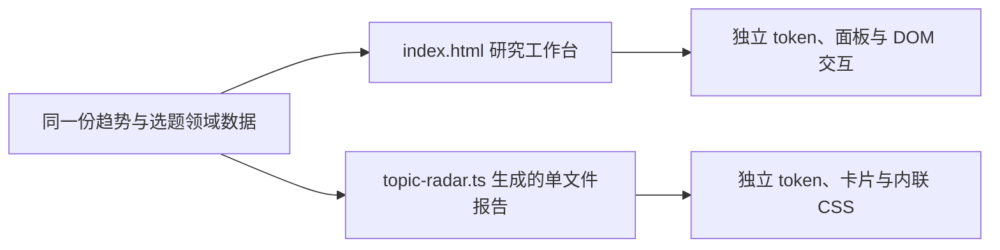
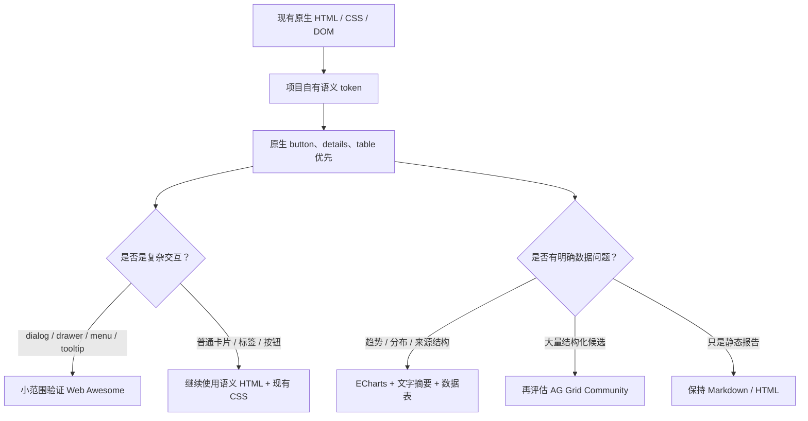

# AI 趋势雷达 / 研究型仪表盘的 UI Skills、设计系统与参考项目调研

日期：2026-08-10  
研究范围：当前可用 Codex skills、官方设计系统文档、GitHub 开源项目  
约束：本轮仅研究，不修改代码、不安装依赖  

## 执行摘要

当前项目不适合直接迁移到 React、Vue、Tailwind 或某个完整 BI 框架。它的浏览器端是一个原生 HTML/CSS/DOM 应用，没有前端打包器；同时还有一套由 TypeScript 拼接并写出的独立单文件报告。此时整体引入重型框架，会把一次 UI 改进升级为构建、部署、状态管理和双界面迁移问题。

推荐的方向是一个分层、渐进的组合，而不是寻找“一套全包组件库”：

1. **实现 skill：**以 `frontend-design` 为主；先用 `visualize` 或 `prototype` 做低成本交互比较；`immersive-motion-ui` 只借用视觉 QA 与无障碍检查，不照搬其高动效技术栈。
2. **设计基础：**保留现有 CSS custom properties，参考或选择性引入 [Open Props](https://open-props.style/) 的 token，不导入全局 reset。
3. **交互组件：**首选对 [Web Awesome](https://webawesome.com/) 做小范围试点，优先验证 dialog、drawer、menu、tooltip 等原生 HTML 难以稳定做好的交互；不要一次替换所有 button/card。
4. **数据可视化：**需要回答明确研究问题时，首选 [Apache ECharts](https://github.com/apache/echarts)；图表必须同时提供文字结论或数据表，不能只依赖 Canvas/颜色。
5. **数据表格：**只有当选题池变成结构化、可筛选的大数据视图时，才评估 [AG Grid Community](https://www.ag-grid.com/javascript-data-grid/community-vs-enterprise/)；当前 Markdown 报告不需要它。
6. **暂不采用：**Shoelace 已停止开发，Material Web 进入维护模式；Spectrum、Carbon、UI5、Lion 都有质量，但对当前无打包器、双单文件界面的引入成本偏高。

最关键的前置工作不是“换皮”，而是先定义两套界面共享的 token、组件边界和交互语义。否则引入任何库都会增加漂移。

## 1. 当前仓库的技术约束

### 1.1 已实现事实

以下结论来自对指定文件的只读检查：

- [`index.html`](../../index.html) 是约 2,473 行的单文件浏览器应用，HTML、约 700 行内联 CSS 和原生 DOM JavaScript 共存。它同时承担报告浏览、主题切换、侧栏、搜索、系统状态、简报和 RAG 对话。
- 浏览器端没有 React/Vue/Svelte/Tailwind/Vite。页面通过 CDN 直接加载固定版本的 Marked 与 DOMPurify，并使用 SRI 完整性校验（`index.html:10-11`）。这说明“无构建直接运行”是当前真实部署路径，不只是临时写法。
- 页面已经有一套 CSS custom properties、深浅主题、响应式布局和 `localStorage` 偏好（`index.html:13`、`1054-1153`）。新系统若整套覆盖颜色、排版和 reset，会与现有样式发生较大冲突。
- 报告通过 `manifest.json` 和 Markdown 静态文件加载（`index.html:1451-1471`），本地 RAG/系统能力则调用同源 API。浏览器端既是静态报告阅读器，也是本地研究工作台。
- [`package.json`](../../package.json) 的依赖主要服务于采集、生成和模型调用；`tsx`、TypeScript、Vitest 位于开发依赖中，但没有浏览器打包器（`package.json:61-84`）。**项目用了 TypeScript，不等于浏览器端已经具备 TypeScript 组件构建链。**
- [`src/web.ts`](../../src/web.ts) 是官网 Feed/Sitemap/正文采集模块，包含站点配置、超时、限长与抓取策略（`src/web.ts:61-130`），不是前端入口。因此它影响 UI 可展示的数据边界，不支持把某个 React 组件直接“接进 web.ts”。
- [`src/topic-radar.ts`](../../src/topic-radar.ts) 还有第二套界面：`renderTopicCards()` 和 `buildTopicRadarHtml()` 直接生成带内联 CSS 的完整 HTML，并写入磁盘（`src/topic-radar.ts:584-869`）。这套报告与 `index.html` 的 token、组件和无障碍行为目前没有共享层。
- 选题卡已有明确领域结构：来源、类别、分数、行动建议、摘要、推荐选题、理由、标签和证据。这意味着 UI 的核心价值是“快速扫描 → 判断优先级 → 查看证据”，不是展示更多装饰性卡片。

### 1.2 从代码检查发现的可访问性风险

这些是静态代码证据，不等同于已经完成浏览器、屏幕阅读器或 axe 审计：

- 三个聊天建议使用带 `onclick` 的 `div`（`index.html:821-823`），月份/分组标题也由可点击 `div` 驱动（`1347`、`1424`）。它们默认不能通过 Tab 聚焦，也没有按钮语义。
- Chat、System、Briefs 三个覆盖面板是普通 `div`，代码中未见 `role="dialog"` / `aria-modal`、打开后的焦点迁移、Tab 焦点约束、Escape 关闭和关闭后焦点归还。W3C 的 [Modal Dialog Pattern](https://www.w3.org/WAI/ARIA/apg/patterns/dialog-modal/) 明确要求这些行为。
- `prefers-reduced-motion` 规则目前只关闭聊天输入中的局部动画（`index.html:460-462`），不是全局动效策略。
- 已有正面基础：大部分动作使用原生 `button`；侧栏缩放条有 `separator` 角色、方向、标签和键盘焦点（`index.html:798`）；联网状态使用 `aria-live`（`index.html:830`）。这说明更合适的方向是补齐语义，而不是重写整个页面。

[WCAG 2.2](https://www.w3.org/TR/WCAG22/) 要求所有功能可通过键盘操作、没有键盘陷阱，并提供可见焦点。组件库可以减少错误，但不能替代项目级键盘流程与焦点管理测试。

### 1.3 架构上的核心矛盾

当前有两个设计表面：

因此第一优先级应是明确共享什么：至少共享颜色语义、间距、排版、状态色、焦点样式和卡片字段顺序。Web Components 可以复用运行时交互，但 `topic-radar.ts` 生成的静态报告是否允许依赖外部 CDN/JS，必须先做产品决策；如果报告需要完全离线，组件库不能成为其基础依赖。

## 2. 评估方法

本调研不以 Star 数作为质量代理。Star 只能说明关注度，不能说明许可证适用、最近仍维护、无障碍质量或能否低成本接入当前架构。

每个候选按以下维度判断：

| 维度 | 具体问题 | 权重倾向 |
|---|---|---|
| 架构适配 | 能否直接用于原生 HTML/DOM？是否强制打包器或框架？ | 最高 |
| 可访问性 | 是否有明确键盘、焦点、屏幕阅读器与对比度策略？是否只是宣传？ | 高 |
| 维护活跃度 | 2026 年是否仍有正式 release、PR 或迁移说明？旧仓库是否已归档？ | 高 |
| 引入成本 | 样式冲突、体积、Shadow DOM、构建链、迁移和学习成本 | 高 |
| 许可证 | 默认许可证、Community/Enterprise 边界、复制代码风险 | 中高 |
| 领域适配 | 是否支持高密度扫描、筛选、证据钻取、表格和趋势可视化 | 中高 |

“高/中/低”是针对本仓库的启发式判断，不是库本身的绝对质量排名。许可证判断也不是法律意见，真正引入时仍需记录准确版本与 LICENSE 文件。

## 3. 当前可用 Codex UI skills

| Skill | 适合做什么 | 对当前项目的判断 |
|---|---|---|
| `frontend-design` | 在现有项目中实现生产级 HTML/CSS/JS 界面，强调明确视觉方向、CSS variables 和可访问性 | **主实现 skill。**与当前原生 DOM 架构最贴合；需要在任务提示里同时约束“研究型、高信息密度、克制动效”，避免只追求营销页视觉冲击 |
| `visualize` | 在对话中构建交互图、比较器、图表或 UI mockup，并要求语义 HTML 与图表替代文本 | **设计探索 skill。**适合先比较信息层级、筛选器和证据抽屉，不应被误认为会直接修改仓库 |
| `prototype` | 用最小、可丢弃实现回答具体设计问题 | **决策前置 skill。**适合验证“卡片还是表格”“右侧 drawer 还是页面内展开”；原型结论确认后再生产实现 |
| `immersive-motion-ui` | 高保真页面、动效、视觉 QA，常见方案依赖 Vite、Tailwind、GSAP/Framer Motion | **选择性使用。**可借鉴排版、层级、响应式和 WCAG 验证清单；不应作为当前仪表盘的默认技术栈，高动效也会干扰持续阅读和数据比较 |
| `sites-building` | 用 Sites/vinext 构建和托管完整站点，特别适用于存在 `.openai/hosting.json` 的项目 | **当前不适用。**本仓库已有静态部署和本地 API 形态，没有证据表明要迁移 Sites；采用它属于架构重写 |

推荐使用顺序是：`visualize` / `prototype` 先回答一个具体 UI 问题，确认后由 `frontend-design` 在现有架构中做手术式实现；只有需要视觉 QA 时再调用 `immersive-motion-ui` 的相关检查。

## 4. 设计系统与组件库候选

### 4.1 综合矩阵

| 候选 | 层级 | 许可证与活跃证据 | 原生 HTML/TS 适配 | 可访问性 | 引入成本 | 结论 |
|---|---|---|---|---|---|---|
| [Web Awesome](https://github.com/shoelace-style/webawesome) | Web Components + themes/tokens | 开源仓库 MIT；是 Shoelace 的活跃后继项目，官方文档持续更新 | **高。**`dist-cdn` 可不经构建工具直接加载，组件可按需 cherry-pick | 官方有[无障碍承诺](https://webawesome.com/docs/resources/accessibility)，组件语义基础较好；仍需项目级键盘测试 | 低—中：Shadow DOM 主题覆盖、首次加载、版本固定和开源/Pro 能力边界需验证 | **组件层首选试点** |
| [Open Props](https://github.com/argyleink/open-props) | CSS design tokens | MIT；官网当前版本与模块化 token 文档清晰 | **很高。**CSS variables，可从 CDN 或只取需要的 token 包 | 不提供行为组件，也不会自动修复语义 | 低：但整包覆盖现有 token 或 reset 会增加冲突 | **token 参考/选择性采用首选** |
| [Spectrum Web Components](https://opensource.adobe.com/spectrum-web-components/) | 完整 Web Components 设计系统 | Apache-2.0；Adobe 维护 | 中。框架无关，但[官方入门文档](https://opensource.adobe.com/spectrum-web-components/getting-started/)不建议生产环境使用全量 bundle，推荐 Rollup/Webpack 按需构建 | **高。**官方明确覆盖键盘、屏幕阅读器与高对比度 | 中—高：引入浏览器构建链、`sp-theme` 和强 Spectrum 视觉语言 | **高质量备选，不是当前首选** |
| [Lion](https://github.com/ing-bank/lion) | 白标 Web Components 基础库 | MIT；2026 年仍有 issue/更新活动 | 中。基于 Lit，适合构建设计系统而非直接套皮 | **很高。**强调 WAI-ARIA、axe 与人工屏幕阅读器测试 | 高：官方[样式原则](https://lion.js.org/guides/principles/styling/)刻意只给功能和无障碍基础，视觉体系要自己完成 | **适合团队自建设计系统；当前过重** |
| [UI5 Web Components](https://github.com/SAP/ui5-webcomponents) | 企业级 Web Components | Apache-2.0；v2.20.2 发布于 2026-03-20 | 中—低。支持静态站和原生 DOM，但官方明确不提供 CDN，预期 npm + bundler | 高，含无障碍主题、键盘与持续修复 | 高：新增构建链，并引入明显 SAP Fiori 视觉身份 | **企业后台备选；不符合当前轻量路径** |
| [Carbon](https://github.com/carbon-design-system/carbon) | tokens、样式、React 与 Web Components | Apache-2.0；主仓库 v11.108.0 发布于 2026-05-20 | 中—低。当前 `@carbon/web-components` 在主 monorepo；Sass/包体系更适合有构建链项目 | 高，成熟企业设计规范 | 高：IBM 视觉语言、Sass/构建和全局样式迁移成本 | **只借鉴密集后台模式；暂不引入** |
| [Pico CSS](https://github.com/picocss/pico) | class-light / semantic CSS | MIT；项目仍可用，但本轮未取得与前几项同等强的近期 release 证据 | **高。**CDN 即用，适合语义 HTML | 依赖原生语义，基础较好；复杂 widget 仍需自行实现 | 低用于新页面；高用于覆盖已有 2,473 行样式，容易出现全局冲突 | **适合新生成报告/原型，不适合覆盖主页面** |
| [Apache ECharts](https://github.com/apache/echarts) | 图表层 | Apache-2.0；6.1.0 发布于 2026-05-19，仍持续维护 | **高。**有浏览器发布包、TypeScript 类型和 CDN 路径 | 中。支持 ARIA 描述与纹理，但[默认关闭](https://apache.github.io/echarts-handbook/en/best-practices/aria/)；复杂图表仍不等于键盘可探索 | 中：API 大、Canvas/SVG 图表需响应式和文字替代 | **可视化层首选，按问题引入** |
| [AG Grid Community](https://www.ag-grid.com/javascript-data-grid/installation/) | 数据网格 | Community 为 MIT；Enterprise 为商业 EULA，文档当前 CDN 示例为 36.0.2 | 高。支持 Vanilla JS 和 CDN | 中—高，但有条件。[官方无障碍文档](https://www.ag-grid.com/javascript-data-grid/accessibility/)说明 DOM 顺序、虚拟化和分页会带来性能/可访问性取舍 | 中—高：视觉和数据模型侵入明显；容易误用 Enterprise 功能 | **未来结构化选题池条件采用** |

### 4.2 为什么 Web Awesome 最适合先试，而不是直接全面采用

[Web Awesome 安装文档](https://webawesome.com/docs/)明确区分无构建工具可用的 `dist-cdn` 与供 Vite/Webpack 优化的 `dist`，也允许只加载所需组件。这与当前 `index.html` 已经通过固定 CDN + SRI 加载依赖的方式最接近。

但“最适合试点”不等于“已完成选型”：

- Web Components 的 Shadow DOM 能隔离样式，也会提高深度定制和调试成本。
- 自定义元素升级前可能出现未定义组件闪烁，需要验证加载策略。
- 当前页面已经有完整 button/card 样式；替换简单元素收益不高。优先级应放在 dialog、drawer、dropdown、tooltip 这类行为复杂、无障碍容易做错的组件。
- Web Awesome 还存在开源组件、项目服务和 Pro 资源的产品边界。正式采用前必须用固定版本的 LICENSE 和所选组件清单确认，而不能只看首页的“免费/开源”描述。

因此建议做一个非常小的验证：只替换一个覆盖面板和一个菜单，观察深浅主题、键盘流程、无样式闪烁、离线/网络失败、bundle 体积与现有 CSS 冲突，再决定是否扩大范围。

### 4.3 Open Props 的正确角色

[Open Props](https://open-props.style/) 是 token 库，不是组件库。它适合提供经过整理的间距、字号、阴影、动画和颜色刻度，但不能解决 drawer 焦点约束、表格排序语义或图表替代文本。

当前项目已有语义较明确的 `--bg`、`--text`、`--accent` 等 token。推荐做法是把 Open Props 当作参考坐标或只导入少数模块，再映射到项目自己的领域 token；不建议让业务 HTML 直接到处使用 `--size-3`、`--gray-8`。后者会让“研究证据、风险、行动优先级”等产品语义退化成视觉色号。

### 4.4 ECharts 与 AG Grid 不是默认依赖

图表只应在它比短文本或表格更快回答问题时出现，例如：

- 最近 30 天不同来源/类别的信号量是否变化；
- “深挖 / 入池 / 观察”的分数分布是否异常；
- 某主题的证据数量、来源多样性和时间演进；
- 数据源失败率与内容新鲜度。

若没有历史序列或结构化 JSON，先画漂亮曲线只会制造“分析感”，不会增加决策价值。ECharts 的 ARIA 功能默认关闭，且自动生成的长数据描述可能难以理解；每个图应有标题、结论摘要、纹理/形状辅助颜色区分，并提供同数据的表格或列表。

AG Grid Community 已包含排序、筛选、分页、样式和键盘支持，但分组、聚合、主从视图等常见 BI 需求落在 Enterprise 边界。它更适合“数百条结构化候选的工作台”，不适合当前以 Markdown 阅读为主的报告页。可访问性模式还可能要求关闭虚拟化或启用分页，从而牺牲性能；这必须用真实数据量测试，而不是凭功能清单判断。

## 5. 明确暂缓或排除的候选

| 候选 | 不推荐当前采用的证据 |
|---|---|
| [Shoelace](https://github.com/shoelace-style/shoelace) | 仓库于 2026-03-24 归档并明确进入 sunset，后继是 Web Awesome。即使 API 熟悉、Star 更多，也不应新引入已停止开发的源项目 |
| [Material Web](https://github.com/material-components/material-web) | 官方 README 标明处于 maintenance mode、等待新的维护者。高 Star 无法抵消路线不确定性 |
| 旧 [Carbon Web Components 仓库](https://github.com/carbon-design-system/carbon-web-components) | 旧仓库已归档；当前包已移入 Carbon 主 monorepo。只看到旧教程就判断 Carbon 停止维护会得出错误结论 |
| React/Tailwind 组件栈（如 shadcn/ui、Tremor） | 这些项目本身可以很优秀，但当前接入意味着增加 React、bundler、CSS pipeline 与迁移边界；为改善几个面板而重写整个浏览器端，成本明显超过收益 |
| 完整采用 Grafana/SigNoz 前端 | 都是大型 React 应用及完整数据平台，不是可摘取的轻组件库；许可证、构建和领域模型都不适合作为当前代码依赖 |

## 6. 高价值参考项目

这些项目更适合学习信息架构和研究工作流，不代表建议复制源码。

| 项目 | 许可证 / 活跃度 | 值得借鉴 | 不应照搬 |
|---|---|---|---|
| [Grafana](https://github.com/grafana/grafana) | AGPL-3.0-only；[发布记录](https://github.com/grafana/grafana/releases)持续活跃 | 全局时间范围、可重复 panel、Explore 模式、来源切换、从总览钻取到原始证据、并排比较 | 巨型 React 应用；AGPL 代码复制和衍生需谨慎。适合观察交互，不作为组件来源 |
| [SigNoz](https://github.com/SigNoz/signoz) | 主体开源但存在目录级许可证边界，应逐文件核对；2026-07 的 release 仍在集中迭代 Dashboard v2 | query-first 筛选、quick filters、panel 放大、从图表跳转日志/trace、AI/LLM observability 的上下文钻取 | 前端与可观测性后端深度耦合，直接抽组件成本很高 |
| [Observable Framework](https://github.com/observablehq/framework) | ISC；v1.13.4 发布于 2026-03-02 | 静态数据应用、报告与 dashboard 同构；前端 JS + 任意后端数据 loader；适合“研究报告即应用” | 会引入新的静态站点生成和构建模型。只有当单文件架构成为持续瓶颈时才值得迁移 |
| [Evidence](https://github.com/evidence-dev/evidence) | MIT；40.1.8 发布于 2026-02-06 | SQL + Markdown 的 report-as-code、叙事与图表并排、研究产物可版本化 | Svelte/Tailwind/DuckDB 与 SQL 数据模型都是新体系；当前来源和 Markdown 流程不匹配 |

从这些项目最值得带回来的不是深色主题或卡片样式，而是三个产品模式：

1. **总览不是终点。**每个结论都能钻取到来源、时间和原始证据。
2. **筛选条件是研究上下文。**来源、主题、时间、行动级别应持续可见，并能生成可分享状态。
3. **图表与列表互相导航。**点击分布中的异常，应落到对应候选；从候选也能回看它为何进入该分布。

## 7. 推荐组合与采用顺序

### 7.1 当前最合适的目标栈

这套组合对 Conrad 友好，因为每一层只解决一种问题：token 管视觉一致性，原生 HTML 管基础语义，Web Awesome 管高风险交互，ECharts 管图形表达，AG Grid 只在数据规模证明需要时出现。对 AI 工具也友好，因为边界清楚，生成代码时不必猜多个框架的状态和样式约定。

### 7.2 分阶段闸门

本节是后续实施建议，不代表本轮已经执行：

#### 阶段 0：先修语义，不加依赖

- 把可点击 `div` 改为 button 或提供等价键盘语义。
- 为三个覆盖面板建立一致的 dialog/drawer 合约：打开焦点、Tab 循环、Escape、关闭焦点归还、标题关联。
- 把 reduced-motion 从局部规则提升为全局动效约束。

通过标准：只用键盘能完成报告导航、打开/关闭三个面板、发送建议和返回触发按钮；焦点始终可见。

#### 阶段 1：统一两套界面的设计基础

- 定义项目自有的语义 token，例如 surface、text、evidence、risk、action-deep-dive，而不是直接暴露某个库的色号。
- 明确哪些 token 同时用于 `index.html` 和生成报告，哪些交互组件只属于工作台。
- 决定生成报告是“完全离线单文件”还是“允许加载固定 CDN 资源”。这是能否复用 Web Components 的关键产品决策。

通过标准：同一种状态在两套界面中含义一致；修改一个核心 token 不需要手动在两段巨大 CSS 中猜测对应关系。

#### 阶段 2：Web Awesome 小试点

- 只验证一个 drawer/dialog 和一个 menu/tooltip。
- 固定版本；若走 CDN，延续当前 SRI/`crossorigin` 安全习惯，或改为仓库自托管构建产物。
- 测试深浅主题、中文、移动端、组件未加载状态和 JavaScript 失败时的降级。

通过标准：没有明显闪烁或主题冲突；键盘/屏幕阅读器行为优于现状；新增体积与维护复杂度有测量记录。

#### 阶段 3：按研究问题增加可视化

- 先定义问题和数据字段，再选图形。
- ECharts 打开 ARIA、为颜色增加纹理/形状编码，并给每图提供一句结论与等价表格。
- 不为只有几个数字的场景添加仪表盘图。

通过标准：用户能从图表进入对应证据；关闭 CSS、无法辨色或不看图时仍能获得同样的核心判断。

#### 阶段 4：出现架构阈值后再评估迁移

当以下情况持续出现时，才研究 Observable Framework 或正式前端构建链：

- 多个页面需要共享交互组件，而复制代码已成为主要缺陷来源；
- 研究数据已结构化且需要跨页面筛选、URL 状态和图表联动；
- 单文件体积使测试、拆分和性能优化明显受阻；
- 项目愿意承担新的 build/deploy/debug 学习成本。

仅仅因为某个参考项目更漂亮，不构成迁移理由。

## 8. 最终排序

### 立即值得采用为“决策方向”

1. `frontend-design` + `visualize` / `prototype` 的 skill 组合。
2. 项目自有语义 token，Open Props 作为参考或选择性来源。
3. Web Awesome 的小范围、可撤销试点。
4. WCAG 2.2 + WAI Dialog Pattern 作为交互验收基线。

### 有数据需求时采用

1. ECharts：趋势、分布、来源结构和数据质量。
2. AG Grid Community：大量结构化候选的筛选、排序、分页；必须锁定 Community 功能边界。

### 只作为模式参考

1. Grafana：总览、Explore、钻取和多来源。
2. SigNoz：快速筛选、panel drilldown、AI/LLM 可观测性。
3. Observable Framework / Evidence：report-as-code 与研究叙事。
4. Carbon / Spectrum / UI5：成熟企业组件的状态、密度与无障碍规范。

### 当前不进入依赖

Shoelace、Material Web、完整 React/Tailwind 组件栈、Grafana/SigNoz 前端源码。

## 9. 证据边界与待验证事项

- 本轮检查了代码与公开一手资料，但没有运行页面、浏览器可访问性树、Lighthouse、axe、VoiceOver 或移动端触控测试。因此无障碍结论是风险识别，不是合规认证。
- Chrome 远程调试未连接，遵循 `web-access` 的降级路径使用公开 WebSearch 与静态一手资料；没有访问登录态页面或执行浏览器自动化。
- 活跃度是 2026-08-10 的快照；正式安装前应再次核对目标版本 release、最近提交、未解决高优先级 issue 和安全公告。
- 组件库宣称“accessible”只代表其设计目标或基础实现。页面组合后的标题层级、焦点顺序、错误提示、动态内容与图表替代仍由本项目负责。
- 许可证结论基于官方仓库和文档。Web Awesome 的免费/Pro 边界、SigNoz 的目录级例外和 AG Grid Community/Enterprise 边界，必须按最终选用文件和版本复核。

## 10. 主要一手资料

- [Web Awesome：官网](https://webawesome.com/)、[安装文档](https://webawesome.com/docs/)、[GitHub](https://github.com/shoelace-style/webawesome)、[Accessibility Commitment](https://webawesome.com/docs/resources/accessibility)
- [Shoelace sunset 公告](https://github.com/shoelace-style/shoelace)
- [Spectrum Web Components](https://opensource.adobe.com/spectrum-web-components/)、[Getting Started](https://opensource.adobe.com/spectrum-web-components/getting-started/)、[GitHub](https://github.com/adobe/spectrum-web-components)
- [Lion](https://lion.js.org/)、[Styling principles](https://lion.js.org/guides/principles/styling/)、[GitHub](https://github.com/ing-bank/lion)
- [UI5 Web Components](https://github.com/SAP/ui5-webcomponents)、[官方文档](https://ui5.github.io/webcomponents/)
- [Carbon 主仓库](https://github.com/carbon-design-system/carbon)、[旧 Web Components 仓库](https://github.com/carbon-design-system/carbon-web-components)
- [Open Props](https://open-props.style/)、[GitHub](https://github.com/argyleink/open-props)
- [Pico CSS](https://github.com/picocss/pico)
- [Apache ECharts](https://github.com/apache/echarts)、[Releases](https://github.com/apache/echarts/releases)、[ARIA 最佳实践](https://apache.github.io/echarts-handbook/en/best-practices/aria/)
- [AG Grid 安装](https://www.ag-grid.com/javascript-data-grid/installation/)、[Community vs Enterprise](https://www.ag-grid.com/javascript-data-grid/community-vs-enterprise/)、[Accessibility](https://www.ag-grid.com/javascript-data-grid/accessibility/)
- [W3C WCAG 2.2](https://www.w3.org/TR/WCAG22/)、[WAI Modal Dialog Pattern](https://www.w3.org/WAI/ARIA/apg/patterns/dialog-modal/)
- [Grafana](https://github.com/grafana/grafana)、[Licensing](https://github.com/grafana/grafana/blob/main/LICENSING.md)
- [SigNoz](https://github.com/SigNoz/signoz)、[Releases](https://github.com/SigNoz/signoz/releases)、[License](https://github.com/SigNoz/signoz/blob/main/LICENSE)
- [Observable Framework](https://github.com/observablehq/framework)
- [Evidence](https://github.com/evidence-dev/evidence)

