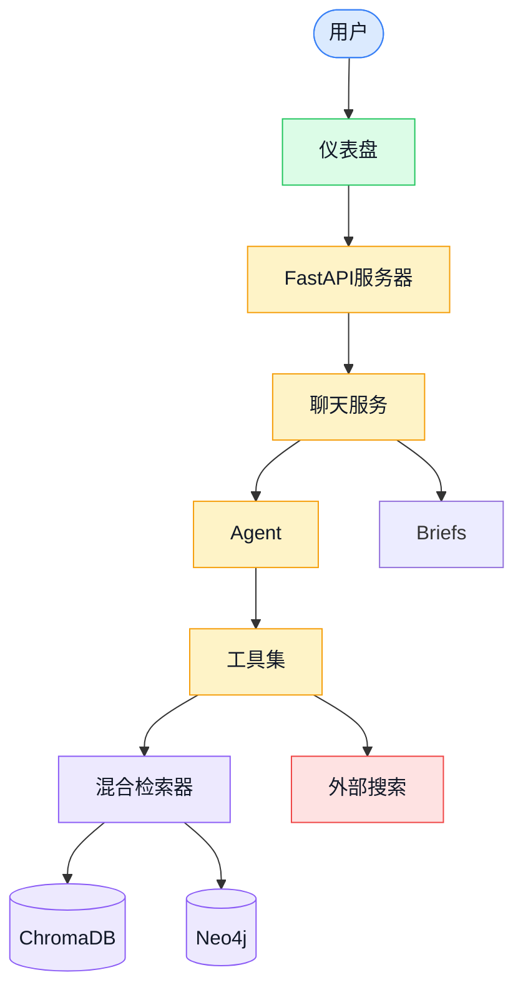
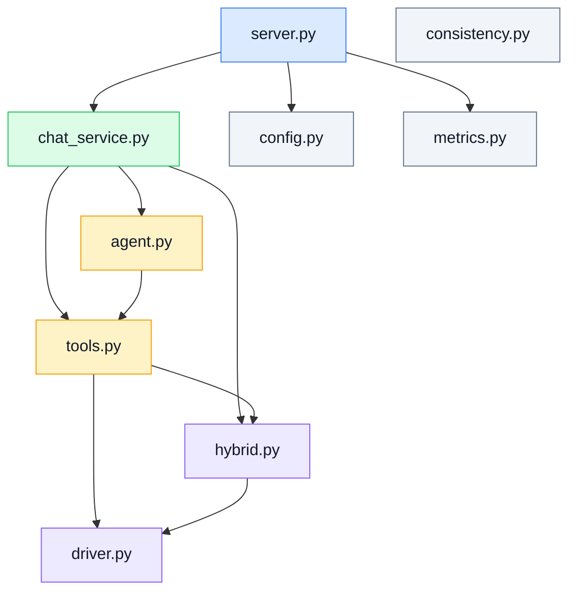
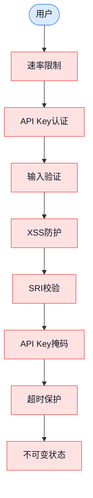
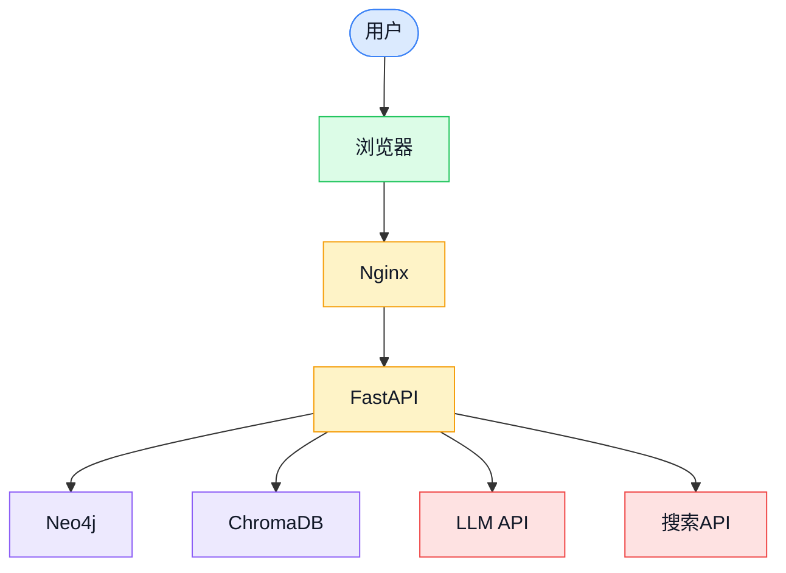

# 架构图

**创建时间**: 2026-06-26 20:35
**创建人**: Project Verifier Skill
**状态**: 完成

---

## 1. 系统架构图

---

## 2. 数据流图

```mermaid
flowchart LR
    %% 节点声明
    INPUT[用户输入]
    API[API端点]
    SERVICE[聊天服务]
    AGENT[Agent]
    TOOL[工具调用]
    RETRIEVE[检索]
    CITE[引用生成]
    OUTPUT[用户响应]

    %% 连接关系
    INPUT --> API
    API --> SERVICE
    SERVICE --> AGENT
    AGENT --> TOOL
    TOOL --> RETRIEVE
    RETRIEVE --> CITE
    CITE --> OUTPUT

    %% 样式
    classDef input fill:#dbeafe,stroke:#3b82f6,color:#111827
    classDef process fill:#dcfce7,stroke:#22c55e,color:#111827
    classDef output fill:#fef3c7,stroke:#f59e0b,color:#111827

    class INPUT input
    class API,SERVICE,AGENT,TOOL,RETRIEVE,CITE process
    class OUTPUT output
```

---

## 3. 模块依赖图

---

## 4. 安全架构图

---

## 5. 部署架构图

---

## 6. 更新日志

| 日期 | 版本 | 变更内容 |
|------|------|---------|
| 2026-06-26 | v1.0 | 初始版本，完成架构图 |
