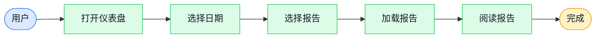
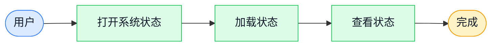
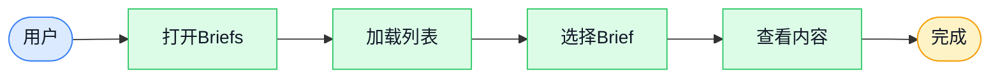
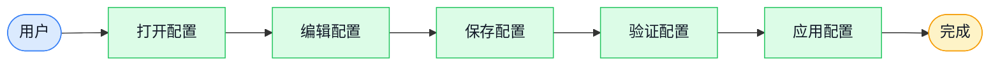
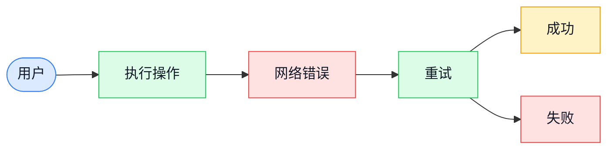
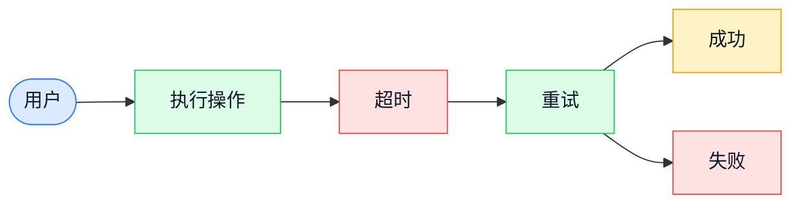

# 用户流程图

**创建时间**: 2026-06-26 20:40
**创建人**: Project Verifier Skill
**状态**: 完成

---

## 1. P0核心流程

### P0_001: 查看报告

**流程说明**：
- **触发方式**：用户打开仪表盘
- **执行路径**：用户 → 仪表盘 → 选择日期 → 选择报告 → 加载 → 阅读
- **成功标准**：报告正常加载并显示
- **失败恢复**：刷新页面

---

### P0_002: Agent聊天

**流程说明**：
- **触发方式**：用户输入问题
- **执行路径**：用户 → Agent → 输入问题 → 思考 → 检索 → 生成回答 → 添加引用
- **成功标准**：回答有引用来源
- **失败恢复**：重新提问

---

### P0_003: 查看系统状态

**流程说明**：
- **触发方式**：用户点击系统状态按钮
- **执行路径**：用户 → 系统状态 → 加载 → 查看
- **成功标准**：状态信息完整
- **失败恢复**：刷新页面

---

## 2. P1重要流程

### P1_001: 联网搜索

**流程说明**：
- **触发方式**：用户启用联网搜索并输入问题
- **执行路径**：用户 → 启用联网 → 输入问题 → 思考 → 搜索外部 → 合并结果 → 生成回答 → 添加引用
- **成功标准**：有外部引用
- **失败恢复**：检查网络连接

---

### P1_002: 查看Briefs

**流程说明**：
- **触发方式**：用户点击Briefs按钮
- **执行路径**：用户 → Briefs → 加载列表 → 选择Brief → 查看内容
- **成功标准**：Brief正常加载
- **失败恢复**：刷新页面

---

## 3. P2边缘流程

### P2_001: 配置管理

**流程说明**：
- **触发方式**：用户修改配置
- **执行路径**：用户 → 配置 → 编辑 → 保存 → 验证 → 应用
- **成功标准**：配置生效
- **失败恢复**：恢复默认配置

---

## 4. 异常流程

### E001: 网络连接失败

**流程说明**：
- **触发方式**：网络连接失败
- **执行路径**：用户 → 执行操作 → 网络错误 → 重试 → 成功/失败
- **成功标准**：操作完成
- **失败恢复**：检查网络连接

---

### E002: API超时

**流程说明**：
- **触发方式**：API超时
- **执行路径**：用户 → 执行操作 → 超时 → 重试 → 成功/失败
- **成功标准**：操作完成
- **失败恢复**：稍后重试

---

## 5. 更新日志

| 日期 | 版本 | 变更内容 |
|------|------|---------|
| 2026-06-26 | v1.0 | 初始版本，完成用户流程图 |
